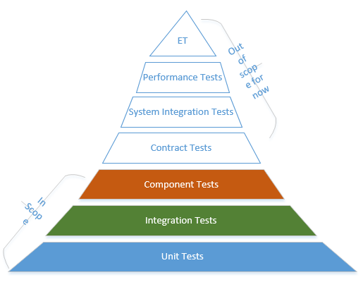
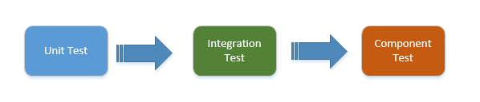
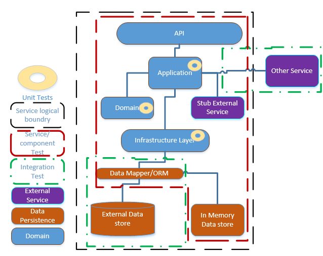

# Testing

Date: 2022-04-08

## Testing Strategies

We have many testing types to cover the microservice testing. Currently we have a reduced scope and we will be focusing on the following testing types, the other types will be covered in later stages gradually.Here is a modified test pyramid for microservices that are in scope. 

## Pre-Deployment Tests
These tests should be written inside the project of the service (i.e. under the test package of the service) and for each service CI/CD pipeline we should run them before the deployment phase.
* Unit Tests
* Integration Tests
* Component/Service Test

In the pipeline, they can run in the below order.

## Combination of Testing Strategies

By combining unit, integration and service testing, we are able to achieve high coverage of the modules that make up a microservice and can be sure that microservice correctly implements the required business logic.

Here is an overview of the testing strategies and the boundaries, how they will be covering the scope of the whole micro service system.

### Unit Tests
A unit test focuses on a single “unit of code” to isolate each part of the program and show that the individual parts are correct. Generally, developers are writing unit tests by using unit testing libraries such as XUnit. They are directly calling the implementation methods in unit tests. 
- It is recommended for developers to write proper Test case even before starting the implementation. The approach should be First develop test cases, then write code and refactor it to pass the unit test.
- Unit tests will be written for application and infrastructure layer where the most logic resides.

### Integration Tests
They verify the communication paths and interactions between components to detect interface defects. 
- The integration tests should be written where the service is using any other service
- integration tests will also cover the data persistence

### Service/Component Tests
In a microservice architecture, the components are the services themselves. Here we need to isolate each component (service) from its peers or collaborators and writing tests at this granularity. 
We will use tools like WireMock to mock the external system or other services. 
We can use in-memory databases to mock DBs but this will create a bit more complexity.
Ideally, we should mock all the external dependencies and test the service in isolation. 

## Resources
[1] https://www.swtestacademy.com/microservices-testing-strategies/
[2] https://martinfowler.com/bliki/ExploratoryTesting.html

