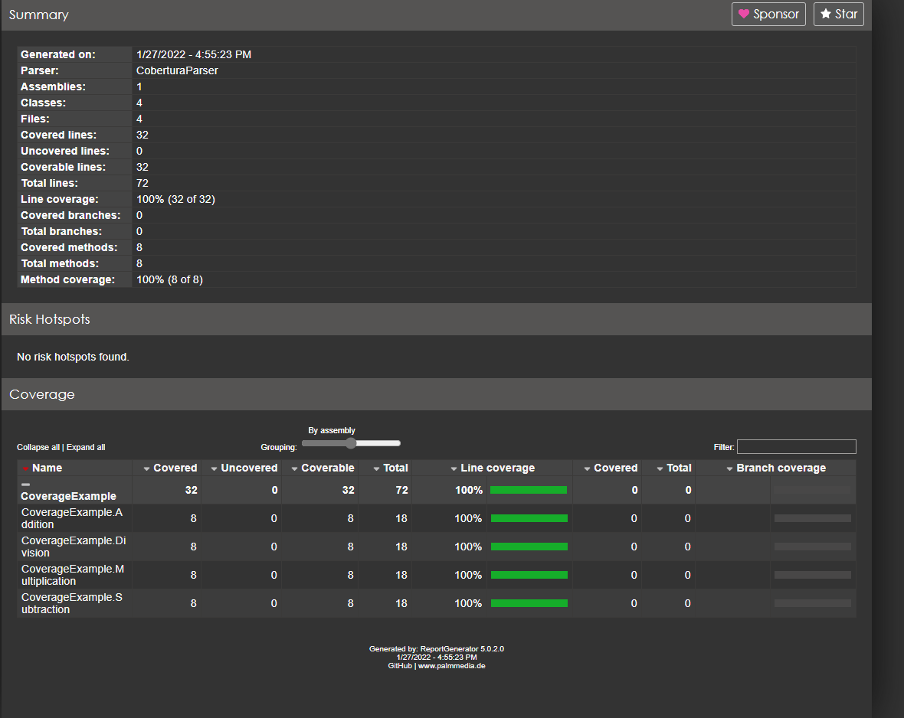

# Unit Testing

## Assertion Library

### fluent assertion
A very extensive set of extension methods that allow you to more naturally specify the expected outcome of a TDD or BDD-style unit tests. Targets .NET Framework 4.7, as well as .NET Core 2.1, .NET Core 3.0, .NET 6, .NET Standard 2.0 and 2.1.
This brings a lot of extension methods into the current scope. For example, to verify that a string begins, ends and contains a particular phrase.
> `string actual = "ABCDEFGHI";
actual.Should().StartWith("AB").And.EndWith("HI").And.Contain("EF").And.HaveLength(9);`
#### Subject Identification
Fluent Assertions can use the C# code of the unit test to extract the name of the subject and use that in the assertion failure. Consider for instance this statement:

> `string username = "dennis";
 username.Should().Be("jonas");`
This will throw a test framework-specific exception with the following message:

> `Expected username to be "jonas" with a length of 5, but "dennis" has a length of 6, differs near "den" (index 0).`

#### Assertion Scopes
You can batch multiple assertions into an AssertionScope so that FluentAssertions throws one exception at the end of the scope with all failures.
> `using (new AssertionScope())
 {
    5.Should().Be(10);
    "Actual".Should().Be("Expected");
 }`

There are many other features that can be reviewed from the [documentation](https://fluentassertions.com/introduction)

### Shouldly
Shouldly is an assertion framework which focuses on giving great error messages when the assertion fails while being simple and straight.
This is the old Assert way:
> `Assert.That(contestant.Points, Is.EqualTo(1337));`
> For your troubles, you get this message, when it fails:
> `Expected 1337 but was 0`
How it Should be:
> `contestant.Points.ShouldBe(1337);`
Which is just syntax, so far, but check out the message when it fails:
> `contestant.Points should be 1337 but was 0.`
Shouldly uses the code before the ShouldBe statement to report on errors, which makes diagnosing easier.

#### Pre-requisites for running on build server

Shouldly uses the source code to make its error messages better. Hence, on the build server you will need to have the "full" pdb files available where the tests are being run.
What is meant by "full" is that when you set up your "release" configuration in Visual Studio and you go to Project Properties > Build > Advanced > Debug, you should set it to "full" rather than "pdb-only".
#### Pros
- Better test failure messages to get more contextual information
- More readable test code as an English sentence.
- Can be extended using custom matchers

#### Advantages of FluentAssertions over Shouldly
- Fluent assertion is much popular and powerful library than shouldy
- Well documented support
- Highly extendable, we can build our own extensions
- Help in writing assertions that keep us out of the debugger hell and clearly communicate what they are trying to accomplish

## References

 - [shouldly git repo](https://github.com/shouldly/shouldly)
 - [fluent assertions git repo](https://github.com/fluentassertions/fluentassertions)
 - [fluent assertions documentation](https://fluentassertions.com/)

--------------------------------------------------------------------

## Stubbing and mocking Server

### 1. WireMock
WireMock.Net  is a tool which mimics the behaviour of an HTTP API. It captures the HTTP requests and sends it to WireMock.Net  HTTP server, which is started and as a result, allows users to setup expectations, call the service and then verify its behaviour.

**Use Cases**
### HTTP Dependencies Not Ready:

An engineering team needs to implement a feature which uses an HTTP API that is not ready. This occurs often in a microservice based architecture. To avoid engineering team wait, users can mimic the behaviour of the HTTP API using WireMock.Net and then replace the call to actual API.

### Unit Test classes which use HTTP APIs:

It allows users to write unit tests for classes that are dependent on HTTP API to verify that the correct information is sent to the HTTP API and ensure that all legal responses can be processed by classes.

#### Integration or End-to-end tests using external HTTP APIs:

Dependency Down External HTTP API cannot initialise into a known state before the tests are run. Therefore, tests that use the data returned by the external HTTP API cannot be written, as it can differ.

Slow tests External HTTP API takes longer than getting the same response from WireMock.Net  and a short timeout cannot be used because the test will fail, when the call is timed out.

API Requests Blocked Wrong network connection, the API request which does not come from a known IP address is blocked. To write fast and consistent tests for HTTP APIs, WireMock.Net  should be used.

Please note that WireMock.Net  cannot guarantee that our application is compatible with the consumed HTTP API. However, it does ensure that:

- The application sends the expected requests to the used HTTP API.
- The application is working as expected when it receives an expected response from the HTTP API.

**Key Features**
- Configure the response returned by the HTTP API when it receives a specific request.
- Capture the incoming HTTP requests and write assertions for that requests.
- Identify the stubbed or captured HTTP requests by using request matching
- Configure request matchers by comparing the request.
- URL, path, request method, request headers, cookies and request body
- Run it as a standalone process. (flexible deployments)Or integrate it in your unit-tests
- Redirect HTTP Requests to another location, record and playbacks
- Support edge case failures
##### Standalone Process
Mock server can be launched within a console application. This is done in Program.cs file and rules are defined so that mappings are implemented.
##### Proxying
It's possible to start the WireMock server in Proxy mode, this means that requests are proxied to the real URL. And the mappings can be recorded and saved.
##### in UnitTests
Users can use their favorite test framework and use WireMock.Net  within the tests. In order to avoid flaky tests, users should:

- Let WireMock.Net  choose ports dynamically. Avoid hard coded ports in the tests. This can cause issues when running these unit-tests on a build-server, there is no 100% guarantee that this port will be free on the OS.
- Clean up the request log or shutdown the server at the end of each test.
##### Stubbing
The core feature of WireMock is the ability to return predefined HTTP responses for requests matching criteria.

##### Basic Stubbing
The following test will configure a response with a status of 200 to be returned when the relative URL exactly matches /api/items. The body of the response will be Product object and a Content-Type header will be sent with a value of application/json.

HTTP methods currently supported are: GET, POST, PUT, DELETE, HEAD. One can also specify ANY (.UsingAny) if one wants the stub mapping to match on any request method.

> `A response body in binary format can be specified via an overloaded WithBody() or WithBodyAsJson()`

##### Stub Priority
It is sometimes the case that two or more stub mappings that "overlap" are created, in that a given request would be a match for more than one of them.
#### Request Logs
The server keeps a log of the received requests. This log can be used to verify the interactions that have been done with the server during a test. To get all the request received by the server, property RequestLogs needs to be read. For more specifics on the requests that have been sent to the server, the very same fluent API can be used which allows to define routes
##### Simulating Delays
A server can be configured with a global delay that will be applied to all requests. To do so one needs to call method WireMockServer.AddRequestProcessingDelay() or configure it at route level:
##### Reset
The WireMock server can be reset at any time, removing all stub mappings and deleting the request log. If either of the UnitTest rules is used this will happen automatically at the start of every test case. This also can be achieved via a call to server.Reset()
##### Webhook
It's also possible to define a Webhook (or multiple Webhooks) for a mapping. With this you can send request to a specific URL after serving mocked response to a request
##### Faults
WireMock.Net  has some limited support for simulating random faults / corrupted responses. These faults are currently supported:

- EMPTY_RESPONSE: Return a completely empty response.
- MALFORMED_RESPONSE_CHUNK: Send an OK status header, then garbage, then close the connection.
- It's also possible to define a percentage (value between 0 and 1) when this fault should occur
##### Admin API Reference
WireMock admin API provides functionality to define the mappings via a http/https interface. To use this interface, one needs to enable the admin interface in code: 
> `var server = WireMockServer.StartWithAdminInterface();`
For detailed usage of these interfaces, please refer to: [Help](https://github.com/WireMock-Net/WireMock.Net/wiki/Admin-API-Reference)

##### Pros
  * Can be used both as a standalone process as well as in unit and integration tests.
  * Support various stubbing scenarios for flexible uses.
  * An Admin API interface is provided which can be communicated via REST.
  * Documentation is regularly updated and maintained.

##### Cons
*   Documentation is lacking depth for more detailed explanation and usage.

### 2. Mockoon
According to their official github page, "Mockoon is the easiest and quickest way to run mock APIs locally. No remote deployment, no account required, open source."

Mockoon is built with Electron and can be used on Windows (exe), Linux (deb, rpm, Appimage and Snap) and MacOS (dmg or brew). For development purposes, Mockoon has a friendly GUI that can be downloadable at https://mockoon.com/download/ .
Mockon can also be installed using chocolatey.

#### Key Features:
- Create an unlimited number of mock API with unlimited number of routes and run them in parallel.
- Use the CLI to run your mock APIs in any headless or automated environment: CI, GitHub Actions, Docker containers, etc.
- Mock API import / export with Swagger/OpenAPI format support.
- Route regex support.
- Serve multiple rules-triggered or random responses with any headers body, or HTTP status codes.
- Automatically send CORS headers (Access-Control-Allow-Origin, etc.) for OPTIONS requests.
- Serve your mock API over TLS with a custom certificate.
- Add any response headers to your routes and mock API. With auto-completion.
- Add latency at environment or route level or even both.
- Requests and responses logs
- Redirect all non-defined routes to the specified host with Mockoon's proxy mode.
- File serving with automatic mime type detection and templating support.
- Rich text editor for body content supporting multiple languages (JSON, HTML, etc).
- Templating supported in body, file content and header, with many helpers: url params, query params, JSON body lookup, etc.
- Auto-save
- Docker support for the CLI

#### Executing mockoon from docker
It's pretty easy to run mockoon from docker. In order to build custom images, one can use mockoon-cli to generate a docker image for a mockoon environment.First, it's necessary to have the @mockoon/cli tool installed.

##### Pros

*   Easy to use
*   Extremely well documented
*   Good support of the community
*   Multi-platform support
*   Great GUI for development purposes

##### Cons

*   Cannot be embedded with the unit test code directly

### Wiremock over Mockoon

* Wiremock provides a feature to work with faults, that could be used to test negative response from the service.
* Can be used directly with testing frameworks, so test writing could be easy and can follow the same unit test patterns.

## References

- [github mockoon repo](https://github.com/mockoon/mockoon)
- [mockoon site](https://mockoon.com/)
- [github wiremock.net repo](https://github.com/WireMock-Net/WireMock.Net/ )
- [github wiremock.net wiki](https://github.com/WireMock-Net/WireMock.Net/wiki)

---------------------------------------------------------------------------------------
## Code coverage tools
Test coverage is a measure (in percent) of the degree to which the source code of a program is executed when a particular test suite is run. A program with high test coverage has more of its source code executed during testing, which suggests it has a lower chance of containing undetected software bugs compared to a program with low test coverage. Many different metrics can be used to calculate test coverage. Some of the most basic are the percentage of program subroutines and the percentage of program statements called during execution of the test suite.

This article will focus on the usage of test coverage tools in the dotnet platform, by comparing the following libraries:
1. Coverlet
2. OpenCover
3. AltCover
### Coverlet
Coverlet is a cross platform code coverage framework for .NET, with support for line, branch and method coverage. It works with .NET Framework on Windows and .NET Core on all supported platforms.
Coverlet is the default coverage tool for every .NET Core and >= .NET 5 applications and it already comes as default in the creation of a xUnit test project.
#### Collecting coverage

To collect coverage, execute the following command:
> `dotnet test --collect:"XPlat Code Coverage"`
Note: The "XPlat Code Coverage" argument is a friendly name that corresponds to the data collectors from Coverlet. This name is required but is case insensitive.

This command should output the results in the coverage.cobertura.xml file, at the location /YourTestProject/TestResults/Random-GUID/cobertura.coverage.xml.
This file will contain all the test results.
#### Visualizing coverage
An easy way to visualize the content generated by coverlet is to use the dotnet tool dotnet-reportgenerator. To install it, execute the following command:
> `dotnet tool install -g dotnet-reportgenerator-globaltool`
After the installation, the reportgenerator command will be available. This command will be used to generate the HTML report. Here is an example:
> `reportgenerator -reports:"\location-of-the-file\coverage.cobertura.xml" -targetdir:coverage-report -reporttypes:Html`

**Note:** the -reports argument is required and it should be the location of the cobertura.coverage.xml file generated in the previous step Collecting coverage .

If you have interest in understand better the capabilities of reportgenerator, [click here to visit their official github page](https://github.com/danielpalme/ReportGenerator). 

After that the report will be generated in the coverage-report folder in a website format. This report can be opened in a browser to visualize the coverage. To open it, double click the file .\index.html.

You should see a report similar to the following. 

#### How Coverlet works:
Coverlet generates code coverage information by going through the following process:

**Before Tests Run**
*   Locates the unit test assembly and selects all the referenced assemblies that have PDBs.
*   Instruments the selected assemblies by inserting code to record sequence point hits to a temporary file.

**After Tests Run**
*   Restore the original non-instrumented assembly files.
*   Read the recorded hits information from the temporary file.
*   Generate the coverage result from the hits information and write it to a file.

#### Build integration
Coverlet also integrates with the build system to run code coverage after tests. Enabling code coverage is as simple as setting the CollectCoverage property to true

> `dotnet test /p:CollectCoverage=true`

After the above command is run, a coverage.xml file containing the results will be generated in the root directory of the test project. A summary of the results will also be displayed in the terminal.

##### Pros:
* Gives a good overview of the code coverage, including the coverage of each class, method, lines and branches.
* List risk hotspots in the code.
* It comes integrated by default in the xUnit test projects.

##### Cons:
* Documentation is not based on release, but on current state of repository, which can be a problem for newcomers.
* Documentation is not very clear on how to visualize the coverage.

### Open Cover
Open cover is a code coverage tool for .NET 2 and above (WINDOWS OS only), support for 32 and 64 processes with both branch and sequence points. The first section of the official readme file in their github repository claim that the author is:

Owner's Comments: **Putting OpenCover into archive mode**
> * A long time ago OpenCover met a need and then slowly expanded on the request of others (and some crazy ideas of my own), in the last few years the development of OpenCover has been sporadic as I have pursued other interests. Now with the numerous releases of .NET core and the availability of other tools such at AltCover that fill that same product space I feel the time has come to park OpenCover.
> * I use AltCover myself as I am often using linux based containers as my target environment

Taking into consideration that the project is officially in archive mode for a long time, the limitation in the framework version (.NET 4.7.2) and the non-compatibility with operation systems other than WINDOWS, we strongly recommend to not consider open cover as an option.

### AltCover
AltCover is a cross-platform coverage gathering and processing tool set for .net/.net core and Mono. As the name suggests, it's an alternative coverage approach.

#### Collecting coverage
Before getting the coverage with AltCover, it's necessary to install the library AltCover in the target test project. Once the library is installed, the coverage can be obtained by running the following command:

> dotnet test /p:AltCover=true
The OpenCover format output will be in file coverage.xml in the project directory.

It's important to notice that as default, AltCover collects unit tests for all the assemblies, meaning that the dependencies will also be collected as part of the coverage. It's possible to filter that behavior by using the /p:AltCoverAssemblyExcludeFilter parameter.

Example of how to execute AltCover with filtered behavior:

> dotnet test /p:AltCover=true /p:AltCoverAssemblyExcludeFilter='^(?!(YourNamespace1||YourNamespace2)).*$'
#### Visualizing coverage
The report generator tool  can be used to generate the html reports in the same way as Coverlet.
To use AltCover to collect coverage, execute the following command:

> dotnet test /p:AltCover=true
The output will be in file coverage.xml in the project directory. Once the coverage collection file is created, the report can be generated by executing the following command:

> reportgenerator -reports:"\coverage.xml" -targetdir:coverage-report -reporttypes:Html
You should see a report similar to the following. 

#### How AltCover works:
Rather than working by hooking the .net profiling API at run-time, it works by weaving the same sort of extra IL into the assemblies of interest ahead of execution. This means that it should work pretty much everywhere, whatever your platform, so long as the executing process has write access to the results file. You can even mix-and-match between platforms used to instrument and those under test.

##### Pros:
* Project seems to be active and well maintained, with recent updates.
* It's compatible with default report generator tool
* Multi-platform support (Windows, Linux, MacOS)

##### Cons:
* Documentation is pretty basic and project has few starts and contributors.
* Small footprint in throughout the community, not a lot of content related to it.
* Counter-intuitive filters, it lists coverage dependencies as default (Can be a pro depending on the requirement)
#### Coverlet vs AltCover
The two libraries are similar in functionality terms. Both support formats (e.g. cobertura) that are adopted throughout the industry. It's important to mention that since both are multi-platform, they would be compatible with azure devops pipeline.
Since both are collectors, there is not much to add on best practices other than execute the test coverage collector.
Coverlet would be a better choice for the an enterprise level of quality due to the following reasons:

- Simplicity of the implementation
- It's already integrated with xUnit
- It's simpler to execute
- It has more recognition in the community

#### References
- [github coverlet repo](https://github.com/coverlet-coverage/coverlet)
- [github opencover repo](https://github.com/OpenCover/opencover) 
- [github altcover repo](https://github.com/SteveGilham/altcover) 
- [Report generator](https://github.com/danielpalme/ReportGenerator )
- [Unit test Code coverage](https://docs.microsoft.com/en-us/dotnet/core/testing/unit-testing-code-coverage?tabs=windows )

