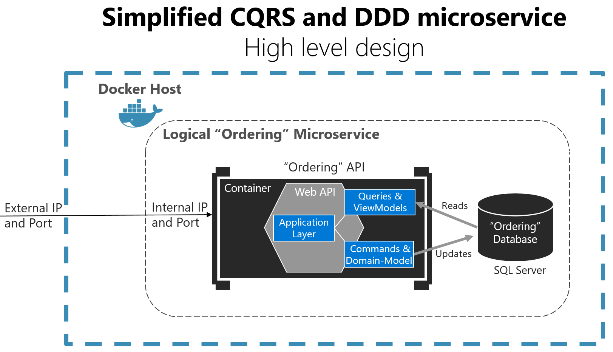
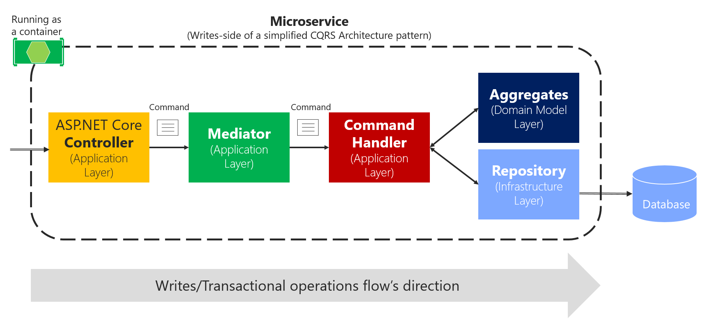

# CQRS and MediatR

Date: 2022-04-22

## CQRS 
CQRS, stands for Command Query Responsibility Segregation. CQRS is an **architectural pattern** that separates the "processing operations" from the "answering operations. Separating the Commands from the Queries gives a single purpose to a component. Each component can than be optimized and **deployed** separately. With CQRS implemented properly, reads and writes can **scale** independently. If the application have high demands for handling queries, the query instances can be scaled out without having to worry about the write instances. Also, another important benefit brought by following this pattern is the fact that Commands and Queries can target different data storage allowing for more **optimization** at the persistence layer. The basic idea is that you can divide a system's operations into two sharply separated categories:
* **Queries**. These queries return a result and do not change the state of the system, and they are free of side effects.
* **Commands**. These commands change the state of a system.
The separation aspect of CQRS is achieved by grouping query operations in one layer and commands in another layer. Each layer has its own data model (note that we say model, not necessarily a different database) and is built using its own combination of patterns and technologies. Even though, Commands and Queries are separated, both are still part of the same application.

## CRUD Method
CRUD stands for Create, Read, Update, and Delete. In classic data manipulation applications, CRUD structures are unquestionably the most frequent. In the simplest case, our interactions are all about storing and retrieving these records.

In more complex applications, however, this approach can become unwieldy. For example, on the read side, the application may perform many different queries, returning data transfer objects (DTOs) with different shapes (perhaps collapsing multiple records into one, or forming virtual records by combining information for different places). Object mapping can become complicated. On the write side, the model may implement complex validation and business logic. As a result, you can end up with an overly complex model that does too much.

## What Problem CQRS solves?

Following are the problems identified using the traditional approach.
* There is often a **mismatch** between the read and write representations of the data, such as additional columns or properties that must be updated correctly even though they aren't required as part of an operation.
* **Data contention** can occur when operations are performed in parallel on the same set of data.
* The traditional approach can have a **negative effect on performance** due to load on the data store and data access layer, and the complexity of queries required to retrieve information.
* Managing security and permissions can become complex, because each entity is subject to both read and write operations, which might expose data in the wrong context.

CQRS **separates** reads and writes into different models, using commands to update data, and queries to read data.

* Commands should be **task-based**, rather than data centric. ("Book hotel room", not "set ReservationStatus to Reserved").
* Commands may be placed on a queue for **asynchronous** processing, rather than being processed synchronously.
* Queries never modify the database. A query returns a DTO that does not encapsulate any domain knowledge.

The models can then be isolated. The two models might not be separate object models, it could be that the same objects have different interfaces for their command side and their query side, rather like views in relational databases. But usually when I hear of CQRS, they are clearly separate models.

## CQRS implementation in microservice
The application layer can be the Web API itself. The important design aspect here is that the microservice has split the queries and ViewModels (data models especially created for the client applications) from the commands, domain model, and transactions following the CQRS pattern. This approach keeps the queries independent from restrictions and constraints coming from DDD patterns that only make sense for transactions and updates. Having the database in the same Docker host is good for development, but not for production.

The  application layer in the DDD design can be considered as this transaction boundary. From outside, we don’t worry about the transaction, we just send a command, and it either succeeds or fails.

## Benefits of CQRS

* **Independent scaling**. CQRS allows the read and write workloads to scale independently, and may result in fewer lock contentions.
* **Optimized data schemas**. The read side can use a schema that is optimized for queries, while the write side uses a schema that is optimized for updates.
* **Security**. It's easier to ensure that only the right domain entities are performing writes on the data.
* **Separation of concerns**. Segregating the read and write sides can result in models that are more maintainable and flexible. Most of the complex business logic goes into the write model. The read model can be relatively simple.
* **Simpler queries**. By storing a materialized view in the read database, the application can avoid complex joins when querying.

## Challenges

Some challenges of implementing this pattern include:

* **Complexity.** The basic idea of CQRS is simple. But it can lead to a more complex application design, especially if they include the Event Sourcing pattern.

* **Messaging.** Although CQRS does not require messaging, it's common to use messaging to process commands and publish update events. In that case, the application must handle message failures or duplicate messages. See the guidance on Priority Queues for dealing with commands having different priorities.

* **Eventual consistency.** If you separate the read and write databases, the read data may be stale. The read model store must be updated to reflect changes to the write model store, and it can be difficult to detect when a user has issued a request based on stale read data.

# Mediator Pattern

The Mediator pattern is a **behavioral** design pattern. The Mediator object encapsulate how a set of objects communicate between each other. With this pattern in place, objects **do not need to communicate directly**. This reduces the dependencies between objects, thereby **reducing coupling**.
Mediator defines an object that **encapsulates** how a set of objects interact. It promotes loose coupling by keeping objects from referring to each other explicitly, and it lets you vary their interaction independently.

## MediatR Library

MediatR is a library that implements the mediator pattern and the CQRS pattern in .Net. Its simple in-process messaging with no dependencies. It allows developers to easily start developing loosely coupled components making it easy to add and test new features. It provides abstractions that supports generic Requests, Request handlers and Events. The library also leverage the middleware pattern when it comes to adding cross-cutting concerns.

The term “in process” is an important limitation here. Since it’s a .NET library that manages interactions within classes on the same process, it’s not an appropriate library to use if we wanted to separate the commands and queries across two systems. In those circumstances, a better approach would be to a message broker such as Kafka or Azure Service Bus.

## Why MediatR should be used?
Following are few main reasons of using this library.

### Decoupling
At it's heart the mediator object will route commands to their corresponding command handlers and will route queries to their corresponding query handlers. All this messaging is done in-process. Services required by handlers will be injected at runtime by the DI framework. Handlers will contain all the logic and will be easy to test since injected services could be easily mocked.

SomeService sends a message to the Mediator, and the Mediator then invokes multiple services to handle the message. There is no direct dependency between any of the blue components.

The example below shows how this separation between Commands and Queries is implemented using MediatR:

Example of CQRS with MediatR (**Query or Command → Handler → Result**)
Since every query and command follows its own pipeline, It's very easy to customize the pipeline for each one of them depending on the context.

### Application Requests

An application can have various inputs. MediatR allows for a myriad of application requests. It can wrap HTTP requests or handle a request triggered by a background job run by a scheduler or a handle a message picked-up from a message queue.
There are a number of ways that you may want to invoke behaviors in your system that don’t initiate from an HTTP request.
Using MediatR to create application requests to cross an integration boundary.

### Request Pipelines
MediatR implements the middleware pattern. We can create the same concept using **MediatR behaviors**. One popular implementation of this pattern is the Microsoft .Net Core middleware. The below diagram gives an overview of the middleware pattern:

Briefly, a request goes into a pipeline. Every piece of the pipeline can execute a logic before handing over the request to the next middleware. We refer to this as Pre-Processing steps. After execution of the action the response follows the same path backward to the caller. We refer to this as Post-Processing steps.

The MediatR patterns implement this pattern as follows:

MediatR provide abstractions that help adding cross-cutting concerns that decouple them from the business logic.
### MediatR Notifications
For use cases where a single requests needs to be handled by multiple handlers, mediatR provides **notifications/Events**  (MediatR calls them Notifications) for such cases. A notification can have zero or multiple handlers. However the execution of all the notification handlers are done all in the same process.

## CQRS with MediatR

Every pattern involved in the proposed architecture lead to tangible benefits. All these patterns along with the mediatR library make the architecture **extensible**, **testable** and **easy to deploy**.
In a CQRS approach you use an intelligent mediator, similar to an in-memory bus, which is smart enough to redirect to the right command handler based on the type of the command or DTO being received. The single black arrows between components represent the dependencies between objects (in many cases, injected through DI) with their related interactions.

 _Using the Mediator pattern in process in a single CQRS microservice_

The above diagram shows the ASP.NET Core controller sends the command to MediatR's command pipeline, so they get to the appropriate handler.

In enterprise applications, the processing requests can get complicated. You want to be able to add an open number of cross-cutting concerns like logging, validations, audit, and security. In these cases, you can rely on a mediator pipeline (see Mediator pattern) to provide a means for these extra behaviors or cross-cutting concerns.

When communicating with external services the CQRS pattern can be implemented using a message broker to achieve the same benefits.

_Using message queues (out of the process and inter-process communication) with CQRS commands_

## Resources
- [1] https://martinfowler.com/bliki/CQRS.html
- [2] https://docs.microsoft.com/en-us/dotnet/architecture/microservices/microservice-ddd-cqrs-patterns/apply-simplified-microservice-cqrs-ddd-patterns
- [3] https://www.connell.dev/onion-architecture-ddd-cqrs/
- [4] https://herbertograca.com/2017/11/16/explicit-architecture-01-ddd-hexagonal-onion-clean-cqrs-how-i-put-it-all-together/
- [5] https://github.com/jbogard/MediatR
- [6] https://docs.microsoft.com/en-us/azure/architecture/patterns/cqrs
- [7] https://codeopinion.com/why-use-mediatr-3-reasons-why-and-1-reason-not/
- [8] https://code-maze.com/cqrs-mediatr-in-aspnet-core/