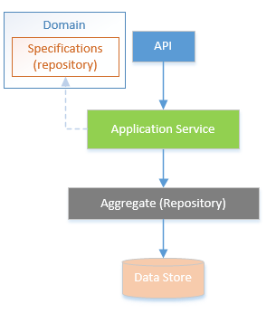
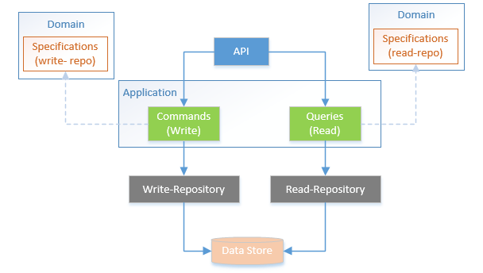

# Specification pattern and its use with Repository and CQRS patterns

Date: 2022-06-22

# Repository Design Pattern

The Repository Design Pattern is used to create an abstraction layer between the data access layer and the business logic layer of the application. Following the clean architecture the infrastructure layer has implementation of the repository, while the domain layer provides the abstraction of repository that is being used by the application layer to communicate with the data access layer.

It has been seen that the repositories starts with standard functions/methods, as there is need of more and more new functions due to new requirements of different data set with different filters keep increases as the system grows. That resulted in fat repositories having lot of code into single class, that resulted in sometimes avoiding the DRY principle.

# CQRS 

Following the CQRS pattern and separating the commands from the queries helps in managing the code base separation for reads and writes. We can design separate repositories for read/write as being presented here. This helps us in separating the concern of each repository the read repository is focussed on getting the data and providing it to the caller efficiently, while write is maintaining the state of the system and if there are any event/notifications to be sent to other aggregates or to other system through integration events.

# Specification Pattern

By definition the pattern allows us to encapsulate some piece of domain knowledge/business rule into a single unit called specification and reuse it in a different part of code base, multiple specification can be combined in chaining to execute collectively. Specification pattern is advocates the DRY "Don't repeat yourself" principle.
One Domain-Driven-Design solution to the problem of where to place querying, sorting, and paging logic is to use a Specification.
We should think of specifications as logical predicates that are relevant in the domain (indeed they are first class citizens in the domain model) that can be composed both to **check** different qualities of an entity and to **select entities** from a set (a set that can be either a repository or a simple list).

## Specification Pattern Use cases
Specification pattern is about encapsulating a piece of domain knowledge into a single unit - called specification - and then reusing in different scenarios. 
There are three such scenarios: 
* **Data Retrieval** - When we need to select a subset of objects based on some criteria (those criteria are called specification)
* **Validation** - When we need check that only suitable objects are used for a certain purpose.

* **Creation of a new object ("Construction-to-order")** - When we need to create a new object that meets the criteria (specification)

## Using Specification pattern for data querying
Steve smith describes as specification is a way to encapsulate a query into a class, so that we would have a collection of different specification corresponds to different types of queries. These specification will work with our repository to make sure that our repository not get blotted. He has created a nuget package providing the implementation of [specification pattern](https://github.com/ardalis/specification).
The same specification class can be used for both validation of the incoming data and filtration of the data from the database when you show it to the user.

### Pros:
- Provides us with a higher level of abstraction
- A separate piece of query to be used specific to a particular operation
- The query logic is away from the repository implementation, in other words it's in core instead of infrastructure
- Very clean and managed repositories code 

### Cons:
- After using CQRS and separating commands from queries. And also with separation of read and write repositories the validation belongs to command side while filtering belongs to querying/retrieval side.
- When writing query then using specification increases the complexity in the code
- Domain logic is distributed between classes
- If there is any new set of data required, then we have to write either the specification or query, so then writing query makes more sense.

## Using Specification pattern for validation

Specification pattern can be used for validation purposes. Since by definition specification is a business rule in a separate unit.

### Pros:
- For validating the business rules, the same specification can be used multiple places
- This help to keep the code clean and implement these business rules in separate classes
- The business rules can be chained to execute collectively.
### Cons:
-  When creating a domain model object, it should reside in a valid state, one should not be able to instantiate invalid domain model (always-valid domain model).
- To follow always-valid domain model concept, the constructor should have the validation, so that it raises exception before initiating invalid object.
- By following this approach the usecase of initiating invalid object and then validating it through specification is not needed.

  
## Recommendations

- Considering the always-valid domain model, should the specification pattern not be used. No, its useful for validating already existing objects.
- For querying/data retrieval purpose specification should not be used.
- Overuse of specification pattern leads to include ORM/infrastructure details into core layer

## Resources
[1] [Specifications](https://www.martinfowler.com/apsupp/spec.pdf)  by Eric Evans and Martin Fowler
[2] [The Specification Pattern](https://matt.berther.io/2005/03/25/the-specification-pattern-a-primer/): A Primer by Matt Berther
[3] [Specification pattern](https://enterprisecraftsmanship.com/posts/specification-pattern-c-implementation/) by vladimir khorikov
[4] [Specification Pattern](https://ardalis.github.io/Specification/getting-started/quick-start-guide.html) by Steve Smith
[5] [validation in DDD](http://gorodinski.com/blog/2012/05/19/validation-in-domain-driven-design-ddd/) by Lev Gorodinski
[6] [Design validations in the domain model layer](https://docs.microsoft.com/en-us/dotnet/architecture/microservices/microservice-ddd-cqrs-patterns/domain-model-layer-validations)microsoft
[7] [always valid domain model](https://enterprisecraftsmanship.com/posts/always-valid-domain-model/) by vladimir khorikov