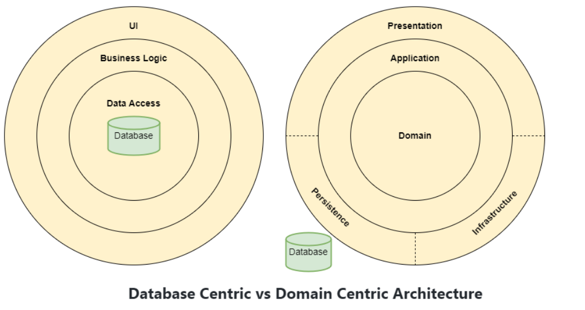
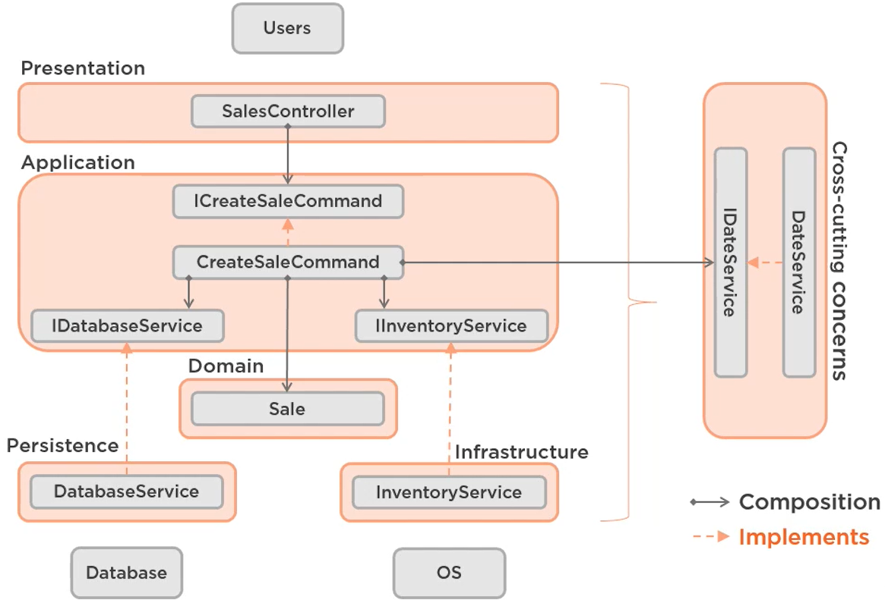
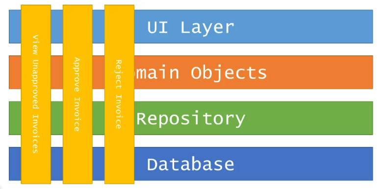
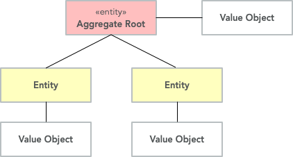
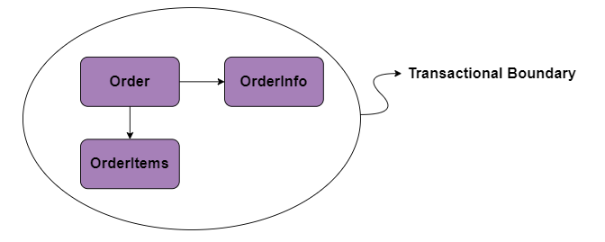
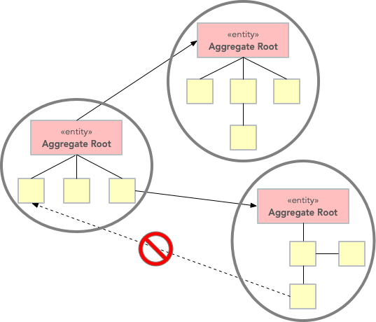
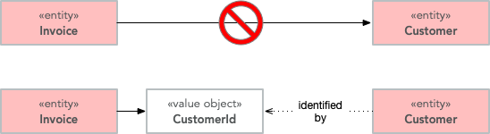
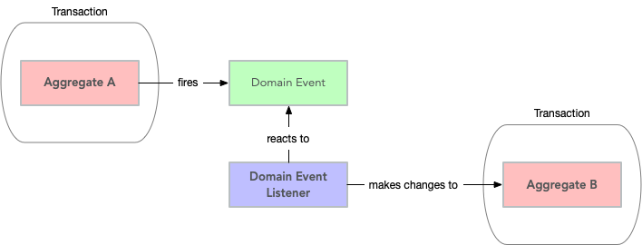
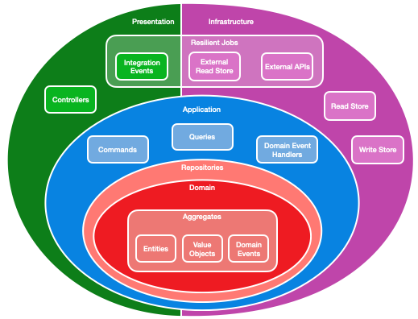

# Clean Architecture

Date: 2022-04-21

Earlier web applications were deployed as a single web application running within a single web server. This was the simplest approaches, As applications grow in complexity, one way to manage that complexity is to break up the application according to its responsibilities or concerns. This approach follows the separation of concerns principle and can help keep a growing codebase organized so that developers can easily find where certain functionality is implemented. Layered architecture offers a number of advantages beyond just code organization, though.

# Traditional N Layer Architecture
The most common organization of application logic into layers is 3 layers. 
These layers are frequently abbreviated as UI, BLL (Business Logic Layer), and DAL (Data Access Layer). Using this architecture, users make requests through the UI layer, which interacts only with the BLL. The BLL, in turn, can call the DAL for data access requests.  In this architecture, the direction of dependency goes in the same direction as the **flow of control**, which is the direction method calls are made.

It means that the data and the way it is persisted is the most crucial part of the application. That’s because most of the application is dependent on the data access layer, and any changes to the technologies in this layer would require changes in other layers.

## Pros
* Scalable: this is due to its capability of multiple tier deployment and the tier decoupling 
* Security can be enforced differently for each tier if the security requirement is different for each tier
* Decoupled layers are logic software component groups mainly by functionality, they are very software development friendly and efficient.
## Cons
*  BLL, which usually holds the most important logic in the application, is dependent on data access implementation details (and often on the existence of a database) 
* Testing business logic in such an architecture is often difficult, requiring a test database.

# Design Approach
Now the approach has been changed from data centric to domain centric system. When we used to design data centric applications the n-layer architecture was much suited. For modern systems the domain is in the center of design. 

# Clean Architecture
The proposed internal architecture for a microservice is based on the well-established Onion architecture. This architecture is leverage the Inversion of control principle and puts the domain at the heart of the application. 
Clean Architecture is also layered architecture. The layer domain (entities) is in the center surrounded by the application layer (use cases). The outer layer consists of ports and adapters that adapt the application to external systems (web, DB, UI) via controllers, repositories, presenters.
This architecture is domain-centric. It puts the domain model at the center of the application. The domain model incorporates both behavior and data but does not define the interaction with the database. The persistence and presentation of the domain model are just the details located as far away as possible.

A view of dependencies and control flow in clean architecture. 

 

## Core Layer	
 **Domain and Application Layer** will be at the center of the design. We can refer to these layers as the Core Layers. These layers will not depend on any other layer. Domain Layer usually contains enterprise/domain logic and entities. Application Layer would have Interfaces and types. The main difference is that The Domain Layer will have the types that are common to the entire enterprise, hence can be shared across other solutions as well. But the Application Layer has Application-specific types and interface.
 ## Core→Domain Layer
    The domain layer includes domain entities, aggregate-roots and value objects, events. It has no dependency on other layers. All other layers can reference the objects in this layer.
 ## Core→ Application layer
    	This layer depends on the **Domain layer** (Entities and Validation Rules that are common to the business case) and defines the different **interfaces** for the infrastructure internal and external services.  The implementation of these services reside on the infrastructure layer. By programming to interfaces, the onion architecture comply to the Open Closed Principle.
## Infrastructure Layer
Infrastructure can be anything. Maybe a persistence layer, implementing Entity Framework Core, or a service specifically made to generate JWT Tokens for Authentication or even a Hangfire Layer. This layer implements the interfaces defined in the application layer.  The services will be injected on the application layer using an IoC container. This separation between the contracts and the concrete implementation results on higher flexibility and lesser coupling.
## Presentation Layer
Presentation Layer is where users/services use to access/consume the resources exposed by the lower layers. It depends on the infrastructure to bootstrap the various services at startup. This can be a WebApi, Mvc Project, etc.

The example shows how the Infrastructure layer: persistence service & Infrastructure services contains the implementations of the contracts defined in the application layer.

The application layer depends on the domain layer and the infrastructure through Inversion of Control.

The presentation layer depends on the application layer. Also, not show in the diagram, the presentation layer reference the Infrastructure only to bootstrap the application services in the DI framework.

Finally, the example shows how the CreateSaleHandler in the application layer depends on the cross-cutting concerns such as IDateService through its contract. This is what makes the CreateSaleHandler very easy to test and evolve since the services are easy to replace.

 

## Dependency Rule
Besides layer separation, we must remember the dependency rule.
1. Dependencies cannot be set bypassing the layers. It means that we can’t use classes defined inside the application layer in the infrastructure layer, because we have adapters layer in between.
2. Our high-level layers must not depend on low-level layers. In other words, classes, functions, objects that are defined in low levels must not appear in high levels. This rule is shown in the diagram by black arrows. How can this be achieved? By using the Dependency Inversion Principle. We define ports (interfaces) at the higher level and implement them at the lower level.

The Core Layers will never depend on any other layer. Therefore what we do is that we create interfaces in the Application Layer and these interfaces get implemented in the external layers. This is also known as DIP or Dependency Inversion Principle.

For example, If your application want’s to send a mail, We define an IMailService in the Application Layer and Implement it outside the Core Layers. Using DIP, it is easily possible to switch the implementations. This helps build scalable applications.

## Pros
* **Framework Independent** – You can use clean architecture with ASP.NET (Core), Java, Python, etc. It doesn’t rely on any software library or proprietary codebase.
* **Database Independent**-Majority of your code has no knowledge of what database, if any, is being used by the application. Often, this info will exist in a single class, in a single project that no other project references.
* **UI Independent**-The UI project cares about the UI only. It has nothing to do with the implementation of business or data logic.
* **Highly Testable**– Apps built using this approach, and especially the core domain model and its business rules, are extremely testable.
## Cons
* Can be overkill when only a CRUD app is needed
* Requires more intentional design (you can't reference data persistence APIs directly in your business logic)

# Vertical Slice Architecture

In Vertical Slice Architecture, A feature manages its data access code, domain logic and its presentation code, this way we can lowering the coupling and high cohesion between features. Instead of dividing code by “type” or kind, we organize it by the change we need to make. When we need to add business functionality to an application, these changes are “full stack,” meaning that they can span everything from the user interface, downwards. When we make changes to the application, we can minimize side effects by removing shared code or abstractions between different slices. Each slice is encapsulated so that the application doesn't need to know what goes on inside the slice, it merely passes a Request and receives a Response.

 

## Tenet of Vertical Slice Architecture
- Things that change together, belong together
- Maximize cohesion along axes of change and minimize coupling between them

## Pros
* **No abstractions** - Because each slice is encapsulated, it’s straightforward to change the implementation of a handler without affecting any other slice. 
* **Refactoring to better design** - With vertical slices, we start with the simplest solution that could possibly work. Once we prove our code works, we use standard code smells and refactoring techniques within that slice to clean it up. With layers, our refactoring directions are limited because of a strict adherence to directional dependencies.
* **Keeps things together** - Using layers architecture, we would need to be very careful in understanding side effects. Here since the change is related to a single feature that keeps related things together.
* **Code structure** - Much simpler since all the code related to a feature is at one place, no hopping from project to project
## Cons
- More **smaller scope** when planning a boundary of a feature
- **Less Reusability** - Since each feature is a separate box so there is less code reusability    
- **Practicality** - Not much practical for enterprise level solutions
* **Continuous Refactoring** - This architecture heavily based upon refactoring and  continuous  improvement suggesting "don’t add abstractions or patterns until the code inside a single slice exhibits code smells that guide our refactoring". 
*  **Focus to code smells** - This approach requires to focus on code smells, since there is not much design constraints.

# Is it really vertical Slice Architecture vs Clean Architecture

- Clean architecture is an approach being used in lot of enterprise level systems
- Vertical slice architecture is more about thinking and defining the boundary of a feature and focusing on the feature separately.
- Vertical slice architecture is much newer, did not get good examples of bigger enterprise solutions, mostly are just to present one/two small feature
- With the inclusion of DDD, microservices and CQRS for an enterprise application, its much practical use of vertical slice architecture

# Domain Driven Design (DDD)

Domain-Driven Design is an approach to software development that centers the development on programming a domain model that has a rich understanding of the processes and rules of a domain. 
Historically, DDD came with two disciplines: tactical design and strategic design. Tactical design proposes concrete concepts and design patterns such as factories, repositories, and entities. By contrast, strategic design deals with subdividing a huge system into smaller, decoupled, and less complex parts. This is what we need to define an architecture for a huge system that can evolve over time.

# Strategic Design
Strategic modeling, it is a pillar of the DDD whose main objective is to define the Bounded contexts, the Ubiquitous Language and the Context Maps together with the entire project team, which are the domain experts and the technical team.

## SubDomains
Domain-driven design (DDD) advocates modeling based on the reality of business as relevant to your use cases. In the context of building applications, DDD talks about problems as domains. It describes independent problem areas as Bounded Contexts (each Bounded Context correlates to a microservice), and emphasizes a common language to talk about these problems. 
We can say that **Domain** is a scope where one works and how one works, it refers to the space of the problem for which we are acting, its entities, its behavior and rules. In other words, domain is effectively an arbitrary boundary around some subset of concepts in the universe. It requires the decomposition of the Domain into Subdomains, a **Subdomain** is a subpart of the Domain. When we use the word subdomain, we are emphasising that the domain we are talking about is a child of another higher-level domain which we have identified.Every subdomain is, therefore, a domain, and most domains are a subdomain. A subdomain in the problem space is mapped to a **bounded context** in the solution space.

## Bounded context
Bounded context is one of the most important concepts of DDD, we can say that is a conceptual limit where a domain model is applicable.
As you try to model a large domain, you will have great difficulties, because different groups of people will use subtly different terms and sentences. That means that any use of that vocabulary outside of that limit will probably mean something different.
Bounded Context is a central pattern in Domain-Driven Design. It is the focus of DDD's strategic design section which is all about dealing with large models and teams. DDD deals with large models by dividing them into different Bounded Contexts and being explicit about their interrelationships. 
Bounded Context is a **semantic contextual boundary**. This means that within the boundary each component of the software model has a **specific meaning** and does specific things. It is important to understand that each Bounded context will have its own **Ubiquitous Language**.[@Vaughn Vernon].

## Ubiquitous Language
The Ubiquitous Language is modeled within a Bounded context, where the terms and concepts of the business domain are identified. Ubiquitous Language is developed in agreement of the whole team ( domain experts, technical team and other involved). The Ubiquitous Language must be spoken at all times between the team members and expressed in the software model.

 

## Context Maps
Context Maps help in understanding the whole project, being able to show the relationships between the different Bounded Contexts. It is extremely important to understand the relationship between Bounded Contexts so that you can build a domain model correctly.

 

# Tactical Design
The Tactical Design, is a set of technical resources used in the construction of your Domain Model, these resources must be applied to work in a single Bounded Context. It focuses on the implementation level details of components inside a bounded context. The purpose of tactical design is to refine the domain model to a stage where it can be converted into working code.
**domain model:** Every bounded context has a domain model that is simply the abstraction of the sub-domain. A domain model is to a bounded context what classes are to objects.
The Tactical Design helps us create an elegant Domain Model using Building Blocks, see below the main Building Blocks:

## Entities
An entity is an object whose identity is of importance. To be able to determine the identity of an entity, every entity has a unique ID that is assigned when the entity is created and remains unchanged throughout the lifespan of the entity. As opposed to value objects, entities are mutable.
* An entity has a unique identifier in the system, which can be used to look up or retrieve the entity. That doesn't mean the identifier is always exposed directly to users. It could be a GUID or a primary key in a database.
* An identity may span multiple bounded contexts, and may endure beyond the lifetime of the application. For example, bank account numbers or government-issued IDs are not tied to the lifetime of a particular application.
* The attributes of an entity may change over time. For example, a person's name or address might change, but they are still the same person.
* An entity can hold references to other entities.
## Value Objects
A value object is an object whose value is of importance. This means that two value objects with the exact same value can be considered the same value object and are thus interchangeable. For this reason, value objects should always be made immutable. Instead of changing the state of the value object, you replace it with a new instance.
### Entity or Value Object?
Is not always easy to know whether to model something as a value object or as an entity. The exact same real-world concept can be modeled as an entity in one context and as a value object in another. Let us take the street address as an example.
If you are building an invoice system, the street address is just something you print on the invoice. It does not matter what object instance is used as long as the text on the invoice is correct. In this case, the street address is a value object.
If you are building a system for a public utility, you need to know exactly what gas line or what electricity line goes into a given apartment. In this case, the street address is an entity and it may even be split up into smaller entities like building or apartment.

 

## Aggregates
An aggregate is a group of entities and value objects that have certain characteristics:

 

* The aggregate is created, retrieved and stored as a whole.
* The aggregate is always in a consistent state.
* An aggregate defines a consistency boundary around one or more entities. The purpose of an aggregate is to model transactional invariants. 
* The aggregate is owned by an entity called the aggregate root, whose ID is used to identify the aggregate itself.
* An aggregate can be referenced from the outside through its root only. Objects outside of the aggregate may not reference any other entities inside the aggregate.
* The aggregate root is responsible for enforcing business invariants inside the aggregate, ensuring that the aggregate is in a consistent state at all times.

 

### Business invariant
A business invariant is a rule that must always hold regardless of what happens to the aggregate. A simple invariants could be that the order total amount should always be sum of the amounts of order items, regardless items added, removed or edited.
An aggregate root can enforce business invariants in different ways:
* All state-altering operations are performed through the aggregate root.
* State-altering operations on local entities are allowed, but they notify the aggregate root whenever they change.

### Aggregate  roots Guidelines
* **Keep your aggregates small:**
Aggregates are always retrieved and stored as a whole. The less data you have to read and write, the better your system will perform. For the same reason, you should avoid unbounded one-to-many associations (collections) since these can grow large over time.
* **Refer to other aggregates only by ID:**
Instead of referencing another aggregate directly, create a value object that wraps the ID of the aggregate root and use that as the reference. This makes it easier to maintain aggregate consistency boundaries since you cannot even accidentally change the state of one aggregate from within another.

* **Change one aggregate per transaction:**
Design your operations so that you only make changes to one aggregate inside a single transaction. For operations that span multiple aggregates, use domain events and eventual consistency.

 

## Repositories
Repositories are mainly used to deal with storage, they abstract concerns about data storage. They are responsible for persisting Aggregates.
## Domain Events
Domain events can be used to notify other parts of the system when something happens. As the name suggests, domain events should mean something within the domain.

## DDD and Clean Architecture Layers

In DDD, the main goal is to establish common language with the business experts. The separation of the domain from rest of the application code is just a side effect of this main goal. It also has some say about the design of classes as entities and aggregates, but that is only within the domain itself. It has nothing to say about design outside the domain code.
Clean Architecture, as one example of domain-centric architectures,is a certain way to structure your code to achieve certain properties during evolution. It tells you where your domain layer is placed within your software design and how dependencies should flow across layers.
DDD complements the clean architecture and both work very well in impelementation together.

## Complete picture
Controllers in the presentation layer, which send commands to my application layer, which load aggregates from the domain layer, using repositories which are implemented in the infrastructure layer as an adapter to the write store.

Aggregates are made up of entities and value objects. They handle all changes and raise domain events, which are handled in the application layer, either by making further changes to aggregates, or by writing to a read store, which can later be queried by controllers or resilient jobs, such as publishing integration events, writing to an external read store, or calling external APIs.

## Resources
- [1] https://herbertograca.com/2017/09/28/clean-architecture-standing-on-the-shoulders-of-giants/
- [2] https://docs.microsoft.com/en-us/dotnet/architecture/modern-web-apps-azure/common-web-application-architectures
- [3] https://betterprogramming.pub/comparing-three-layered-and-clean-architecture-for-web-development-533bda5a1df0
- [4] https://www.connell.dev/onion-architecture-ddd-cqrs/
- [5] https://medium.com/nick-tune-tech-strategy-blog/domains-subdomain-problem-solution-space-in-ddd-clearly-defined-e0b49c7b586c
- [6] https://thedomaindrivendesign.io/domains-and-subdomains/
- [7] https://medium.com/@chatuev/ddd-for-microservices-4778a363c071
- [8] https://www.infoq.com/articles/ddd-contextmapping/
- [9] https://thedomaindrivendesign.io/what-is-strategic-design/
- [10] https://thedomaindrivendesign.io/what-is-tactical-design/
- [11] https://docs.microsoft.com/en-us/azure/architecture/microservices/model/tactical-ddd
- [12] https://vaadin.com/blog/ddd-part-2-tactical-domain-driven-design
- [13] https://jimmybogard.com/vertical-slice-architecture/
- [14] https://garywoodfine.com/implementing-vertical-slice-architecture/
- [15] https://headspring.com/2020/08/18/how-vertical-slice-architecture-fulfills-clean-architectures-broken-promises/
- [16] https://jimmybogard.com/composite-uis-for-microservices-vertical-slice-apis/
- [17] https://dev.azure.com/PrattAndWhitneyCanada/DT%20LAB/_wiki/wikis/ERA%20Wiki/27/High-level-architecture-General-concepts
-[18] https://dev.azure.com/PrattAndWhitneyCanada/DT%20LAB/_wiki/wikis/ERA%20Wiki/87/Design-microservices-using-a-DDD-approach