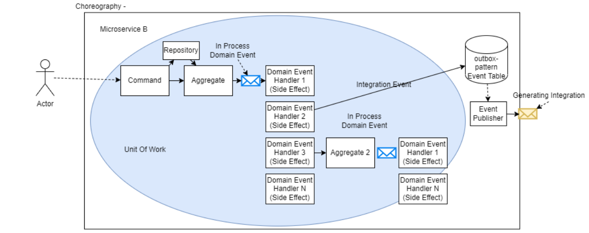
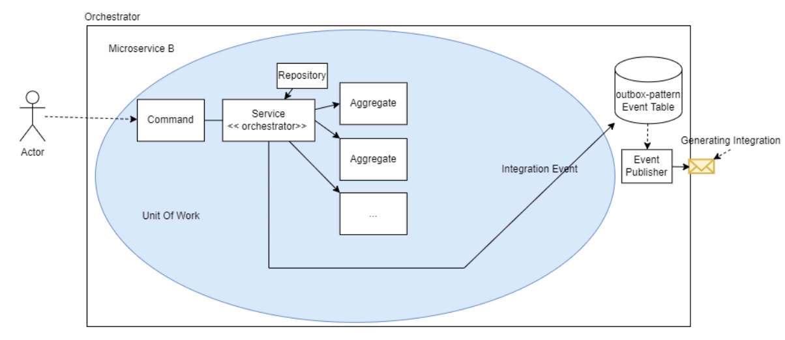
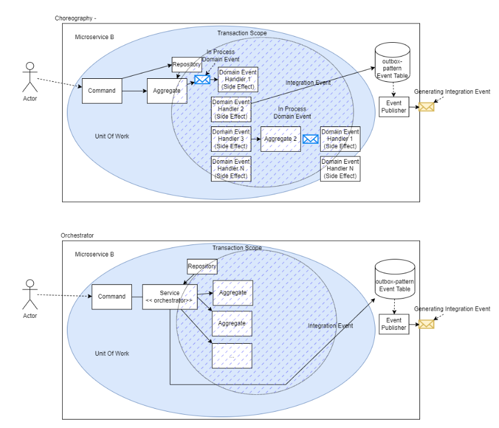
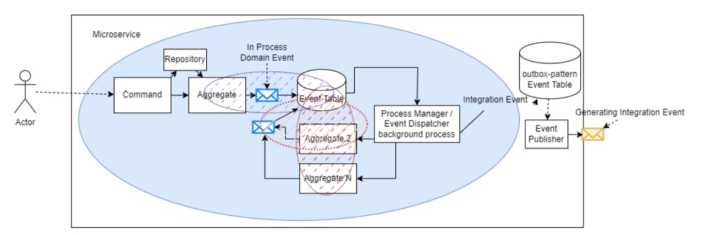

# Communication within micro-service

Date: 2022-07-22

Designing a DDD based microservice may require to intiate code in multiple places. Sometimes it has to call other aggregates to perform some required actions. There are different strategies to make such calls, like sagas, orchestration based code, or choreography based code implemented through events.

# Choreography-based 
In this approach the communication between the aggregates is based upon events. An aggegate execute an action and then raise an event, that event could trigger any action by another aggregate, which may raise another event, that again can conclude to another action to be taken by another aggregate. Any event handler may raise an integration event to be handled externally using outbox pattern. 



## Pros
* There is no code coupling an asynchronous communication
* Domain events will be defined at domain level, where aggregates will trigger required event
* There is a good place to put more side effect for any event in event handler 
* System is event based, the event handler is one that deals with event manage next actions to be taken for any event 

## Cons
* Lesser control for the code flow
* Since the code triggers against the events, lesser readability for the developer
* This can fall into cycle as the event is triggered by different aggregates that can form a loop and keep trigger events and handle in a loop.

# Orchestration-based 

In this approach there is a service that received a client command, it calls the aggregate to take some action. After taking action action on aggregate 1, it calls the other aggregate to take action and so on, all the required aggregates are called one by one. After executing a particular action an integration event can be raised through outbox pattern. 



## Pros
* A well controlled approach orchestrator service will know which step it is and which action is being taken, the sequence is monitored by the service
* There is less chance of executing any unknown action.
* More readable code flow because orchestrator service will be in the middle of the command.

## Cons
* The flow of code is fixed in orchestrator service
* Side effect can not be injected, everytime to make any change the flow needs to be changed in orchestrator service
* The domain layer will not raise events for other aggregates, so the aggregate will perform an action and then will not initiate anything, since its orchestrator service which is deciding the next action

# Handling Transactions
Another concern over here is the scope of transaction related to one command. The command coming from front-end may need to require to call many aggregates. Should all this be done through one transaction and commit transaction at the end, or every aggregate should be treated into a separate transaction and should not depend upon the a global transaction.

Both of these above mentioned approaches can support single transaction, so all the changes in all the aggregates will either commit or rollbacked. That increases data consistency.



There is a design recommendation that the aggregate should be designed to complete one operation in a single transaction, there should not need to have another aggregate to be included in the same transaction. For operations that span multiple aggregates it is recommended to raise domain events, and implement eventual consistency. Which is an added complexity in the system and especially when we are with in the same service. A good compromise could be to rely on domain events to make changes in other aggregates and do it in the same transaction.
It should be ensured that there is no cycling situation with in the aggregate events. General rule is one should try to avoid changing the state of an aggregate directly from within another aggregate.

# Hybrid approach

This approach is much like the choreography, where the aggregate raises event of any operation. But the implementation is different, where its not handling the event at the same time, instead it puts event into a table. There is a separate process that reads from the event table and creates the command for the next aggregate. This process is a background process that keeps running, it is the one that can raise intgration event if needed for the required operation. This process acts as a central place for controlling all the events.



## Pros

* It supports the single transaction per aggregate 
* Follows the design concept of domain to raise event for any action that needs to be propagated
* Helps in refactoring, if new microservices are created to segregate aggregates, then the process manager can keep working since event handler and event raiser are separate now.
* Code is much readable due to placing a separate process of process manager

## Cons
* Increases complexity with the invention of process manager a separate service
* Event handling is dependent upon the new background service process manager, if its down/not running the aggregates are only producing events
* There could be multiple connections to the same DB, one from the service and another from the background service to update the status of events
* There is still chance of cyclic events processing between the aggregates.
*  If the event is not being processed then a compensation transaction may need to be created.
* An overhead of retaining the event and managing the state may be needed to keep track of all the system events and outcome
* Need to ensure the Process manager idempotent

## Recommendations


## Resources
- [1](https://vaadin.com/blog/ddd-part-2-tactical-domain-driven-design)  by Petter Holmström
- [2](https://microservices.io/patterns/data/saga.html) by Chris Richardson's
- [3](https://github.com/eventuate-tram/eventuate-tram-core) by Chris Richardson's
- [4](https://github.com/eventuate-tram/eventuate-tram-core-dotnet) by Chris Richardson's
- [5](https://www.youtube.com/watch?v=VvUdvte1V3s) by Jimmy Bogard

## brain storming session

HTTP Request -> Command -> under transaction behavior -> [Handler Implementation here] Modify 1 aggregate -> under transaction behavior


HTTP Request -> SAGA/Orchestrator service
    - Command -> under transaction behavior -> [Handler Implementation here] Modify 1 aggregate -> under 
    transaction behavior
    - Query -> under transaction behavior -> Read Modify 1 aggregate -> under transaction behavior
    - Command -> under transaction behavior -> [Handler Implementation here] Modify 1 aggregate -> under transaction behavior
    - Command -> under transaction behavior -> [Handler Implementation here] Modify 1 aggregate -> under transaction behavior
    - {CATCH EXCEPTION}


| Layer | Component | Just-do-it | 1 UoW/AG | 1 UoW/CH | SAGA (PR) | SAGA (Logic App) | SAGA (BPMN) |
| - | - | - | - | - | - | - | - |
| In/Out of process | | IN | IN | IN | IN/OUT | OUT | OUT | 
| Application | Command Handler | 1 | 1 | 1 | | | | 
| Domain | Aggregate | 1 | 2+ | 2+ |  | | | 
| Infrastructure | Repository/Service | 1 | 2+ | 2+ |  | | | 
| Infrastructure | Unit Of Work | 1 | 1/AG (2+) | 1/CH | | | | 
| Result |  | ✅ | ⚠️ | ✅ | | | | 
| Mitigation |  | Full rollback support | Compensation in command handler | Full rollback support | | | | 


Questions:
- [Where do we start the saga?](https://stackoverflow.com/questions/39030419/where-to-invoke-sagamanager-in-cqrs-even-handling)
- 1 unit of work per aggregate or 1 per command handler?
- Can we nest commands within command handlers? (we most likely want to avoid, TBD)
- Can we nest queries within command handlers? (we most likely want to avoid, TBD)
- Can we nest queries within query handlers? (we most likely want to avoid, TBD)


Option 1:
```
REST -> Send CreateOrderCommand
            - Handler: - Repo Saves order aggregate
                       - Send CreateBuyerCommand
                            - Repo Saves buyer aggregate

REST -> Send CreateBuyerCommand
            - Handler: Repo. Save buyer aggregate
                      - Verify Buyer Payment Options

```
Option 2 (preferable):

```
REST -> Send CreateOrderCommand
            - Handler: - Repo Saves order aggregate
                       - Repo Saves buyer aggregate
                       - Verify Buyer Payment Options

REST -> Send CreateBuyerCommand
            - Handler: Repo Saves buyer aggregate
                      - Verify Buyer Payment Options
```