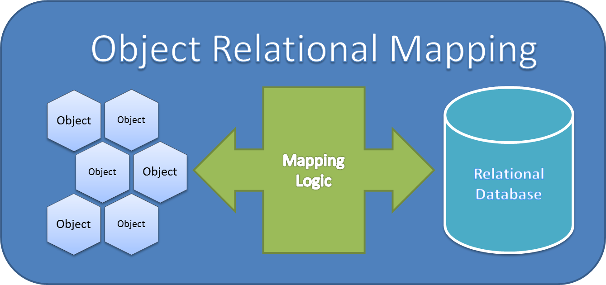

# Comparison of ORMs

Date: 2022-04-29

An object-relational mapper (ORM) provides an object-oriented layer between relational databases and object-oriented programming languages without having to write SQL queries. It standardizes interfaces reducing boilerplate and speeding development time.

# Why ORM
ORM tools are popular with OOP developers because they minimize the amount of SQL knowledge required to connect a database to an application. ORMs also automatically generate the SQL code, allowing you to focus on generating business logic. There are four significant benefits of using object-related mappers to manage the interface between applications and databases.

* Writing data-access code is time-consuming and doesn’t add a lot of value to the application’s functionality. It’s essentially the plumbing of the code. 
* Simplified development because it automates object-to-table and table-to-object conversion, resulting in lower development and maintenance costs
* Less code compared to embedded SQL and handwritten stored procedures
* Transparent object caching in the application tier, improving system performance
* An optimized solution making an application faster and easier to maintain
* Since the code generated by the ORM is well-tested, you do not need to spend as much time testing the data-access code. Instead, you can focus on testing the business logic and code.
* A well-written ORM will implement design patterns to force you to use best practices for application design.

# Choosing ORM

There are a number of ORMs in the market. Following are some popular ORMs. Since our development environment is .Net, we will be analyzing these ORMs with respect to implementations in .net.

## EntityFramework Core
Entity Framework (EF) Core is a lightweight, extensible, open source and cross-platform version of the popular Entity Framework data access technology. EF Core can serve as an object-relational mapper (O/RM), which:

- Enables .NET developers to work with a database using .NET objects.
- Eliminates the need for most of the data-access code that typically needs to be written.

## N-Hibernate
NHibernate manages the transfer of plain .NET objects to and from a relational database. NHibernate creates SQL for loading and storing objects based on an XML description of your entities and relationships.

# Micro ORM
## Dapper
Dapper is a micro ORM or it is a simple object mapper framework which helps to map the native query output to a domain class or a C# class. Its known as king of the micro-orms, it is a high performance data access system. Using Dapper, it is very easy to fire a SQL query against database and get the result mapped to C# domain class.
### Pros
* Good performance and efficient
* Much adopted in the .Net community, backed by stack overflow

### Cons
 * Old style query expression to be used

## RepoDB
RepoDb is a new hybrid micro-ORM for .NET designed to cater the missing pieces of both micro-ORMs and macro-ORMs (aka full-ORMs). It was also designed to simplify the micro-ORM coding experience and at the same time maintaining the performance and efficiency of the application.

### Pros
* It provides query expression and fluent style, so your experience is a combination of both Dapper and Entity Framework.
* Good performance than dapper in some scenarios
* Supports 2nd level cache, bulk and batch operations
### Cons
* Join statement is not straight forward
* Not much adopted by the community 

## LINQ 2 DB

LINQ to DB is the fastest LINQ database access library offering a simple, light, fast, and type-safe layer between your POCO objects and your database. Architecturally it is one step above micro-ORMs like Dapper, Massive, or PetaPoco, in that you work with LINQ expressions, not with magic strings, while maintaining a thin abstraction layer between your code and the database. Your queries are checked by the C# compiler and allow for easy refactoring.

### Pros
* Good developer experience by using LINQ expressions, instead of writing SQL queries in the code
* Very good community support
### Cons
* Performance could be slower than dapper.

|Micro-ORM | Stars| Downloads | License| github |
|--|--|--|--|--|
|Dapper|14.9k|142M|GNU General Public License v3.0 or later|https://github.com/DapperLib/Dapper|
|repoDB|1.4k|448.7k|Apache License 2.0|https://github.com/mikependon/RepoDb|
|linq2db|2.3K|3.9M|MIT|https://github.com/linq2db/linq2db|

Dapper is known by its performance, here is a simple comparison with EF Core. Simple query results for a run with 10 Sports, 10 Teams per Sport, and 10 Players per Team.

|ORM Type \Avg. Exec. Time (ms) |Player by ID|Roster by Team ID|Team Rosters by Sport ID|
|--|--|--|--|
|EF Core w/ Tracking|2.00|1.29|6.45|
|EF Core w/ No Tracking| 1.47|0.69|4.53|
|Dapper|0.13|0.31|1.11|
|LINQ2DB||||

### Common Feature Comparison
Micro ORMs perform only a subset of the functionality of full-blown Object Relations Mappers. From the following table it can be seen the deficiencies of a micro ORM compared with the ORM.
|Features|EF Core|NHibernate|Dapper (Micro ORM)|
|--|--|--|--|
|Change Tracking|✅|✅|❌|
|SQL Generation|✅|✅|❌|
|Lazy Loading|✅|✅|❌|
|Support different Database providers|✅|✅|✅|
|Code first approach|✅|❌|❌|
|Database Migrations|✅|❌|❌|
|Caching|✅|✅|❌|
|Async Operations|✅|✅|✅|
|Batch Processing|✅|✅|❌|
|Work with Stored Procedures|✅|✅|✅|
|Shadow property (Entities that are part of DB schema, but not mapped in the class model)|✅|✅|❌|

## ORMs Feature Comparison
Different ORMs support different features and for comparison, listed below are the known and commonly used features of the different ORMs and its convenient output.
|Features|EF Core|NHibernate|Dapper|
|--|--|--|--|
|DBs|The Entity framework Core supports SQL Server, SQL Lite, MySQL, PostGreSQL,Cosmos DB.|NHibernate support SQL Server, SQL Server CE, Oracle Database, Inges, PostgresSQL, MySQL, DB2, Sybase, Informix, SQLite, Firebird, ODBC(open-source connectivity), or OLE (Object Linking and Embedding)DB.||
|Configuration and mappings|EF uses code first approach (fluent) configuration and attribute based mapping. It can map public and non-public properties or fields.|NHibernate has both fluent and XML configurations and mappings. It also supports attribute based mapping by using the NHibernate Attributes.  NHibernate provides **custom conventions**||
|Mapping|EF can map non-public members, properties, and fields and both provide a notion of value types.|NHibernate also can map non-public members, properties, and fields and both provide a notion of value types||
|Concurrency|EF Core can use a ROWVERSION/TIMESTAMP column on SQL Server, or any of a list of columns, when updating a record.|NHibernate offers richer capabilities, besides SQL Server ROWVERSION/TIMESTAMP, it can also use database native mechanisms such as Oracle’s ORA_ROWSCN, but also timestamp or version columns.||
|Table Inheritance|Entity framework supports single table inheritance /Table per class hierarchy.|NHibernate provides Single table inheritance, Class table inheritance, Concrete table inheritance.||
|Caching|Entity Framework supports **first level** caching i.e. it is only available during the lifetime of a transaction. You can cache the result of the selected queries.|NHibernate supports** first and second level** of caching through distributed cache provider which includes ASP.NET Cache, NCache, Redis, SysCache, etc.||
|Validation|Entity Framework uses Data Annotations that can validate the entities by adding one or more attributes to the properties in it.  It can be applied on any entity class or a property to override the default behavior.|NHibernate uses NHibernate Validator to perform validations or you can use a legacy approach i.e. by implementing interfaces.||
|Collections|Collections in EF Core are simple: just lists, which means, one-to-many. There is no support for many-to-many yet.|Both one-to-many and many-to-many associations are supported.||
|Migration|EF Core has the migrations API, which is quite interesting. You can list all the versions of a schema, apply one explicitly or go back to a previous version.|NHibernate can do basic database generation and schema update – automatic or upon request.||
|Ease of use|EF Core is very easy to use, generally well documented, and this is something where NHibernate is far behind.|As of now, it can only be used in relatively simple scenarios – just consider the lack of support for table inheritance strategies||

### Platforms	
|Features|EF Core|NHibernate|Dapper|
|--|--|--|--|
||The Entity framework has multiple DLL in NuGet packages. Entity framework provides dependencies are brought along as needed.|NHibernate is a single DLL that is distributed through NuGet with no other dependency.||
||Entity framework builds on .Net core and provided features like logging and dependency injection and its internal components.|NHibernate doesn't use dependency injection therefore a way of replacing service is quite different from service to service.||
||EF  use DbContext which includes mapping and configuration information and exposes all APIs and communicates with the database.|NHibernate uses a configuration object and it produces a session factory.which are lightweight abstractions encapsulating an ADO.Net connection||

## Advantages of NHibernate over EF
Following are the some main advantages of NHibernate over EF.

* Entity framework requires additional connections to handle databases other than MSSQL, which NHibernate provides.
* In terms of data loading, SQL generation, custom column types, custom collections, and so on, NHibernate can be modified. However, the entity framework has limited extension points.
* The Entity Framework does not enable lazy loading for scalar attributes like BLOB and CLOB, but NHibernate does.
* Support for row deletion in a cascade fashion is available only in NHibernate.
* Preload, Postload, Update, and Delete are also available in NHibernate.
* Second-level cache support is available in NHibernate.

## Advantages of EF over NHibernate 
Here are some strong points of EF Core where it is ahead of NHibernate
 * Because of metadata preparation, NHibernate takes longer to start than the Entity Framework.
 * EF Core provides a stable migration API
 * EF Core provide dependency injection, while NHibernate doesn't use dependency injection 
 * Ease of use, and no extra learning curve for dev team

 ## Popularity in .Net Community
 Following the current trends:
 * EF Core is much more adopted by the .net core community
 * NHibernate has 21M downloads as compared with 412.6M downloads for EFCore.
 * Entity Framework Core with 8.01K GitHub stars and 2.05K forks on GitHub appears to be more popular than NHibernate with 1.65K GitHub stars and 826 GitHub forks
## Resources
[1] https://www.partech.nl/en/publications/2021/08/what-is-nhibernate-and-how-is-it-different-from-entity-framework  
[2] https://stackify.com/entity-framework-core-nhibernate/#:~:text=EF%20Core%20can%20use%20a,also%20timestamp%20or%20version%20columns.
[3] https://www.ifourtechnolab.com/blog/entity-framework-vs-nhibernate-understand-similarities-and-differences
[4] https://leardapper.com 
[5] https://exceptionnotfound.net/dapper-vs-entity-framework-core-query-performance-benchmarking-2019/
[6] https://github.com/nhibernate/nhibernate-core
[7] https://github.com/dotnet/efcore?ref=stackshare
[8] https://blog.devgenius.io/why-choose-repodb-orm-over-dapper-da87432c7830

