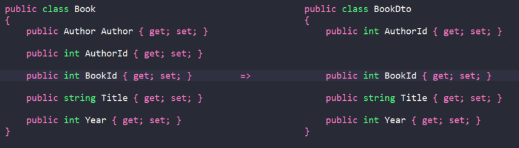

# Comparison of Object Mapper Libraries

Date: 2022-04-18

Mappers solve the common problem of writing mundane and repetitive code when assigning values between objects.  Three different mapping libraries are evaluated to give an idea of common themes and some differences which might be relevant for your development needs.

# What problem Object Mapper Solves
Object to object mapping is the process of assigning values from one object to another.  This is common in a layered architectures, particularly those developed using an ORM framework such as Entity Framework Core.  There can be many instances in application code where there is a requirement to translate data between the underlying entity model classes and data transfer objects (DTOs).  Another case where object mapping is used is between DTOs, typically from a Web API to view model classes in MVC web application. 

Mapping code is quite mundane and repetitive to write and a well adopted solution is to use a mapping library.  Mapping libraries generally work by matching members in objects and through object graphs by using a set of conventions based on name and in some cases type too.

# Object Mapping Libraries
There are a number of object mapping libraries, here are top popular and well known libraries being compared.

## AutoMapper
AutoMapper takes a low-configuration approach and is designed to be used in dependency injection scenarios such as in ASP.NET Core applications.

AutoMapper demands a configuration which can be divided into profiles and validated.  The library can perform a scanning operation to include all profiles when the configuration is built.  It creates an expression tree which can be inspected during debugging using an extension to view.
## AgileMapper
AgileMapper is a zero-configuration, highly-configurable object-object mapper with viewable execution plans.Members are matched on a set of name and type rules.  If the type doesn’t map, no extra config is required to prevent errors.

Execution plans are formed by creating an expression tree and compiling to a function, these are then cached.  These plans can be cached upfront and also viewed. The execution plans can be validated during development.
## Mapster
Mapster is another zero-configuration object-object mapper that matches by name.  Once more, it supports configuration that configuration can be validated. It uses an extension method which is available on any object to perform the mapping operation.  Another extension method provides a convenient way of passing in values at runtime during mapping.

Mapster boasts good performance according to its own GitHub project page and compares itself with other libraries favourably. The code repo also provides a tool to create DTO classes and extension methods from entity classes which can generate code and save time.

### Popularity
In terms of current usage AutoMapper is by far the most popular and established mapping library from the three selected.
	
||AgileMapper|AutoMapper|Mapster|
|--|--|--|--|
|NuGet Version|1.8.1|11.0.1|7.3.0|
|Total Downloads|555k|250m|5.6m|
|Daily Average Downloads|164|61k|2.2k|
|GitHub Stars|407|8.7k|2.5k|

### Ease of use
All three were simple to understand and to setup using NuGet.  In terms of usability, Agile Mapper and Mapster were easier than AutoMapper as neither have a requirement for configuration.   

Getting started is similar for all three libraries:

1. Install package
2. Have source and destination types to map
3. Create configuration (required for AutoMapper)
4. Create instance (required for AutoMapper)
5. Perform some mapping!

Agile Mapper and Mapster both offer a static API, something that AutoMapper removed in v9. Mapster is slightly different to the other two as it provides an extension method for the mapping operation. This is a convenient feature and feels natural to use.

`Mapster`
> `var destObject = sourceObject.Adapt<Destination>();`

`AutoMapper`
> `var destObject = Mapper.Map(sourceObject).ToANew<Destination>();`

`agileMapper`
> `var destObject = Mapper.Map(sourceObject).ToANew<Destination>();`

### Ease of configuration

All libraries are designed to work with dependency injection with configuration that is created once as a start-up operation.  This will provide the application with a compiled set of mappings leading to a performance gain.
Configuration can be easily loaded as all the libraries provide a way of scanning for configuration classes, which is especially useful in larger codebases.

### Collections
AutoMapper and AgileMapper initialised empty collections when no value was to be mapped.   This behaviour is good practice as collections are expected to be initialised. Mapster didn’t do this and returned nulls as default behaviour.

### Mapping
All three libraries performed straightforward mapping based on matching names.  They also performed reverse mapping, although AutoMapper required configuration for this to work.

### Flattening
All three support flattening by convention without any special configuration when the destination names followed a simple pattern.
> For example:  source.Author.StarRating will map to dest.AuthorStarRating.

### Nested objects
All three supported mapping an object graph without any additional configuration.  AgileMapper has a dedicated Flattening API with some useful functions such as flattening an object to a dictionary or query string parameter list.
All three support IQueryable projections.  This is a convenient way to map an entity object directly to the destination DTO when working with EF Core.
### Performance
Mapster boasts of superior performance compared to AutoMapper due to its pre-compilation strategy. However, all the libraries work in a similar way using compiled expression trees which are then cached for future execution.

## Resources
[1] https://github.com/MapsterMapper/Mapster 
[2] https://github.com/agileobjects/AgileMapper
[3] https://github.com/AutoMapper/AutoMapper/
[4] https://www.thereformedprogrammer.net/
[5] https://www.innovensa.co.uk/blog/comparison-of-object-mapper-libraries#:~:text=Mapster%20boasts%20of%20superior%20performance,then%20cached%20for%20future%20execution.
[6] https://www.youtube.com/watch?v=UIslFVEHkzA&t=462s