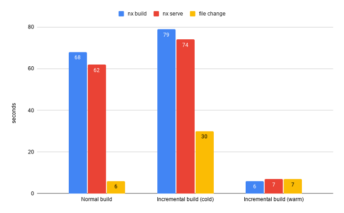
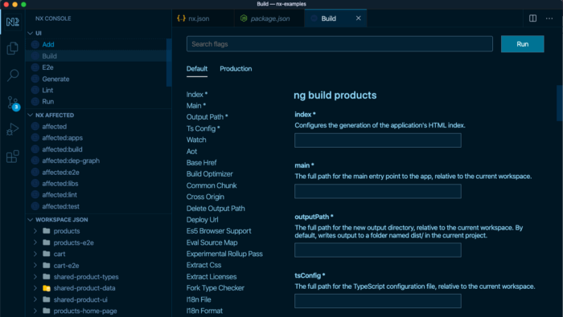

# 2. Code structure: Nrwl Nx as default tool to support our monorepo strategy

## Status

|Status|Date|Validated by|
|------|----|------------|
|Proposed|02/08/2022|O.Ktata|
|Accepted|02/08/2022|Synergy|

## Context

The right tool is required to fully benefit from a monorepo style workspace.
Multiple tools are available with different philosophies. Some promoted by big companies to manage billions of files. Others are meant for open source communities that mostly rely on publishable packages. Our requirements for a monorepo tool is based on our current development environment at pratt, the objectives of the ERA initiative and the ability to adapt quickly to future needs. Furthermore, the tool has to be fast, extensible and provide the best DX possible. Like any tool or platform that we adopt, it needs to be supported by a strong community. The ultimate goal is to address the enterprise concerns that developers face in large scale projects as efficiently as possible.
To know more about the comparison between the main players in the monorepo realm, their strengths and weaknesses, please refer to the references section below.

## Decision

To start our journey in the monorepo world, we decided to adopt Nrwl Nx as a tool to leverage our mono repo strategy. 

```
Future work:
We will keep an eye on the Lerna new capabilities and integration with Nx since Lerna is now maintained by Nrwl (since May 2022). The goal is to complement our vision of easy sharing of code in case we are required to manage packages between product lines repos.
```

## Consequences

Because of the advantages that Nx provides, the benefits for FE developers will be huge. Here are some of the most important ones:

- It provides modern tools to the FE developer allowing them to work more effectively and efficiently. It supports, out-of-the-box, the best tools and linters that are more robust than the ones delivered with default Ng CLI (JEST/Cypress/ESLint vs Karma/Protractor/TSLint).

- Computation caching improves performance. Unchanged files will never be compiled again. The result is much faster builds and continuous integration.  

    

- Better editor Support & GitHub Support:
  
    

- Simpler APIs with Nx and Nx Devkit: The Nx Devkit is much simpler and easier to use. It can be used in conjunction with Angular Devkit.

- Nx Update solves a lot of the issues related to ng Update  and more.Not only does nx migrate update you to the latest version of Nx, but it also updates the versions of dependencies that we support and test such as Jest and Cypress. You can also use the        migrate command to update any Nx plugin. More on this [Updating with Nx](https://nx.dev/l/a/core-concepts/updating-nx).

- Better support for Micro-Front-Ends: Nx provides the same dev experience for many frameworks including Angular and React. You can build Angular apps, Next.js apps, share code between them. You can build portals out of Angular and React microfrontends. You can share org-specific code generators, lint checks, CI/CD setup.

## Resources:
[1] [code structure-part-1-mono-repos-vs-poly-repo](../documentation/code%20structure-part-1-mono-repos-vs-poly-repo.md)

[2] [code-structure-part-2-mono-repos-with-nx](../documentation/code-structure-part-2-mono-repos-with-nx.md)

[3] [code-structure-part-3-working-with-Nx-Schematics](../documentation/code-structure-part-3-working-with-Nx-Schematics.md)

[4][Nx is Modern Angular](https://blog.nrwl.io/nx-is-modern-angular-bda6cf10746d)