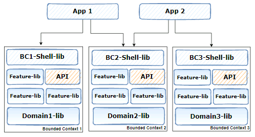

# 07. Architecture: Shell library as entry point to bounded contexts
## Status

|Status|Date|Validated by|
|------|----|------------|
|Proposed|02/08/2022|O.Ktata|
|Accepted|02/08/2022|Synergy|

## Context
As per Nrwl recommendation, apps needs to be thin and rely solely on feature-libraries to provide functionality. Thus, it's important to make sure that low level details about every bounded context stays separate from the app. One way to achieve this is through a facade/shell library. 

A shell provides the entry point for a bounded context. The feature-shell library is the orchestrator of the first level routes in bounded contexts [1]. 

The responsibility of the shell is to be the glue that organizes all features in a given bounded context.

## Decision
We will add a shell library per bounded context that will serve as entry point.
## Consequences

- Each application brings the entire functionality of the desired Bounded Contexts by configuring their routes through the shell libraries.
- It is the application's job to include the slices of the domain that match its needs.
