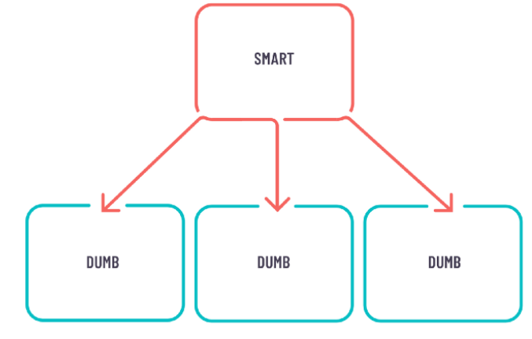

# 08. Architecture:container-presentation pattern as default pattern when creating components
## Status

|Status|Date|Validated by|
|------|----|------------|
|Proposed|02/08/2022|O.Ktata|
|Accepted|02/08/2022|Synergy|

## Context

Enterprise large-scale applications requires conventions and patterns to keep code clean and collaboration smooth between all developers.
One of the most popular design patterns in Component-Based Front-end frameworks is the container-presentation pattern a.k.a Smart-dumb component.

The smart component acts as the parent of the dumb one and it handles all data manipulations. So it registers to the store, it maps, filters, reduces and then provides data to the child component. It also retrieves events from user interactions and decides how to modify the state depending on the type of action [1].

The dumb component has only two responsibilities:
- Present given data
- Notify the parent component about any raw user interaction, such as clicking a button.

As a rule of thumb, it's best to create as few smart components as possible and create as many dumb components as possible. This will make components easier to test and more reusable.
More details on the supporting documentation.

## Decision

Container-presentation pattern will be the defacto pattern when creating components. Naming conventions will enforce the use of this pattern. Please refer to 'the coding style and conventions' documentation in the high-level documentation [3].

## Consequences

- Better separation of concerns. This will result on more readable and easier to maintain libraries.
- Better reusability. You can use the same presentational component with completely different state sources, and turn those into separate container components that can be further reused [2].
- Presentational components are essentially your app’s UI library. All components could be tweaked by providing the right inputs.
- Code easier to test: Smart components will be tested using Unit tests while dumb components are meant to be tested in isolation with Storybooks.
- Work can be split based on dumb or smart components. For instance, senior developers could work on the smart component where back-end data retrieval services is required, while junior developers could focus on the look and feel of the UI components.
- The overall performance  of the app is improved because of the reliance on the OnPush Strategy that reduces the change detection cycles. In fact, the onChange lifecycle hook is triggered only when the input of the presentational component changes.
## Resources

[1] [Enterprise Smart-Dumb components](https://generic-ui.com/blog/enterprise-approach-to-the-smart-and-dumb-components-pattern-in-angular)

[2] [Smart-Dumb Components](https://medium.com/@dan_abramov/smart-and-dumb-components-7ca2f9a7c7d0)

[3] [High-level architecture](../documentation/architecture-part-1-high-level-architecture.md)