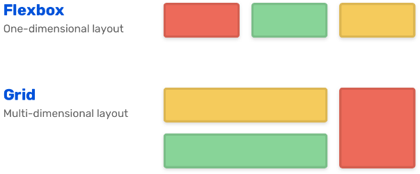
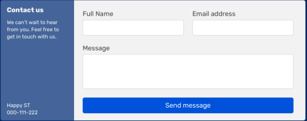

# 72. UI Theme:CSS Grid and Flex-box models?

Date: 2022-04-06

## Status

|Status|Date|Validated by|
|------|----|------------|
|Proposed|23/04/2022|O.Ktata|
|Accepted|----------|Synergy|

## Context
Flex Box and CSS Grid are two layout models that serve different purposes. It's important to know what each of them has to offer before choosing one or the other for a specific use case. 

The fundamental difference between the two models is the lays on the **dimensional aspect** they both cover[1]. Since both models are not mutually exclusive, it's very easy to use both of them at the same time depending on the use case.

**FlexBox**: It's a **One Dimensional model**. The elements in a flex layout follow the main axis (column or row). Usually, if the component to design has all of its child items displayed inline, then it's best to use flexBox. FlexBox is seen as the right choice for small components. Here is an example[2]:

**Css Grid**: It's a **Two Dimensional** model. It works on both axis. If aligning elements has to reason about both Vertical and Horizontal positioning then this system is the right choice for such use cases. CSS Grid is seen more suitable for large UI components or pages. Here is an example[2]:

Here are some on-line tools helping you to design you CSS grids and flex:
-CSS Grid
https://grid.layoutit.com/
https://tburleson-layouts-demos.firebaseapp.com/#/docs
- Flex
https://angrytools.com/css-flex/
https://the-echoplex.net/flexyboxes/
## Decision
We will be combining both models depending on the use case.

**Flexbox** will be used to line up UI elements in one direction. Example of use cases:
- Form elements such as input with buttons and labels.
- Navigation Bars with menus and logos.
- Tabs or Bottom menus that provide actions that fits in one line either on top or at the bottom.
- Card Component layout. The card can be later used in a CSS Grid to display a list of cards.
- Rows in a grid or a list that represent one item to display.

**CSS Grid** will be used to line up UI elements in two directions. Example of use cases:
- Page layouts that requires organizing sections such as Main, Sidebar, Header, Footer,etc.
- Card grids such as dashboards or List Views with Tiles.
- Section Layout for a complex form.
  
## Consequences

By supporting both models we get the best of the two Worlds. 
With both models applied correctly we will have[3]:

- Perfect Alignment
- Major browser support
- Easy item arrangement
- Adjustable track sizes
- Content overlapping protection

# Resources
[1] https://webdesign.tutsplus.com/articles/flexbox-vs-css-grid-which-should-you-use--cms-30184
[2] https://ishadeed.com/article/grid-layout-flexbox-components/
[3] https://www.positronx.io/css-grid-layout-holy-grail-angular-ui-tutorial/