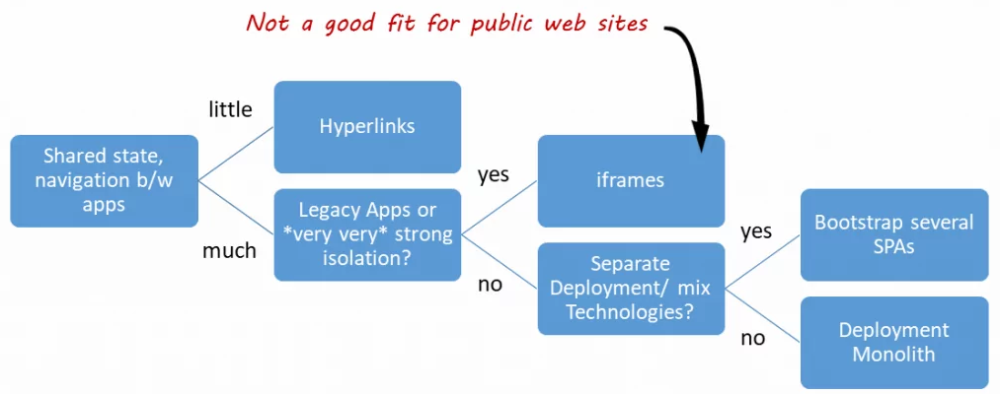

From Netflix:
A UI composed of other dependencies is nothing new; it’s something all modern web applications do today. The traditional approach of bundling dependencies at build time lacks the flexibility we need to empower our stakeholders. We want external dependencies to be resolved on-demand from any number of sources, from another application to an engineer’s laptop.
This led us to the following **high level objectives**:

- Low Friction Adoption: Encourage reuse of existing front end code and avoid creating new packages that encapsulate UI functionality. Applications can be difficult to manage when functionality must be shared across packages. We would leverage an approach that enabled applications to extend their core functionality using common, and familiar, React paradigms.
- Weak Dependencies: Host applications could reference modules over https to a remote bundle hosted internally within Netflix. These bundles could be owned by teams outside of RGT built by already adopted standards such as with Webpack Module Federation or native JavaScript Modules.
- Highly Aligned, Loosely Coupled: fully align with the standard frameworks and libraries used within Netflix. Plugins should be focused on delivering their core functionality without unnecessary boilerplate and have the freedom to implement without cumbersome API wrappers.
- Metadata Driven: Plugin modules are defined from a configuration which could be injected at any point in the application lifecycle. The framework must be flexible enough to register, and unregister, plugins such that the extensions only apply when necessary.
- Rapid Development: Reduce the development cycle by avoiding unnecessary builds and deployments. Plugins would be developed in a manner in which all of the context is available to them ahead of time via TypeScript declarations. By designing to rigid interfaces defined by a host application, both the plugin and host can be developed in parallel[1].
## Benefits of Micro FE Architecture
Adhering to Mirco-FE architecture would provide you various benefits:

- Maintainable small code base
The frontend code base will be divided into smaller frontends which is more easier to maintain. In addition to that, the Decoupled codebase minimizes the ability to propagate a bug from code change to the whole application. (I would suggest to avoid or minimize the coupling between micro frontends. Coupling between micro frontends would make implementation and decision a nightmare for developers.)

- Incremental upgrades
This smaller codebase would allow you to update or even rewrite your application in an incremental manner which you found almost impossible in a monolithic frontend. Hereafter, the development team can adapt to a new frontend technology even the starting point of the application was much older technology. Which you may upgrade in a later phase of the development cycle.

- Independent deployments
Micro frontends can be deployed independently (Just as a typical microservice). This would give us more chances to minimize the scope of effect when a deployment happens to the frontend and even easy to debug or identify what went wrong after a deployment.

- Autonomous teams
The decoupled codebase would allow development teams to develop and deploy independently. This is a huge plus point when you have several teams to develop one application.

## Challenges Encountered
However, there are a few challenges of using micro frontends architecture,

- Initial application payload size
Since every micro application is going to duplicate dependencies and several code lines, the initial app load time size for an application would be higher. The overall application size would be larger than a monolithic application. (It is obvious since every micro app would contain duplicated dependencies n times)

- Difficulty to local development
Since micro frontends cannot initialize without the container application local development needs both applications to run simultaneously. In addition to that, the codebase of a micro application is slightly different than a usual application thus, developers need to code changes to start a micro application independently. (Even though an application could work separately, depends on the framework or the technology used for micro frontend implementation, developers need to do few code changes to start application separately in local)

- Operational and governance complexity
It is obvious since we divided the monolithic repository into smaller repositories the development team needs more testing, more pipelines, and resources to operate the application.

- Shared data/communication between applications
In an ideal scenario a micro frontend should act independently, But practically we found many cases where we required to communicate back and forth between micro applications. (such as shared data about the authentication/token details, a variable that should update and effect to every micro frontend, etc.). Even though we expect micro applications to develop independently at one point we might need to share some details between applications. (We can discuss this in a later article to deep dive in these challenges of micro frontend architecture).

## How to implement it
Implementing microfront-end could be done by leveraging a myriad of technologies depending on the use case and your current development stack.

### Client-Side
- Web Components - Web components are a concept of creating custom dom elements. They are like widgets that can be imported into the application.
- Javascript integration - Frameworks like Single-SPA will help you to implement micro frontends using a javascript library.
- iFrame - You can use iframes to inject an application. This is not a recommended approach.
## Server-Side
- Zalandos solution - https://www.mosaic9.org/
- Facebook’s big pipe - https://www.facebook.com/notes/facebook-engineering/bigpipe-pipelining-web-pages-for-high-performance/389414033919/
Apart from all the examples given above you could custom tailor a solution for your need as you please. However, we chose Single-SPA for our requirement since we were working with serverless applications and the minimum learning curve.

Manfred Steyer propose this decision tree to help you decide whether MFE is the right choice for you and what are the high level alternatives you can use instead [3]:

## From Domains to Microfrontends
Let’s assume you’ve identified the sub-domains for your system. The next question is how to implement them. One option is to implement them within a large application – aka a deployment monolith. The second is to provide a separate application for each domain. Such applications are called micro frontends[3].

# Resources
[1] https://netflixtechblog.com/how-we-build-micro-frontends-with-lattice-22b8635f77ea
[2] https://dailyjsx.com/micro-frontends/
[3] https://www.angulararchitects.io/aktuelles/a-software-architects-approach-towards/
[4] book: enterprise-angular.pdf: https://www.angulararchitects.io/en/book/
[5] https://medium.com/@0saurabhgour/getting-started-with-micro-frontends-1ae450b76392
[6] https://indepth.dev/posts/1485/the-micro-frontend-chaos-and-how-to-solve-it