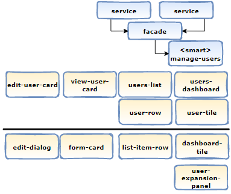

# Summary

This documentation is one of a series of documents centered towards the proposed FE architecture. This documentation helps you better understand the proposed architecture and all its underlying decisions.

|ADR|Name|
|---|---|
|[ADR-0006](../decisions/0006-arch-strategic-ddd.md)|Strategic DDD to identify and isolate sub-domains|
|[ADR-0007](../decisions/0007-arch-shell-pattern.md)|Shell Pattern|
|[ADR-0008](../decisions/0008-arch-container-presentation-pattern.md)|Container-Presentation pattern|
|[ADR-0009](../decisions/0009-arch-push-based-architecture.md)|Push-based arhitecture|
|[ADR-0010](../decisions/0010-arch-facade-pattern.md)|Facade pattern|
|[ADR-0011](../decisions/0011-arch-onion-architecture.md)|Onion architecture|
|[ADR-0012](../decisions/0012-architecture-SCAMs.md)|SCAM-Standalone Components|
|[ADR-0013](../decisions/0013-arch-push-based-configuration.md)|Push-Based configuration|
|[ADR-0014](../decisions/0014-architecture-assets-libraries.md)|Asset libraries|
|[ADR-0015](../decisions/0015-architecture-high-level-architecture.md)|**High-Level architecture**|

# Architectural Foundation
## Importance of FE architecture
The front end development is getting just as complex as the backend development[1]. Front-end technologies and architecture choices are pivotal to improving the perceived quality and user experience of software applications [6]. Following the right principles and guidelines, development teams can architect, design and develop sustainable solutions. With the support of a monorepo style workspace, powered by Nx, we are putting ourselves in a good position to succeed.

## Foundational principles and patterns
Before presenting the final architecture and its corresponding code structure, we recommend that you learn more about the architectural principles and patterns that led to it. These are the main topics that drove our core architectural decisions:

1. Using DDD strategic design;
2. Applying Shell pattern;
3. Applying the Container/Presentation component pattern;
4. Following a reactive programming through push-based architecture;
5. Applying the Facade pattern along with RxJS observables;
6. Following the onion architecture design principle.
7. Applying Single Component Angular Module(SCAMs) pattern
--------
8. Micro Front-End with Module Federation (own topic).
9. Back-End for Front-End (BFF) (own topic)
10. Asset library design
11. Push-based configuration library design

Here are the supporting documents covering these topics:

|Document|
|---|
|[Part-1-high-level-architecture](../documentation/architecture-part-1-high-level-architecture.md)|
|[Part-2-DDD](../documentation/architecture-part-2-DDD.md)|
|[Part-3-shell-pattern](../documentation/architecture-part-3-shell-pattern.md)|
|[Part-4-container-presentation-pattern](../documentation/architecture-part-4-container-presentation-pattern.md)|
|[Part-5-push-based-architecture](../documentation/architecture-part-5-push-based-architecture.md)|
|[Part-6-facade-pattern](../documentation/architecture-part-6-facade-pattern.md)|
|[Part-7-onion-architecture](../documentation/architecture-part-7-onion-architecture.md)|
|[Part-8-SCAMs-Standalone](../documentation/architecture-part-8-SCAMs-Standalone.md)|

## Why different ADRs for one architecture to rule them All?

Each ADR covers an aspect of the final architecture. Each decision has its own rationale and solve a specific problem. If better ways of solving the same problem that an ADR is solving becomes possible, we can easily evaluate alternatives and possibly upgrade the architecture. Thus, a new ADR could supersede the old one without affecting the other decisions. By doing so, every decision can evolve separatly from the others. A good Example is the SCAM pattern that is superseded now by the new standalone component introduced with Angular 14. 

# Final Architecture and corresponding code structure
Here is an overview of the final FE architecture based on the core areas presented earlier:

The proposed code structure will be implemented on top of Nx Workspace which provides us with nice capabilities. Please refer to the Workspace documentation to know more about Nx (section: Code Structure).

## 1. From Strategic DDD
Strategic design brings a lot of value when splitting a large system into multiple single responsibility libraries.

- **Sub-Domains/Bounded contexts**: Inside the libs folder, every bounded context will have a dedicated subfolder. A library will contain all components related to a specific bounded context. This high level container will include all domain related concepts: Booking, ordering, boarding, etc.

## 2. From Shell pattern
- A special Library called a **feature-shell** will represent the entry point of the bounded context. The shell will include the routing to all routable child components in the bounded context.
 
 

## 3. From Nx team and Manfred Steyer recommendations

Nx puts **Apps** and **libs** in different folders. It's recommended to make apps very thin and put all logic inside libraries.

- Every **app** will only depend on shell libraries belonging to bounded contexts that will compose the app.

To reduce the cognitive load, we recommend to categorize libraries as follows:

- Feature libraries: Implements a use case with smart components and use-case specific UI components.

- Shared library: a special library will be dedicated to all shared helper functions(Util) and use-case agnostic UI components (dumb components).

- data-access: Implements data accesses, e.g. via HTTP or WebSockets.
The data access layer will follow the domain,application,infrastructure pattern from the onion architecture and as designed by Manfed Steyer:

## 4. From Onion architecture:
Domain, application and infrastructure layers will be enforced in the final architecture to enforce the stability principle allowing for a highly maintainable and reusable code.

Features inside a bounded context have a dependency on domain services and models.

The domain library will contain 3 subfolder:

- Entity/Domain: It represents the entity (for FE it's more a viewModel) to be displayed. Do not confuse this Entity with the the Entity object in the real back-end. The back-end is still the unique source of truth. Back-End entities are the one that will be ultimately stored in a database.

- Application: Includes facades serving the smart components in each feature libraries. Facades will be injected to components.
  
- The Infrastructure layer: It includes the low level services that connects to the Back-End usually through HTTP client. In our architecture all calls should go to a BFF.

As shown in this diagram, bounded context libraries are natural candidates for MFE. In this scenario a dedicated BFF will be provided for each MFE.

### From following OHS pattern
- Every bounded-context will include a Barrel (**index.ts**) that includes all components, directives or modules that could be imported by other bounded contexts. This represents our implementation of the OHS pattern from DDD as described by Eric Evans.

### From Container-Presentation pattern
This pattern is a must-have. It allows for bette reusability through encapsulation.In one hand, smart components deals with data access and business logic. In the other hand, dumb components focus only on presentational logic.

A **Shared library** will hold all 'very dumb' UI components that will easily be shared by all projects because they are use-case agnostic.
- Dumb components that are use-case related will be exposed through the public API/Barrel (index.ts).

The diagram below show the integration of smart components with the application layer (from onion architecture).It also shows the two types of presentational components:

### From Push-based architecture
The whole data flow will be based on RxJs streams through a push-based architecture. This will allow for :
A push-based architecture allows for:

- Optimized Data-Delivery: Long-lived streams allow us to deliver data at any future time. And with careful stream construction, we can optimize the delivery through each stream to only emit data when that specific data source has changed.
- Aggregate Data-Delivery: We can also dramatically simplify view layer complexity and re-rendering by aggregating our streams into a single output stream.

### From Facade pattern
We will be adding a facade in front of our smart components to hide all the complexity of the data services.
The push-based architecture will be exposed through this facade. This means all necessary streams for the smart component will be available through the facade and used reactively. Here is an example of such facade:

### From assets library
Every app needs to manage static files: Styles, images, etc. Traditionally, these are stored in the Asset folder and accessed directly by the application.
In our architecture based on the Nx workspace, a special library will be dedicated to each app in the mono-repo to provide access to all the required assets. 

Another library will be dedicated to the configuration 

- Special libraries for assets, styles as LazyDK proposed.
### Configuration libraries
How configuration will be served is inspired from this work: 
- https://medium.com/angularlicious/use-rxjs-to-push-configuration-to-angular-libraries-1c47830cc394

### Access to assets library

### Access constraints
These are the core rules and tags for the proposed architecture:

1. Application
2. BFF project
3. Shared Libraries: Tags: [type:UI]
4. Asset Library:
5. Util libraries:
6. under every BC: Feature libraries: Tags:[scope:<bounded-context>,type:feature]
7. under every BC: Configuration Library:Tags:[scope:<bounded-context>,type:feature]

These are the core rules:
Rule 1: Lib with **Tag:app** only depends on:
1- Libs with Tag: Shell
2- Project with Tag: BFF (implicit dependencies)
3- Libs with Tag: Assets
3- Libs with Tag: Configuration
Rule 2: 

More tags could be identified in order to better enforce the architecture inside a specific BC. New rules could be added based on the new tags. However, the core rules should not be altered. Example: inside a bounded context, you can limit access to a specific feature or component from other features even though the core rule says that a feature type can access any feature inside same bounded context. Such rule can implement: sourceTag: feature-A cannot depend on feature with tag: feature-B.

### Variation to coding conventions
Most of the coding standards will come from the angular team's styles guide.

However, for clarity, we will be adding few conventions tailored to our own architecture and workspace code structure:
- Every feature library is prefixed by **feature**
- A folder named **shared** for all use-case agnostic UI components. 
- A folder named **util** for utility services. These services that are project agnostic (i.e.:AuthN and AuthZ utility libraries).
- Model suffix to entities in domain layer()i.e: book.model.ts
- For every bounded context (specif folder):
  - A special library to hold **configuration**.
  - A special library to hold **assets** 
  - A **shared** folder holding use-case reusable UI components. The UI components should contain a reference to the domain in the name and the type of ui .i.e.: users-list-view, user-detail-card, roles-select.
  - 

# Resources

[nx] nx Supporting documentation:

[1] https://khalilstemmler.com/articles/typescript-domain-driven-design/ddd-frontend/
[2] https://www.youtube.com/watch?v=h-F5uYM69a4&t=479s
[3] https://deviq.com/principles/stable-dependencies

[5] https://dev.to/this-is-angular/emulating-tree-shakable-components-using-single-component-angular-modules-13do
[6] https://www.gartner.com/doc/4012589?ref=AnalystProfile&srcId=1-4554397745
[7] SCAMs for better architecture:https://www.rainerhahnekamp.com/en/angular-standalone-components-and-their-impact-on-modularity/
[8]Good practices:https://nx.dev/guides/monorepo-nx-enterprise