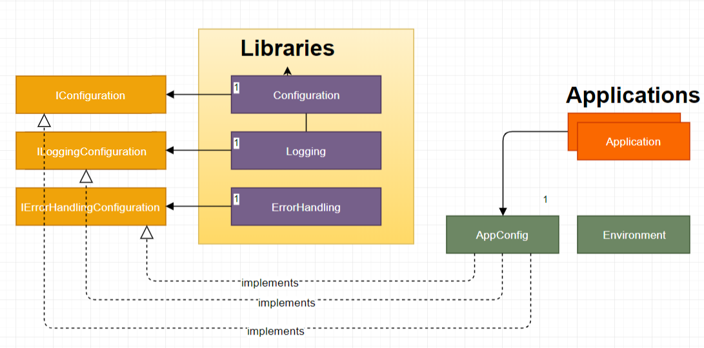

one of the difficulties is getting the configuration to these libraries. This post will demonstrate how an Angular application can provide configuration to Libraries in an Angular Workspace environment. 

# configuration with libraries workspace
Angular libraries in the Workspace cannot access the environment context. Applications reference and use libraries — and Angular Libraries may reference and use other libraries. If libraries had access to the environment context it would cause a circular dependency.
One of the main tenets of developing reusable libraries is to keep them generic enough to be reused by many applications and libraries. Therefore, the next evolution of the target library is to create a configuration for elements that can vary. Therefore, libraries need configuration.

Note: Not all library projects need configuration, but when they do, they prefer it pushed.
# architecture

## How to provide Strongly-Typed Configuration to Angular Libraries ?
Here is what needs to happen to enable configuration for libraries.

1. each library will define its own configuration schema or object type;
2. each library will define an interface for the structure of the specific configuration;
3. each library will subscribe to publish events of configuration;
4. library configuration will be pushed to libraries;
5. each library has the responsibility to validate the configuration provided;
6. each library has the responsibility to define default values for any required items;
7. each application will retrieve the configuration;
8. a service will provide the mechanism to publish configuration to library subscribers.

The main goal is to use a push strategy. The libraries should not pull or request their own configuration. It is not their responsibility to have such knowledge. Therefore, we will let the libraries react to published events of configuration when applications provide it.

The configuration Service will be the mediator between apps holding configuration data and libraries that needs that data.

## What makes this solution extensible?
### 1. Configuration Context

The context gets injected everytime

### 2. Interface driven
To allow decoupling between the apps and the libraries, configuration interfaces will be provided by each bounded context. an IConfiguration interface will be the container for all these BC configurations.

# Resources
[1] https://medium.com/angularlicious/use-rxjs-to-push-configuration-to-angular-libraries-1c47830cc394