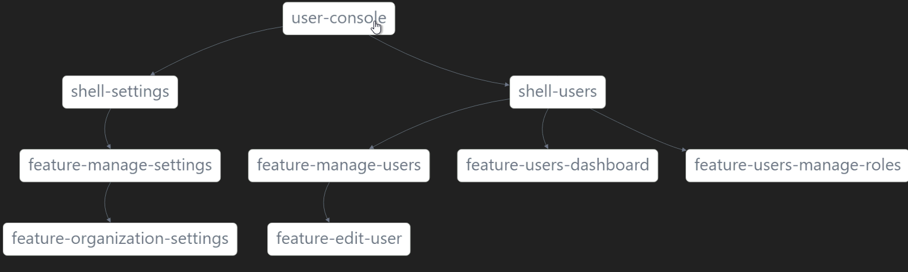

# Summary
This documentation supports this ADR:
|ADR|Name|
|---|---|
|[ADR-0007](../decisions/0007-arch-shell-pattern.md)|Shell library as entry point to bounded contexts|

# Shell pattern

We will use the shell pattern to increase decoupling between the apps and internal feature libraries.
There are different ways of implementing this pattern[1]. We will be following Manfred Steyer [1] [2]:

```
For an application that contains multiple domains, a shell provides the entry point for a domain
The feature-shell library is the orchestrator of the first level routes.
```


- The responsibility of the shell is to be the glue that organizes all features in a given bounded context.
- Shell libraries don’t **orchestrate** the complete application routes and features. They only arrange the routes and features of a **single Bounded Context**. 
- Each application brings the entire functionality of the desired Bounded Contexts by configuring their routes through the shell libraries.
- It is the application's job to include the slices of the domain that match its needs.

```
const routes: Routes = [
  {
    path: 'settings',
    loadChildren: () =>
      import('@pwc/settings/shell').then((m) => m.ShellSettingsModule),
  },
  {
    path: 'users',
    loadChildren: () =>
      import('@pwc/users/shell').then((m) => m.ShellUsersModule),
  },
  { path: '', redirectTo: 'users', pathMatch: 'full' },
  //{ path: '**', redirectTo: 'home', pathMatch: 'full' },
];
Here is an example showing the shell pattern in action:
```
 

# Resources

[1] https://medium.com/angular-in-depth/the-shell-library-patterns-with-nx-and-monorepo-architectures-d7ec5713c8a6
[2] Enterprise Angular, 4th edition, Manfred Steyer https://www.angulararchitects.io/en/book/
