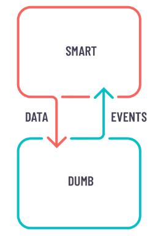
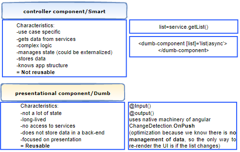
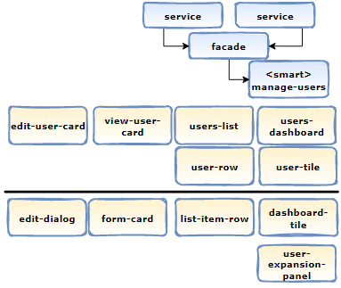

# Summary

This documentation supports this ADR
|ADR|Name|
|---|---|
|[ADR-0008](../decisions/0008-arch-container-presentation-pattern.md)|Architecture:container-presentation pattern as default pattern when creating components|

# What is the Container-Presentation pattern (a.k.a.Smart/Dumb component)
After identifying domains/bounded contexts using strategic DDD. It's time to dig deeper in more concrete patterns that will simplify even more the developer's life and make the code much more decoupled thus more reusable and easier to maintain.

The first one of these patterns is the container-presentation components pattern  also knows as Smart/dumb component.
The dumb component is a simple component that has only two responsibilities which are to **present given data** and to **notify its parent** about any raw user interaction, such as clicking a button.

The smart component acts as the parent of the dumb one and it **handles all data manipulations**. So it registers to the store, it maps, filters, reduces and then provides data to the child component. It also retrieves events from user interactions and decides how to modify the state depending on the type of action.

**Smart components**:
- Are connected to facades and services.
- Know how to load data and how to persist change.
- Coordinates presentational components and connect them to the state.
- handles events emitted by presentational components.
  
**Dumb components**:
- Are stateless
- Are fully defined by their bindings. Data comes in as @inputs and changes get out as @output.
- Are easy to test since they communicate only through inputs and outputs.
- Easy to reuse since they contain no logic.
  
- As a rule of thumb, it's best to create as few smart components as possible and create as many dumb components as possible. This will make components easier to test and more reusable.
- Smart components are to be tested using Unit tests while dumb components are meant to be tested in isolation with Storybooks.

here is how these two concepts fit in the overall architeture:

## Advantages
- Better separation of concerns. The app is more readable.
- Better reusability. You can use the same presentational component with completely different state sources, and turn those into separate container components that can be further reused.
- Presentational components are essentially your app’s UI library. All components could be tweaked by providing the right parameters.
- Presentational components could be tested in isolation of the Business (use-case) logic.
# Resources
[1] [Enterprise Smart-Dumb Components](https://generic-ui.com/blog/enterprise-approach-to-the-smart-and-dumb-components-pattern-in-angular)
[2] [Smart-Dumb Components](https://medium.com/@dan_abramov/smart-and-dumb-components-7ca2f9a7c7d0)