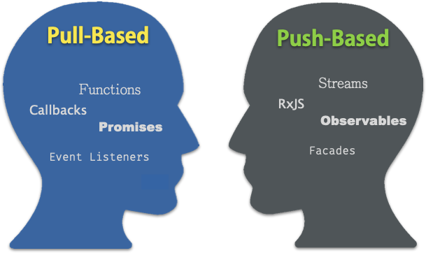
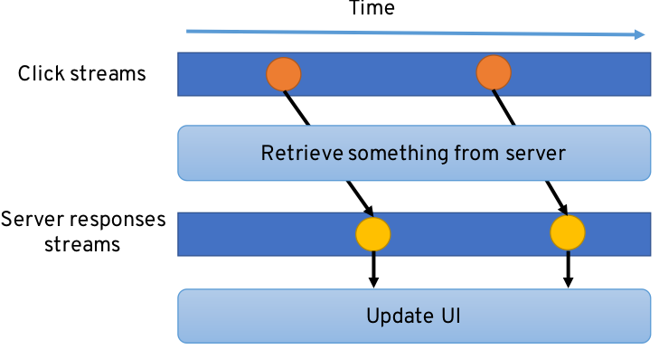
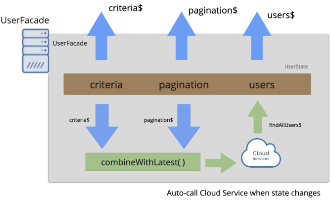
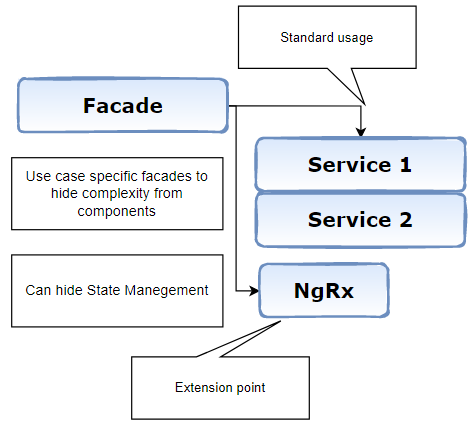
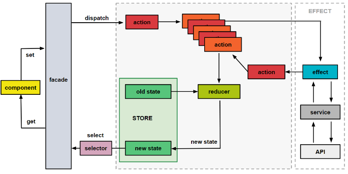

# Summary

This documentation supports this ADR
|ADR|Name|
|---|---|
|[ADR-0009](../decisions/0009-arch-push-based-architecture.md)|Architecture: Push-based driven architecture|

# Towards push-based architecture with RxJS
Let's start from the beginning. 
## Declarative vs Imperative programming
**Declarative programming** : is a programming paradigm that expresses the logic of a computation(What to do) without describing its control flow(How to do it).
Example: A SQL Select or a LinQ statement.

**Imperative programming** : is a programming paradigm that describes computation in terms of statements that change a program state. The imperative programs can be dually viewed as programming commands or mathematical assertions.
Example: procedural statements leading to the end result.

Takeaway: 
In declarative programming, you describe what you want without commanding the program the way you want it.

In imperative programming, you want a certain way and you give the program clear instructions to do it your way.

## Reactive programming
Reactive programming is a type of declarative programming. It's a design paradigm that relies on asynchronous programming logic to handle real-time updates to otherwise static content. It provides an efficient means -- the use of automated data streams -- to handle data updates to content whenever a user makes an inquiry[4].

Reactive programming creates software that responds to events rather than solicits inputs from users.

In angular, reactive programming means heavy reliance on streams more specifically RxJS streams. This library provides all we need to manipulate data streams, from subscribing to streams to receive data and combining streams with high order functions. It's very powerful and makes the UX very intuitive and fast. In the other hand, reactive programming requires a major mindset shift from developers that are used to more traditional approaches to programming.



Developers needs to understand the principles of reactive programming in order to design efficient and resilient applications.



Applying reactive programming in angular means that UI components (smart or dumb) will react to changes without worrying where the change comes from or how to get it. They simply listen to RxJS streams.
## pull-based architecture
With Pull-based architecture, the views will explicitly call service methods to force-reload (aka ‘pull’) the data. This is the traditional approach employed by most developers[1].

## Push-based architecture


## Facades (content shared with ddd Domain layer)
Facades are a programming pattern in which a simpler public interface is provided to mask a composition of internal, more-complex, component usages[1] .
As an intermediary, it ensures that communication or access to the individual components of a subsystem is simplified, thereby also minimizing direct dependence on these components. It delegates the client calls in such a way that clients need to know neither the classes nor their relations and dependencies.
[5]



For example, using a Facade, to wrap and blackbox NgRx, simplifies accessing and modifying the NgRx state by hiding all internal interactions with the Store, actions, reducers, selectors, and Effects.
This diagram shows how a facade can abstract away the complexity of collaborating with a state management solution such as NgRx:


A smart component could look like this when directly interacting with a state management solution:

When implementing the facade pattern, the code is much cleaner and the Liskov principle is very easy to implement in case we want to change the state management solution:

The facade implementation that we propose has to be an Observable Based API.This means that the facade will fully support a push-based architecture.
As consequence, the facades will have observable properties and its methods will return observables. Using observables allows external consumers (eg view components) to get notifications whenever the state changes. This way consumers do not need to poll or guess if the state has changed[3].

Using RxJS and facades will results:
- Manage search criteria and search results; outside the view layer
- Reduce imperative logic used in the view layer
- Data-push API that supports asynchronous data changes and notifications

As much as possible, we want our view components to be simple renderers and delegate events (user interactions, state changes, etc) to non-view components.
- Views render data emitted from data providers, and
- observables work as streams of data that can be pushed to views (aka observers).
### advantages
- Optimized Data-Delivery
Long-lived streams allow us to deliver data at any future time. And with careful stream construction, we can optimize the delivery through each stream to only emit data when that specific datasource has changed:
```
export class UserFacade {  
  users$      = this.state$.pipe(map(state => state.users), distinctUntilChanged());
  criteria$   = this.state$.pipe(map(state => state.criteria), distinctUntilChanged());
  pagination$ = this.state$.pipe(map(state => state.pagination), distinctUntilChanged());
  loading$    = this.state$.pipe(map(state => state.loading));

  /** Update internal state cache and emit from store... */
  private updateState(state:UserState) {
    this.store.next(_state = state); 
  }
}
```
- Aggregate Data-Delivery
We can also dramatically simplify view layer complexity and re-rendering by aggregating our streams into a single output stream.
```
export class UserFacade {
  
   /**
   * Viewmodel that resolves once all the data is ready (or updated)...
   */
  vm$: Observable<UserState> = combineLatest(
      this.pagination$,
      this.criteria$,
      this.users$,
      this.loading$
    ).pipe(
    map( ([pagination, criteria, users, loading]) => {
      return { 
        pagination, 
        criteria, 
        users, 
        loading 
      };
    })
  );

}
```
Whenever any of the the individual streams (eg pagination$ users$, etc) emit values, the vm$ will re-emit an updated viewModel with current values.
# Resources
[1] https://thomasburlesonia.medium.com/push-based-architectures-with-rxjs-81b327d7c32d

[2] https://medium.com/default-to-open/understanding-a-large-scale-angular-app-with-ngrx-80f9fc5660cc

[3] https://medium.com/angular-in-depth/angular-you-may-not-need-ngrx-e80546cc56ee

[4] https://www.techtarget.com/searchapparchitecture/definition/reactive-programming#:~:text=Reactive%20programming%20describes%20a%20design,a%20user%20makes%20an%20inquiry.

[5] https://nerd-corner.com/how-to-build-a-push-based-architecture-in-angular-facade-design-pattern/