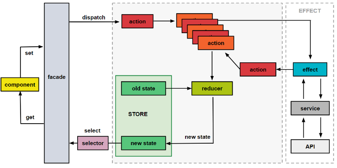
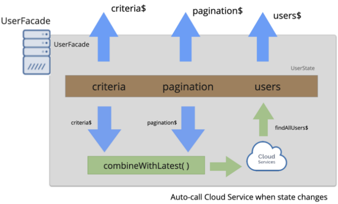

# Summary

This documentation supports this ADR
|ADR|Name|
|---|---|
|[ADR-0010](../decisions/0010-arch-facade-pattern.md)|Architecture: Facade pattern in front of Smart component|
## Facades
Facades are a programming pattern in which a simpler public interface is provided to mask a composition of internal, more-complex, component usages[1] .
As an intermediary, it ensures that communication or access to the individual components of a subsystem is simplified, thereby also minimizing direct dependence on these components. It delegates the client calls in such a way that clients need to know neither the classes nor their relations and dependencies[5].

Before looking at the value of the facade pattern and how it's implemented in the angular context, we need first to distinguish between the different strategies used by a smart component to get their state. For the full picture on state management in Angular please refer to the right documentation related to State management.

In a nutshell, state is the data that the application manipulates or display. There are three types of state:
- Server state: back-end data
- Application state: data shared across the whole app.
- Page-Specific state: data relevant only for a specific page.
To determine the correct location where the state should be stored, you need to determine **how many pages** does the state affect and for **how long**.

At the application level, Angular provide different ways of managing state:
- Storing state in services;
- Storing state in a Store (one component in NgRx);
- Storing state in a dedicated library such NgRx or NGXS;
- Storing state using URL and routing;
- Storing data at the component level.

For example, using a Facade, to wrap and blackbox NgRx, simplifies accessing and modifying the NgRx state by hiding all internal interactions with the Store, actions, reducers, selectors, and Effects.
This diagram shows how a facade can abstract away the complexity of collaborating with a state management solution such as NgRx:



When implementing the facade pattern, the code is much cleaner and the Liskov principle is very easy to implement in case we want to change the state management solution:


## Facade with push-based architecture
The facade implementation that we propose has to be an Observable Based API.This means that the facade will fully support a push-based architecture.



As consequence, the facades will have observable properties and its methods will return observables. Using observables allows external consumers (eg view components) to get notifications whenever the state changes. This way consumers do not need to poll or guess if the state has changed[3].

Using RxJS and facades will results:
- Manage search criteria and search results; outside the view layer
- Reduce imperative logic used in the view layer
- Data-push API that supports asynchronous data changes and notifications

As much as possible, we want our view components to be simple renderers and delegate events (user interactions, state changes, etc) to non-view components.
- Views render data emitted from data providers, and
- observables work as streams of data that can be pushed to views (aka observers).

For more information on how the facade will be architected, please refer to push-based-architecture documentation.

### advantages
- Optimized Data-Delivery
Long-lived streams allow us to deliver data at any future time. And with careful stream construction, we can optimize the delivery through each stream to only emit data when that specific datasource has changed:
```
export class UserFacade {  
  users$      = this.state$.pipe(map(state => state.users), distinctUntilChanged());
  criteria$   = this.state$.pipe(map(state => state.criteria), distinctUntilChanged());
  pagination$ = this.state$.pipe(map(state => state.pagination), distinctUntilChanged());
  loading$    = this.state$.pipe(map(state => state.loading));

  /** Update internal state cache and emit from store... */
  private updateState(state:UserState) {
    this.store.next(_state = state); 
  }
}
```

- Aggregate Data-Delivery

We can also dramatically simplify view layer complexity and re-rendering by aggregating our streams into a single output stream.
```
export class UserFacade {
  
   /**
   * Viewmodel that resolves once all the data is ready (or updated)...
   */
  vm$: Observable<UserState> = combineLatest(
      this.pagination$,
      this.criteria$,
      this.users$,
      this.loading$
    ).pipe(
    map( ([pagination, criteria, users, loading]) => {
      return { 
        pagination, 
        criteria, 
        users, 
        loading 
      };
    })
  );

}
```
Whenever any of the the individual streams (eg pagination$ users$, etc) emit values, the vm$ will re-emit an updated viewModel with current values.
# Resources
[1] https://thomasburlesonia.medium.com/push-based-architectures-with-rxjs-81b327d7c32d

[2] https://medium.com/default-to-open/understanding-a-large-scale-angular-app-with-ngrx-80f9fc5660cc

[3] https://medium.com/angular-in-depth/angular-you-may-not-need-ngrx-e80546cc56ee

[4] https://www.techtarget.com/searchapparchitecture/definition/reactive-programming#:~:text=Reactive%20programming%20describes%20a%20design,a%20user%20makes%20an%20inquiry.

[5] https://nerd-corner.com/how-to-build-a-push-based-architecture-in-angular-facade-design-pattern/