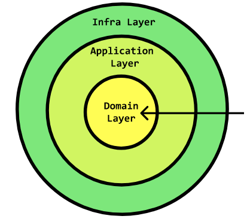
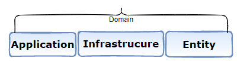

# Summary

This documentation supports this ADR
|ADR|Name|
|---|---|
|[ADR-0011](../decisions/0011-arch-onion-architecture.md)|Architecture: Onion architecture for back-end services|
# 6. Architecting using the onion architecture.
Certainly, the back-end is considered the only source of truth for an application but more and more front-end applications are designed to be smart with some kind of presentational Logic that can become very complex in certain scenarios. Thus the need to better organize its internal components and give a special care to front-end architecture. Early architectural decisions have a profound impact on the quality and ease of development for the remainder of the project's lifespan.

## Stability principle
According to Bob Martin's stable dependencies principle, the dependencies between packages should be in the direction of the stability of the packages. A package should only depend upon packages that are more stable than it is[3]. This principle that is well enforced by the Clean architecture and its concrete implementation: The onion architecture, will be followed when designing the front-end internal components.

Domain, application and infrastructure layers will be enforced in the final architecture to enforce the stability principle allowing for a highly maintainable and reusable code.

In Domain-Driven Design, there are typically three different types of Services you'll encounter:

Application Services: Operate on scalar types, transforming them into Domain types. A scalar type can be considered any type that's unknown to the Domain Model. This includes primitive types and types that don't belong to the Domain.
Domain Services: Operate only on types belonging to the Domain. They contain meaningful concepts that can be found within the Ubiquitous Language. They hold operations that don't fit well into Value Objects or Entities.
Infrastructure Services: Are operations that fulfill infrastructure concerns, such as sending emails and logging meaningful data. In terms of Hexagonal Architecture, they live outside the Domain boundary.
https://badia-kharroubi.gitbooks.io/microservices-architecture/content/patterns/tactical-patterns/domain-application-infrastructure-services-pattern.html

# how to apply the onion architecture to the FE
### Designing Domain
The most important thing in an application is the domain. It is where the main **entities** of the application and their data transformations are. I suggest that you start with the domain in order to accurately represent the domain knowledge of the app in your code.
Following Manfred Steyer recommendations, the domain layer will have 3 parts:
- Entities:
- Application:
- Infrastructure

The transformation functions in the domain should depend only on the rules of the domain and nothing else. Such functions would be, for example:

- a function for calculating the total cost;
- user's taste preference detection;
- determining whether an item is in the shopping cart, etc.

### Designing Application Layer
The application layer contains the **use cases**. A use case always has an **actor**, an **action**, and a **result**.

In the store, we can distinguish:

- A product purchase scenario;
- payment, calling third-party payment systems;
- interaction with products and orders: updating, browsing;
- access to pages depending on roles.

Use cases are usually described in terms of the subject area. For example, the “checkout” scenario actually consists of several steps:

- retrieve items from the shopping cart and create a new order;
- pay for the order;
- notify the user if the payment fails;
- clear the cart and show the order.
The use case function will be the code that describes this scenario.

Also, in the application layer there are ports—interfaces for communicating with the outside world.

TBD: develop on this if required..P1

# Resources
[1] https://dev.to/bespoyasov/clean-architecture-on-frontend-4311
https://github.com/bespoyasov/frontend-clean-architecture/tree/master/src/domain