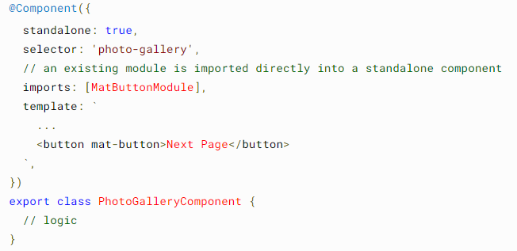

# 7. (needs a PoC) SCAMs (single Component/Concept Angular Modules)
This documentation supports this ADR:
|ADR|Name|
|-|-|
|ADR-000X|[]()|

Close to the metal, this pattern used mostly with Angular to make the components tree-shakable thus reducing the bundle size. For each component, an NgModule that imports only the declarable (components, directives and pipes) used by that specific component is created. Likewise, it only declares and exports that single component [1].

## advantages of SCAMs
- Testing components is easier with SCAMs:
SCAMs import exactly the declarables needed to render a single component template. This makes them useful for component testing, since we won’t have to configure as many options in the testing module or use shallow rendering.

- Identifying unused imports is easier with SCAMs
In an Angular module with many declarations, how will we identify imports that are unused? We would have to go through the component template of every component declared by the Angular module. 
The build optimizer will shake unused declarables from the bundles, but they are unable to exclude entry components. On a side note, we also cannot tree shake dependencies listed in the providers metadata of an Angular module that we import. So too many imported Angular modules might increase our application bundle despite using the build optimizer.

- Using SCAMs, we only have to consider a single component template to check whether we have unused imported Angular modules. For every component, directive, and pipe used in the component template, its SCAM imports another SCAM or a third party Angular module.

- Code-splitting on the component level:
When we scope an Angular module to a single component, we can split our code on the component level. We can do so using lazy loaded routes, the "lazyModule" option in angular.json and dynamic ```import()```s. Alternatively, we can compile a component as a separate library and lazy load it, again by using a dynamic ```import()```.

# Standalone components (Angular 14+)

In v14 and higher, standalone components provide a simplified way to build Angular applications. Standalone components, directives, and pipes aim to streamline the authoring experience by reducing the need for NgModules. Existing applications can optionally and incrementally adopt the new standalone style without any breaking changes[2].


All you need is specify that the component is standalone and then use it as if it was a ngModule.

# Resources
[1] SCAMs for better architecture:https://www.rainerhahnekamp.com/en/angular-standalone-components-and-their-impact-on-modularity/
[2] https://angular.io/guide/standalone-components

