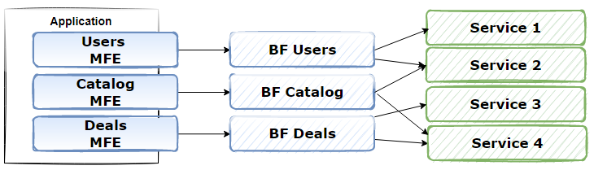

# Backend for Frontend
What: The BFF architecture pattern 1 prescribes the creation of dedicated back-end APIs
for each front-end experience. Because each API is specific to a given user experience, it
can be optimized for that experience. Having dedicated APIs to meet the needs of specific
front ends enables faster iteration. It also reduces the risk of shared API changes causing
unintended side effects across UIs for mobile, desktop or web applications.

When to use: 

Use the BFF pattern when the back-end functionality varies markedly for
each distinct UX. This pattern is also effective when optimizing front-end experiences to
handle specific client requirements — for example, when optimizing for smaller screens on
mobile devices or using custom compression techniques on low-bandwidth networks.
When the BFF pattern is used in conjunction with micro frontends, this extends the
benefits of team ownership all the way to the back end. Although the BFF pattern was
originally conceived to enable dedicated back ends for each front-end experience (web,
mobile and so on), we can apply the same principles to create dedicated “backends for
each micro frontend”:

BFF+MFE https://www.kallemarjokorpi.fi/blog/how-to-build-micro-frontend-architecture-with-web-components-and-bff-part-22.html?_sm_nck=1
API-Led intersting https://www.linkedin.com/pulse/3-layered-api-led-connectivity-phase-digital-balaretnaraja/

A shared or general purpose backend service must be maintained with significant development overhead.
Customizations are made to a general-purpose backend to accommodate multiple interfaces.
An alternative language is better suited for the backend of a different user interface.
## Benefits
Because each backend is specific to one interface, it can be optimized for that interface. As a result, it will be smaller, less complex, and likely faster than a generic backend that tries to satisfy the requirements for all interfaces. Each interface team has autonomy to control their own backend and doesn't rely on a centralized backend development team. This gives the interface team flexibility in language selection, release cadence, prioritization of workload, and feature integration in their backend.[3] 

## API gateway vs BFFs
## Considerations
Code duplication across services is highly likely when implementing this pattern.
Frontend-focused backend services should only contain client-specific logic and behavior. General business logic and other global features should be managed elsewhere in your application.
Think about how this pattern might be reflected in the responsibilities of a development team.
Consider how long it will take to implement this pattern. Will the effort of building the new backends incur technical debt, while you continue to support the existing generic backend?
## BFF and GraphQL
GraphQL and BFF are often conflated and considered alternatives of each other. However,
they are more complementary than mutually exclusive. BFF is not concerned with the
shape of data. As an architecture pattern, BFF can use either REST or GraphQL. GraphQL
can be an effective alternative to using dedicated RESTful APIs while implementing a BFF
approach. In that sense, BFF is a higher-order pattern.
-Quick win: A BFF is a low-stakes way to introduce GraphQL to an
organization. Its surface area is limited to just one application. It
does not require you to actually rewrite any downstream services
or APIs in GraphQL [2].

# Resources
[1] https://dailyjsx.com/micro-frontends/
[2] https://www.infoq.com/presentations/graphql-bff/
[3] https://learn.microsoft.com/en-us/azure/architecture/patterns/backends-for-frontends
[4] https://kuroco.app/blog/api-management/2022/05/05/api-gateway-vs-backend-for-frontend/