# Summary
We will start by presenting the challenges and concerns faced by today's enterprise Teams in aspects related to code structure and application architecture.
Secondly, we will answer the question of what are monorepos and how they are different from what we are doing today namely,polyrepos.
Next, we will present the advantages brought by monorepos and how they aim to address enterprise teams concerns.
Finally, we will end up comparing the most used monorepo supporting tools used today.

This documentation is meant to introduce the monorepo subject in order to better understand the context of these ADRs:

|ADR|Name|
|---|---|
|[ADR-0001](../decisions/0001-code-struct-mono-repo-over-multi-repos-for-fe.md)|Mono repos over multi repo for FE|

# Concerns of Enterprise Teams
Developing applications on a **large enterprise** team is different than developing alone or on a small team. While small groups might be able to get away with ad hoc decisions on **application structure** or **coding best practices**, the same cannot be said when you’re working with dozens or perhaps hundreds of other people. In addition, enterprise teams need to assume that their code will stick around for many years to come. This means they’ll need to do as much work as possible at the beginning of an application’s development to minimize the cost of maintenance down the road.

We can summarize the **concerns of enterprise teams** like this:

- **Consistency** — how do we make sure everyone in the organization (which may be thousands of people) follows the same best practices for structuring and writing code?
- **Safety** — how do we ensure that our code will not be subject to attacks or prone to errors?
- **Increased size and complexity** — how can we structure our code so that it can grow without sacrificing clarity or performance?
- **Changing requirements** — how can we keep up with the demands of the business to continually update the application without letting technical debt get out of control?

## Polyrepo
Before digging deeper on monorepos, let's focus on its 'counterpart': polyrepos.
A polyrepo is the current standard way of developing applications: a repo for each **team**, **application**, or **project**. And it's common that each repo has a **single** build artifact, and simple build pipeline.

The industry has moved to the **polyrepo** way of doing things for one big reason: **team autonomy**. Teams want to make their own decisions about what libraries they'll use, when they'll deploy their apps or libraries, and who can contribute to or use their code.

  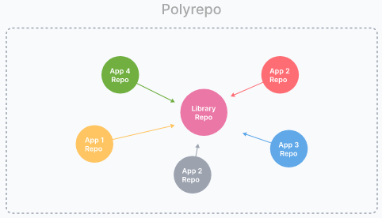

Those are all good things, so why should teams do anything differently? Because this **autonomy** is provided by **isolation**, and isolation **harms collaboration**. More specifically, these are common drawbacks to a polyrepo environment:
## Drawbacks of polyrepo
- **Cumbersome code sharing**: To share code across repositories, you'd likely create a repository for the shared code. Now you have to set up the tooling and CI environment, add committers to the repo, and set up package publishing so other repos can depend on it. To this there will be extra effort on reconciling **Incompatible versions** of third party libraries across repositories.
  
- **Significant code duplication**: No one wants to go through the hassle of setting up a shared repo, so teams just write their own implementations of common services and components in each repo. This **wastes up-front time**, but also increases the **burden of maintenance, security, and quality control** as the components and services change.

- **Costly cross-repo changes to shared libraries and consumers**:Consider a critical bug or breaking change in a shared library: the developer needs to set up their environment to apply the changes across multiple repositories with **disconnected revision histories**. Not to speak about the **coordination effort** of versioning and releasing the packages.

- **Polyrepo Inconsistent tooling**: Each project uses its own set of commands for running tests, building, serving, linting, deploying, and so forth. Inconsistency creates **mental overhead** of remembering which commands to use from project to project.

# What's a mono-repo?
A monorepository is an architectural concept. Instead of managing multiple repositories, you keep all your isolated code parts inside one repository. Bare in mind that **monorepo** has nothing in common with **monolithic apps**. You can keep many kinds of logical apps inside one repo; for example, a website and its iOS app.

## The organizational Change
A monorepo **changes** your organization. It is more than code & tools. A monorepo changes your organization & the way you think about code. By adding consistency, lowering the friction in creating new projects and performing large scale refactorings, by facilitating code sharing and cross-team collaboration, it'll allow your organization to work more efficiently.
|Sharing based on packages|Sharing based on direct access and rules |
|--|--|
||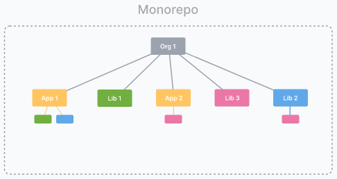|

## Advantages of a monorepo workspace

- **One place to store all configs and tests**. Since everything is located inside one repo, you can configure your CI/CD and bundler once and then just re-use configs to build all packages before publishing them to remote. Same goes for unit, e2e, and integration tests—your CI will be able to launch all tests without having to deal with additional configuration.
- **Easily refactor global features with atomic commits**. Instead of doing a pull request for each repo, figuring out in which order to build your changes, you just need to make an atomic pull request which will contain all commits related to the feature that you are working against.

- **Re-use code with shared projects while still keeping them isolated**: Monorepo allows you to reuse your packages from other packages while keeping them isolated from one another.
- **No overhead to create new projects**: Use the existing CI setup, and no need to publish versioned packages if all consumers are in the same repo.
- **Atomic commits across projects**: Everything works together at every commit. There's no such thing as a breaking change when you fix everything in the same commit.
- **One version of everything**: No need to worry about incompatibilities because of projects depending on conflicting versions of third party libraries.
- **Easier dependency management**: Only one **package.json**. No need to re-install dependencies in each repo whenever you want to update your dependencies.
- **Developer mobility**: Get a consistent way of building and testing applications written using different tools and technologies. Developers can confidently contribute to other teams’ applications and verify that their changes are safe.

Projects are not created equal and monorepos are not a silver bullet. Depending on your specific requirements, the maturity of your company and the ecosystem that your apps/libraries will live in, there will be a different approach to code source control. Here is the spectrum of adoption of different repo paradigms:
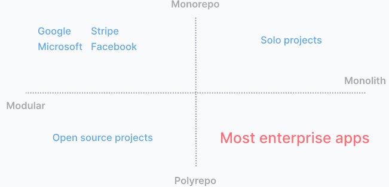
Next, we will be comparing tools that supports monorepos with its different flavors. Some of these tools are more suited for Open Source projects others are more suited for monorepos similar to Google,Meta or Microsoft.
## Need for tooling
Monorepos have a lot of advantages, but to make them work you need to have the right tools. As your workspace grows, the tools have to help you keep it **fast**, **understandable** and **manageable**.
### Fast
- **Local computation caching**: The ability to store and replay file and process output of tasks. On the same machine, you will never build or test the same thing twice.

  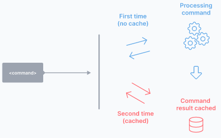
- **Local task orchestration**: The ability to run tasks in the correct order and in parallel. All the listed tools can do it in about the same way, except Lerna, which is more limited.

  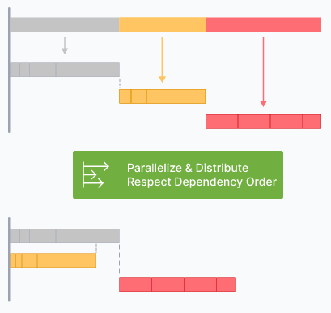
- Distributed computation caching : The ability to share cache artifacts across different environments. This means that your whole organization, including CI agents, will never build or test the same thing twice.

  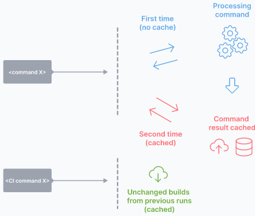
- Distributed task execution:The ability to distribute a command across many machines, while largely preserving the dev ergonomics or running it on a single machine.
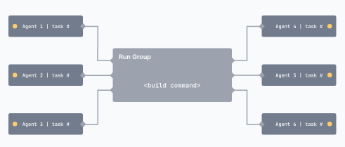
- Transparent remote execution: The ability to execute any command on multiple machines while developing locally.
- Detecting affected projects/packages:Determine what might be affected by a change, to run only build/test affected projects.

  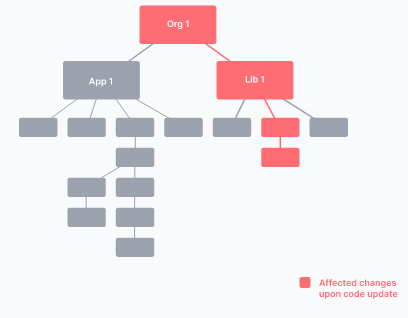
### Manageable
- **Code sharing**: Facilitates sharing of discrete pieces source code. Sharing could be done in different ways. For example, Nx allow any folder of files to be marked as a project and can be shared. Nx plugins help configure WebPack, Rollup, TypeScript and other tools to enable sharing without hurting dev ergonomics. In the other hand Lerna supports it only by sharing npm packages.
  
- **Consistent Tooling**:
The tool helps you get a consistent experience regardless of what you use to develop your projects: different JavaScript frameworks, Go, Rust, Java, etc.
In other words, the tool treats different technologies the same way.
- **Code generation**: Native support for generating code.
- **Project constraints and visibility**:
Supports definition of rules to constrain dependency relationships within the repo. For instance, developers can mark some projects as private to their team so no one else can depend on them. Developers can also mark projects based on the technology used (e.g., React or Nest.js) and make sure that backend projects don't import frontend ones.

    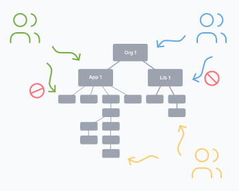
### Understandable
- **Workspace analysis**: The ability to understand the project graph of the workspace without extra configuration.
  
- **Dependency graph**:Visualize dependency relationships between projects and/or tasks. The visualization is interactive meaning you are able to search, filter, hide, focus/highlight & query the nodes in the graph.visualization.
  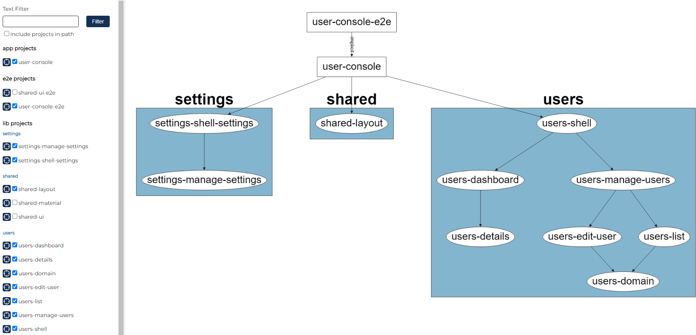

### Tools' comparison
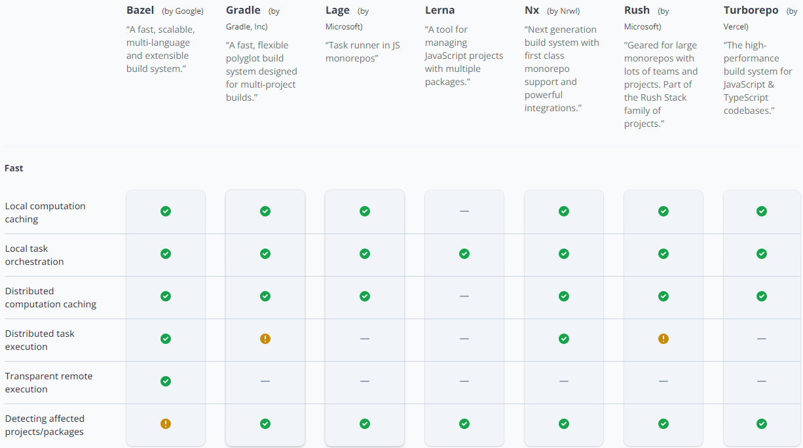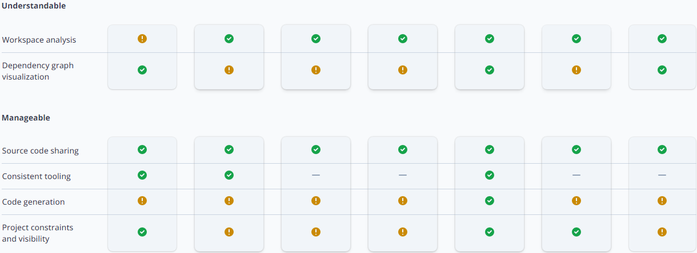

- Sharing components: it becomes harder to share components between projects /apps that evolve separately. One project has interesting UI components that were development using an old version that are very useful to a new project. It's hard to include them unless we migrate the old code to a new version or copy and past. Separately built libraries can be also published as npm packages and reused/consumed by new projects. maintaining those packages is not an easy task. Consumer apps or libraries may need tweaking of those packaged libraries which will inevitably introduce more collaboration between teams which will slow down the development of new components. This most likely will lead to code duplication as the defacto solution in order to move faster.

## Resources
[1] https://www.toptal.com/front-end/guide-to-monorepos#:~:text=A%20Monorepository%20is%20an%20architectural,in%20common%20with%20monolithic%20apps.

[2] https://lerna.js.org/

[3] https://monorepo.tools/#understanding-monorepos

[4] https://stackoverflow.com/questions/67000436/the-difference-between-nx-and-lerna-monorepos#:~:text=Lerna%20is%20focused%20on%20linking,development%20workflow%20for%20multiple%20packages.