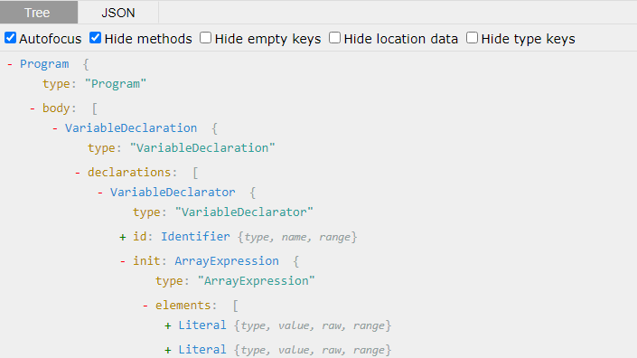
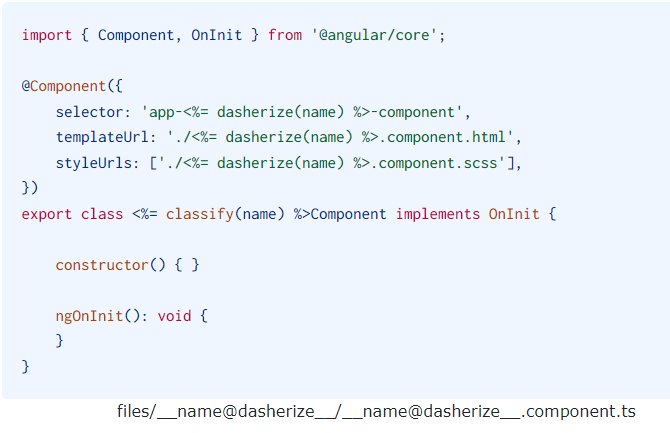

# Summary
This documentation provide an introduction to the world of schematics. It helps you better understand the following ADR:
|ADR|Name|
|---|---|
|[ADR-0005](../decisions/0005-code-struct-create-own-generators.md)|Create our own plugins|

# Introduction

The ultimate goal is to **enforce our architectural decisions** on developers to promote consistency across projects/applications. To help us achieve that we will provide developers with a toolbox that contains reusable components and artifacts that:

- are already styled and themed correctly following our standards.
- are architected the way we wanted it.
- are tested in isolation.
- Safe to use.
- have internal sub-components communications already established and well tested.

Generators provide a way to automate many tasks that are regularly performed as part of our development workflow: 
- Scaffolding out components, features, data access libs, etc.
- Ensuring libraries are generated and structured in a certain way.
- Updating the workspace configuration files.
Generators help standardize these tasks in a consistent, and predictable manner.

Nx provides tooling around creating, and running custom generators from within the workspace or in dedicated workspaces.

There are three main types of generators:
- **Plugin Generators** are available when an Nx plugin has been installed in your workspace.
- 
- **Workspace Generators** are generators that we can create for our own workspace. Workspace generators allow us to implement processes and workflows that are unique to our own organization.
- 
- **Migration Generators** are invoked by Nx plugins when we decide to upgrade Nx to keep the config files in sync with the latest versions of third party tools.

Here is a generator example:

```
nx generate [plugin]:[generator-name] [options]
```
```
nx generate @pwc/angular:master-detail manage-users --project=users
```
## Advantages
The ultimate goal of creating our own schematics is to be more productive and focus on what is really important and not wasting time in boilerplate code that provide less value. The business logic and specific use cases should be the main focus of any developer or business in general.Infrastructure code should be supported by tooling as much as we can.

Custom schematics becomes even more important when architecting large scale applications. It helps architects create more opinionated architectures that guides the developer at every step of their work.

Having all developers sharing and using the same mindset when developing software has tremendous advantages:
- The learning curve is far less steep when the generated boilerplate code guides the developer on how to confidently add functionalities.
- Resources can switch projects more easily when they are familiar with the opinionated architecture.
- Having architectural decisions implemented in the code increases the adoption of good practices and standards when enforced at the code level. Decisions enforced at the documentation level are far less efficient.
- By enforcing decisions at the code level, architects can make sure that performance and security requirements are implemented up-front.
- For the company, using generators for boilerplate code nad components makes estimation of user stories easier and more predictive.

## How to create Schematics in angular using Nx
Nx provides tooling around creating and running custom generators.

### Workspace Generator Utilities

Angular uses **@angular-devkit** to create schematics. The kit includes all low level commands needed to manipulate the workspace and maintain files. Nx has its own devkit.
The **@nrwl/devkit** package provides many utility functions that can be used in schematics to help with modifying files, reading and updating configuration files, and working with an Abstract Syntax Tree (AST).

The devkit rely on Abstract Syntax Tree to navigate through the code structure. A very essentional tool that help working with AST is the [ASTexplorer](http://astexplorer.net)



### Templates
A template is basically the code that we want to generate in a given file except that we need to customize it first. All dynamic content, such as the name of a component, has to be written inside special tags (<%= , %>), to print the value.


Schematics can be added to Nx Console to be easily accessible to developers.

## Resources

[1] https://tomastrajan.medium.com/total-guide-to-custom-angular-schematics-5c50cf90cdb4

[2] https://auth0.com/blog/create-custom-schematics-with-nx/