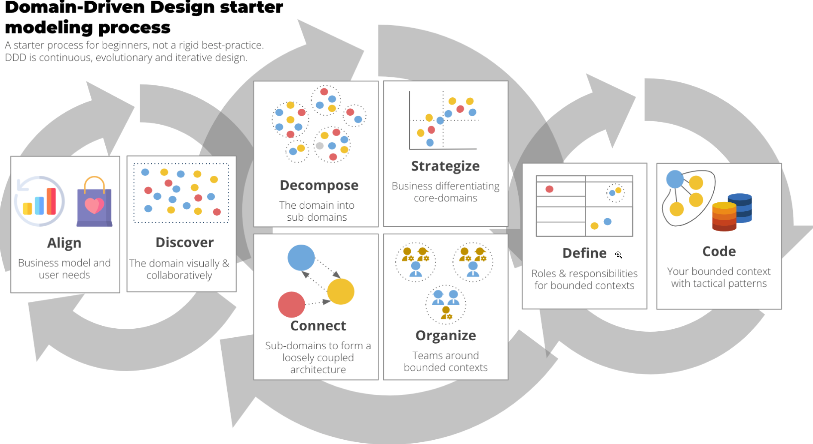
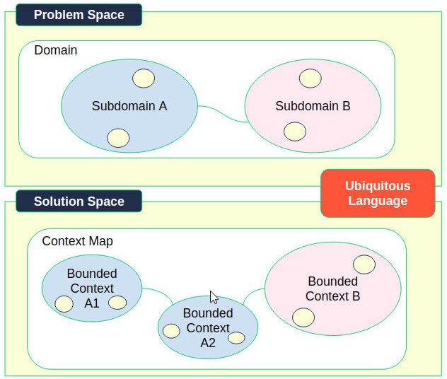
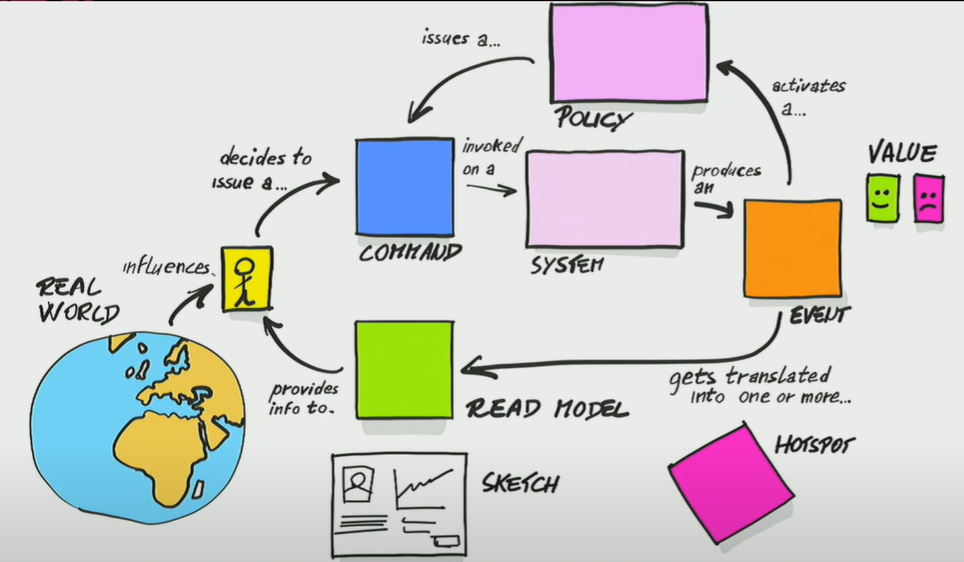
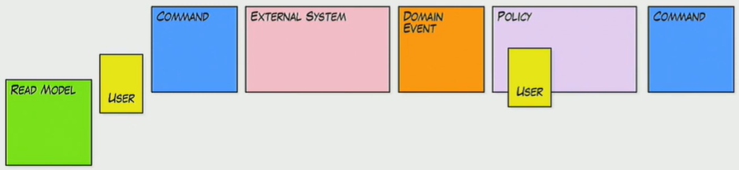
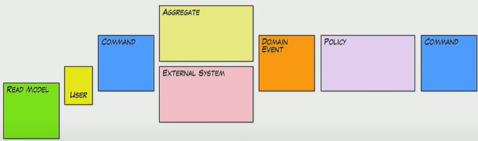
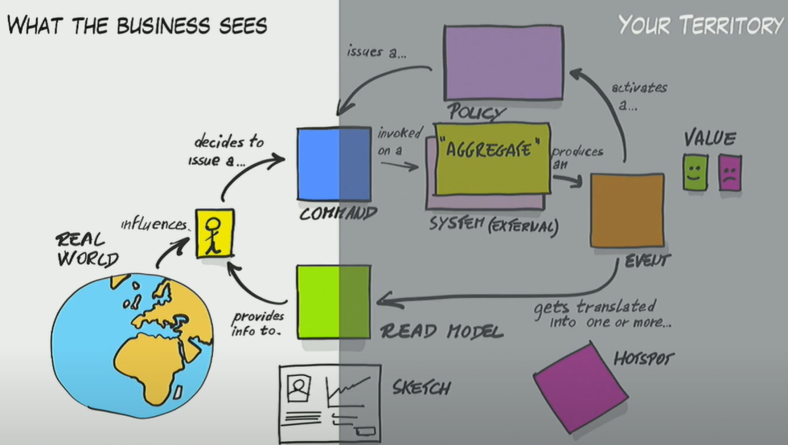
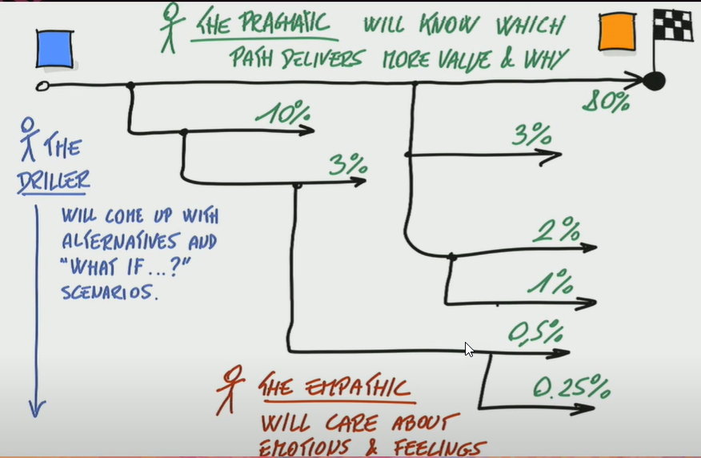
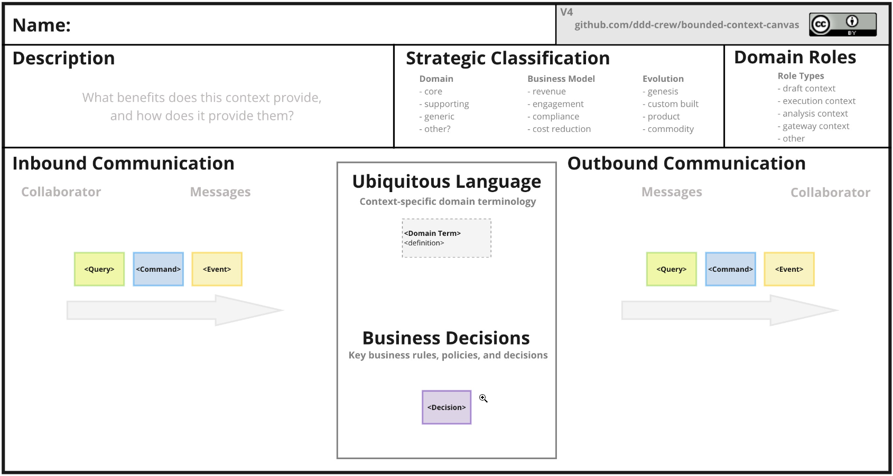

Social architecture & organizational design[6]

Domain-Driven Design is an **evolutionary** design process which necessitates **continuous** iteration on all aspects of knowledge and design.

> DDD is about understanding and modeling the domain.

Strategic DDD is about designing loosely-coupled, highly cohesive, domain-aligned software architectures and organizational structures by applying the principles and practices of Strategic Domain-Driven Design.

Aligning the solution space with the reality of your problem space is the primary focus of DDD. 

## Identifying bounded context
**What's a bounded context?** 

A service is the technical authority for a specific business capability. All data and business rules reside within the service.
> Bounded Contexts are software sub-systems **aligned** to parts of the business domain. Bounded Contexts can be implemented as **micro-services** or as **modules** within a monolith. BC deals with the solution space.

Bounded Contexts promote autonomy by removing/reducing dependencies on other teams/work. They group product and technology choices that change together for business reasons, owned by a single team (UI-Biz.logic-API-DB about a specific capability).
  
This could be achieved using two well known techniques:
- Event Storing: a crunsh knowledge technique used at the very early stages in strategic DDD in order to help the development team understand the domain with the support of the domain experts.
- **Context Mapping**: It's a general purpose technique, part of the Domain Driven Design (DDD) toolkit, helps the architects and developers manage the many types of complexity they face in software development projects.
- Bounded Context Canvas: It's is a collaborative tool for designing and documenting the design of a single bounded context. It provides you with a structured process for exploring and identifying the internal parts of bounded context. It helps design an individual Bounded Context by answering the essential design questions in the canvas. It helps validate if we identified the right boundaries, interfaces, and dependencies.

# Technique 1: Event Storming
## Big picture:
- Aimed at collaborative **discovery** where issues are visualized but not yet resolved. Show disagreements is OK. The goal is to generate discussions around hot spot.
- Current state map or plausible future state
**Official outcomes**:

- Massive learning
- Bounded Context
- Alignment

 **Unofficial outcomes**:
- Business learning business
- Spot the enemy: lack of political commitment.

## Process modeling:
Lightweight version of software design. We are seeking **an agreement** and a shared understanding of the new solution.
**Assumption**:
- we are working on the most compelling problem.
- The problem has a solution in software and/or Process
- Key experts are available:
  - Business people from the department involved.
  - Technical Experts: software and service/UX designers
- Scope: Epic or set of features. The scope is a unit of understanding not necessarily matching with units of delivery.
****
**How to do it?** 
Like a game, a cooperative game: having rules:
1- Every path should be completed: identify all possible outcomes.
Ends with : happy customer, happy user, happy department or task completed, etc.
2- Color grammar should be respected:

3- Every stakeholder should be reasonably happy

4- Every HotSpot should be addressed.

Components:
1- Users: that do things
7- Read models: data needed to take decisions  
3- Commands: Actions performed by users
2- Events: that are facts about what happened.
4- External systems: we interact with
5- Policies: business rules and reactive logic to events.
Policies shows how the system reacts to given events?
Policies are a set of rules expressed like this:
- Whenever an *event* happens a *command* should be triggered
6- Hotspots: open issues to discuss.

The process is not meant to be precise like a BPMN notation. It's **fuzzy by design**. It allows every one to be part of the conversation and allowing everything to be included. The goal is to reach agreement to design the right solution. 
As a rule of thumb, there is always a policy between an event and a command. Most inconsistencies are inside policies.
Policies could be:
- Implicit: without an explicit agreement
- Explicit: written somewhere, assuming everyone is following them. like a standard of work.
- Automated: listeners, saga, process managers (such as BPMN orchestration tools).

## Software design:
No need to include business. Mostly to support tactical DDD.
Same as process modeling extended with aggregates:

## The team:
- Business: domain experts
- Software design
- UX designers

- Pragmatic: Which path delivering most value and why
- Driller: identify alternatives "What if?" scenarios
- Empathic: will care about Emotions and feelings

## Openings
- start from the beginning: More natural but easy to get overwhelmed
- Start from the end: path to that brings more value: less discoveries and not suited for newbies.
- Explore with Events: then connect: requires strict time boxing
# Technique 2: Context mapping

# Technique 3: Bounded Context Canvas

## Domains
- Core domain:
- Supporting domain:
- Generic domain:
  
Business model: 
- Revenue
- Engagement:
- Compliance:
- cost reduction:

# Technique 4: Storytelling

# Technique 5: Object Model First approach
- Data base representation;
- How data is stored into tables, what relationship;
- Identify models based on real-world models
# Heuristics
Identifying Sub-domains could be done using several heuristics: 

- **Organizational Structure**: different business units, different roles could indicate different sub-domains.
- **Vocabulary**: the ubiquitous language is one of the main tools used to identify sub-domains. When the language changes, it's more likely we are in another sub-domain.
- **Pivotal events**: Events are facts. A pivotal event is raised when the event indicates a completion of a given action or task.If the domain feels the need to notify this completion. It's more likely to notify other sub-domains that may continue the work on their end.
# Resources

[1] DDD event Storming:https://youtu.be/fGm62ra_mQ8
[2] Bounded Context Canvas: https://github.com/ddd-crew/bounded-context-canvas
[3] Context mapping: https://github.com/ddd-crew/context-mapping
[6] https://inside.getyourguide.com/blog/2019/11/18/
tackling-business-complexity-with-strategic-domain-driven-design