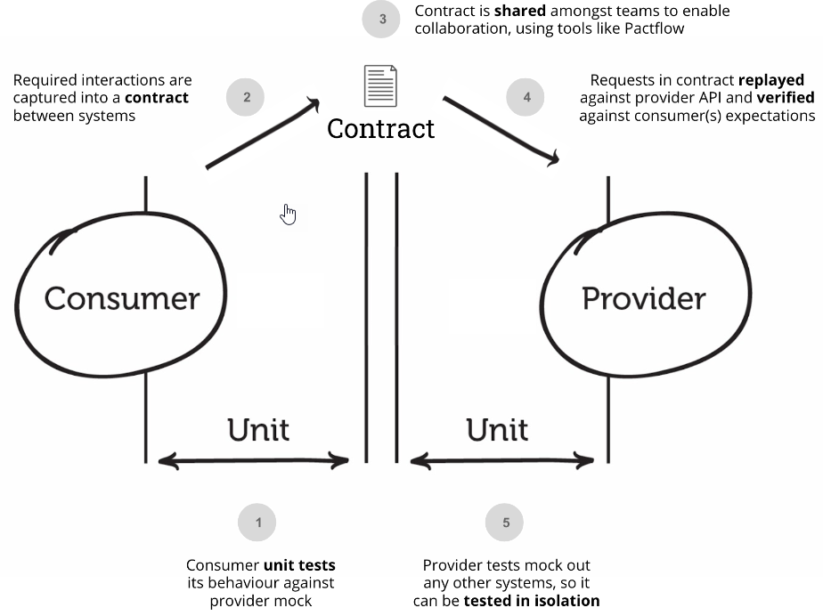

# Context mapping patterns
## Open/Host Service
A bounded Context offers a defined set of services that expose functionality for other systems. Any downstream system can then implement their own integration. This is especially useful for integration requirements with many other systems. Example: public APIs in the backed or Barrels (index.ts) in angular libraries.

## Conformist
The downstream team conforms to the model of the upstream team. There is no translation of models. Couples the Conformist's domain model to another bounded context's model.

## Anti-Corruption Layer (ACL

The ACL is a layer that isolates a client's model from another system's model by translation. Only couples the **integration layer** or **adapter** to another BC's model but not the domain itself. The intent is to prevent the intrusion of foreign concepts and models into the domain model.

|||
|-|-|
|Notation|Example|
## Customer/Supplier
There is a customer/supplier relationship between teams.
The downstream, team is considered to be the customer. Downstream requirements factor into upstream planning. Therefore, the downstream team gains some influence over the priorities and tasks of the upstream team.

## Separate ways
BCs and their corresponding teams have no connections because integration is sometimes or it takes very long to implement. The teams chose to go separate ways in order to focus on their specific solutions.

## Partnership

Partnership is a cooperative relationship between two teams. These teams establish a process for coordinated planning of development and joint management of integration.

This pattern could be enhanced by implement Contract Testing [5]

## Shared Kernel
When two teams share a subset of the domain model including code or database. Typical examples: shared libraries (nuget packages or npm packages). Teams with a Shared Kernel (SK) are mutually dependent and should form a Partnership.

## Published Language
A PL is a well documented shared language between BC which can translate in and out from that language. PL is often combined with Open Host Service. Typical examples are common interfaces such as iCalendar or vCard.

## Big Ball of mud
A part of a system which is a mess by having mixed models and inconsistent boundaries. Big Ball of Mud (BBoM) is a demarcation of a bad model or system quality.

## <Teams>Free
Changes in one BC do not influence success or failure in other BCs. There is , therefore, no organizational or technical link of any kind between the teams.

## <Teams>Mutually dependent
Two software artifacts or systems in two bounded contexts need to be delivered together to be successful and work. There is often a close, reciprocal link between data and functions between the two systems.

## <Team> Upstream/downstream
Actions of an upstream team will influence the downstream counterpart while the opposite might not be true. This influence can apply to code but also on less technical factors such as schedule or responsiveness to external requests.

# Resources

[1] DD
[2] Bounded Context Canvas: https://github.com/ddd-crew/bounded-context-canvas
[3] Context mapping: https://github.com/ddd-crew/context-mapping
[4] ACL:https://codeopinion.com/anti-corruption-layer-for-mapping-between-boundaries/
[5] Contract testing: https://docs.pact.io/