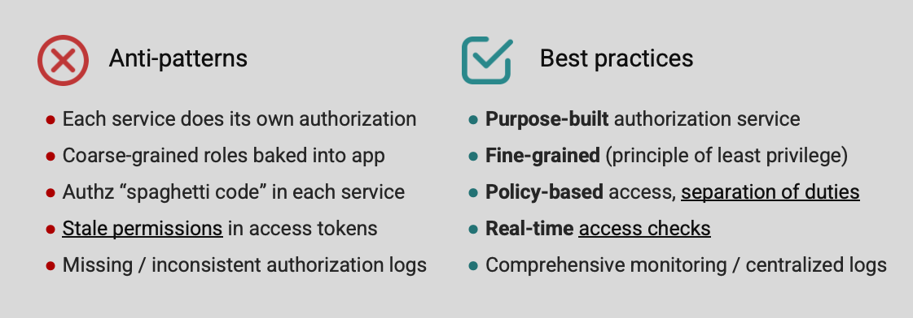
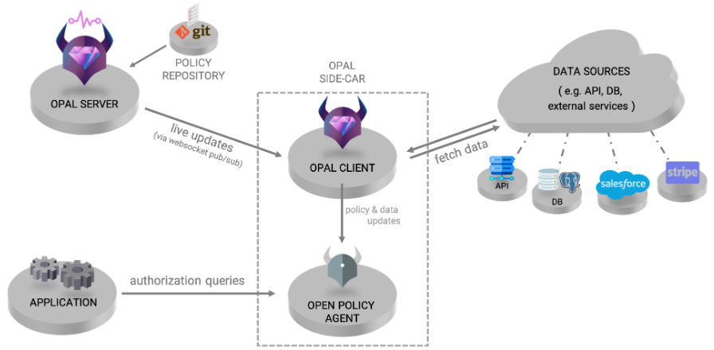
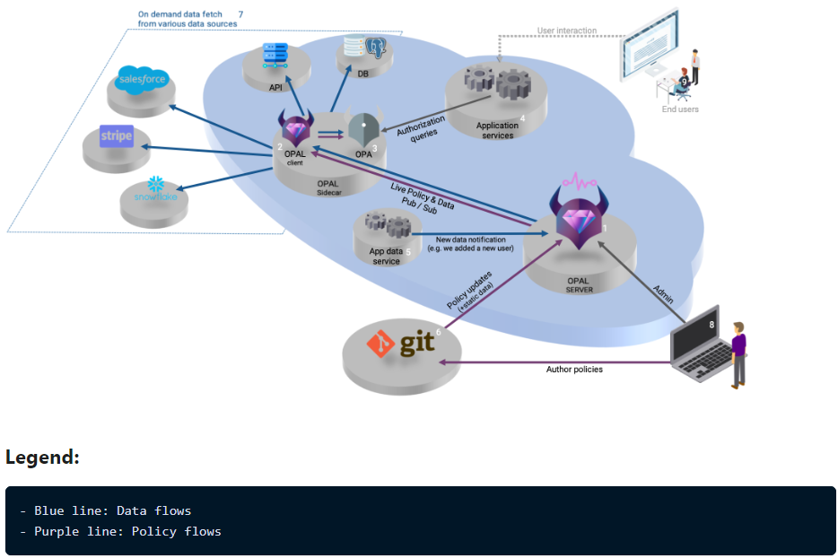

# Motivation
Traditional runtime authorization controls and related policy management practices are typically homegrown and deployed on-premises. These authorization systems are limited in their ability to scale and address business needs, specifically when policy evaluation becomes dependent on the relationship among entities. This situation is increasingly unsustainable. Weak runtime authorization controls not only expose organizations to a higher level of access risk in cyberattacks, but also increases the cost of access management and hinders digitalization initiatives.[5]

Modern runtime authorization use cases require stateless authorization decision points that enable policy definition to be decoupled from policy decisions across different operating environments. This approach enables system owners, together with risk managers, to govern policy management practices while enterprise architects and technical professionals govern the technical implementation.[6]

Keyword: decoupling

# Introduction
https://www.styra.com/blog/how-to-enforce-fine-grained-authorization-in-microservices/

# challenges

Managing policies in a distributed environment.

# Fine-Grained vs Coarse-grained authorization? [1]

Fine-grained access control is the ability to grant or deny access to critical assets, such as resources and data, based on multiple conditions and/or multiple entitlements to a single data resource. Coarse-grained access control, on the other hand, is the ability to grant or deny access to resources based on a single factor, i.e. role, or entitlement.

Fine-grained authorization is synonymous with Attribute-based Access Control (ABAC) or Policy-based Access Control (PBAC), whereas coarse-grained access control is synonymous with Role-based Access Control (RBAC).

https://www.styra.com/blog/fine-grained-vs-coarse-grained-authorization/

# AuthZ dor APIs
- Decouple policies from application code
- shared /Universal policies
- common language accross domains
- Centeralized policy management
- Centralized logging and auditing of policy enforcement
  [Some summaries]https://youtu.be/LvJp4Hz0wZM
# Least privelege

The industry is moving from”castle-and-moat” perimeter-based security to a zero trust model, which calls for a “never trust, always verify” approach and micro-segmentation. Further, the risk of internal threats are on the rise and authorization-related issues have become top security vulnerabilities. For any platform that enables collaboration among multiple users, this approach is an imperative.

Current AuthZ patterns:

# Authorization models

- ACLs: Access Control Lists:
- RBAC: Role-based Access Control: LDAP,AD
- ABAC: Attribute-based Access Control:
- Re-BAC: relationship-based Access Control:

ABAC and RBAC are the two most basic and commonly used authorization models, and they provide the baseline for most other complex and specific ones. Let’s start by getting to know them a little better:

## What is RBAC?

Role-based access control (RBAC), is an authorization model used to determine access control based on predefined roles. Permissions are assigned onto roles (Like “Admin or “User”), and roles are assigned to users by the administrator. This structure allows you to easily understand who has access to what.

The combination of three elements - who (What role are they assigned?) can do what (What actions are they allowed to perform) with a resource (Which resources) is called a policy.

⁠You can also check out our tutorial on implementing RBAC in OPA

## What is ABAC?

ABAC (Attribute-based access control), determines access based on a set of characteristics called “attributes”, rather than roles. Attributes include parameters such as a user’s role, security clearance, time of access, current time, location of the data, current organizational threat levels, resource creation date or ownership, data sensitivity, etc.

It's important to note that the attributes examined in ABAC are not just the user's - but of the accessed resource, the overall system, and anything else that is relevant in this context.

ABAC based policies are based on a combination of four elements: who (The identity of the user) can do what (What actions are they allowed to perform) with a resource (Which resources) in what context (What are the circumstances required for the action to be performed).

## RBAC VS ABAC

The choice between RBAC and ABAC depends on the needs of your organization -

RBAC provides a rather simple solution for determining authorization. Having evolved from RBAC, ABAC provides a more in-depth approach for authorization needed in order to prevent unauthorized access. While requiring more processing power and time, ABAC provides a more complex and detailed authorization method factoring a much greater number of variables.

In many cases, RBAC and ABAC can be used together hierarchically, with broad access enforced by RBAC protocols and more complex access managed by ABAC. That being said, it is important to choose relevant authorization methods tailored to your organization’s needs - so the authorization process is neither too simplistic nor too complex.

[4]
Authorization concepts.

What's a Realm?
As example in Keycloack:
Security defenses

Front-end permissions vs back-end permissions?

Coarse vs Fine-grained?

# Policy based FGA

Policy enabling an application decouples the policy implementation from the business logic so that administrators can define policy without changing the application while still keeping up with the size, complexity, and dynamic nature of modern applications.

# Anti-patterns related to authorization

1- Each microservice responsible for its own authorization:This leads to inconsistent implementation of the authorization process. The maintenance is hard and requires a lot of effort.
Instead we should have a dedicated authorization service.
2- Use of Coarse-grained roles within the application: Having roles such as admin, basic users, manager, etc. baked inside the app makes it hard to scale and requires the code to change to accommodate new roles. Instead we should apply the least privilege principle by giving only the fine-grained permissions needed for the user to execute his work as designed.
3- Having the authorization logic intermingled with the business logic creates a hard to read and maintain code. Instead, separation of concerns should be applied. A Policy based authorization access strategy is preferred to nested if-statements.
4- Using permission as scopes in access token (read, view, write). Access tokens cannot provide enough fine-grained control. Real-time access checks are more suitable for fine-grained permissions.
5- Lack of authorization logs: It's important to trace and monitor permissions granted to users. This is important for compliance and security reasons. It's easier to centralize logs and monitoring of everything related to fine-grained authorization.

## Design considerations

-

## Best practices

- Decoupling policy and code. In short – Having the code of the authorization layer mixed in with the code of your application can result in trouble upgrading, adding capabilities, and monitoring the code as it is replicated between different microservices.
- To avoid this, we recommend creating a separate microservice for authorization that will be used by the other services in order to fulfill their authorization needs.
- Event Driven updates (decouple data from code)
- Backoffice for stakeholders
- Interface for customers
- GitOps
- Unify policy enforcement

# The need for a purpose-build authorization services

Zanzibar, AuthZ intuit, Aws Amplify. What they have in common:
2 Ecosystems to AuthZ:
1- Policy as Code (successor of ABAC): Open Policy Agent (OPA): it's a cloud Native computing foundation graduated project (mature project)[3]. It's an open source, general-purpose policy engine. The goal is to decouple **policy** from the **service's code** so you can release, analyze, and review policies (which security and compliance teams love) without sacrificing availability or performance.
2- Policy as data: successor of ReBAC: popular tools such google Global authZ service: Zanzibar. It's an opionoated authorization model. Build for document/folder style authZ (sucessor of ACL). It models relationship graph between subjects and objects.

- Fine-grained:
  Requirement: the Authorization strategy should support a consistent model such as RBAC or ABAC that fits the business need and the application domain.
- Policy-Based
  Requirement: Policies should be extracted out of the application and be in its own repo inside its own image/container.
- Real-time: Since every request requires authorization, calls should be local and executed against latest data (resources/users).
- Central management: Policies and resource data should be managed centrally.
- Compliance and forensics: decision logs should be captured and stored centralized.

5 Identity Management Scenarios to Study []
These examples can help you understand when RBAC systems are best and when ABAC systems might work better. We've also included an example of using both together, as sometimes that works well too.

Companies should consider the question of RBAC vs. ABAC when dealing with:

1. Small workgroups. RBAC is best. Defining work by role is simple when the company is small and the files are few.
   If you work within a construction company with just 15 employees, an RBAC system should be efficient and easy to set up.
2. Geographically diverse workgroups. ABAC is a good choice. You can define access by employee type, location, and business hours. You could only allow access during business hours for the specific time zone of a branch.
3. Time-defined workgroups. ABAC is preferred. Some sensitive documents or systems shouldn't be accessible outside of office hours. An ABAC system allows for time-based rules.
4. Simply structured workgroups. RBAC is best. Your company is large, but access is defined by the jobs people do.
   For example, a doctor's office would allow read/write scheduling access to receptionists, but those employees don't need to see medical test results or billing information. An RBAC system works well here.
5. Creative enterprises. ABAC is ideal because creative companies often use their files in unique ways. Sometimes, everyone needs to see certain documents; other times, only a few people do. Access needs change by the document, not by the roles.

## ABAC advantages:

Well-defined control: Administrators can define, enhance, and manage many variables, ensuring a high level of control. You can develop very specific and granular rules that protect your assets.

## ABAC disadvantage

# Open Policy Agent (OPA)

OPA unifies all policies across each individual service in one server.
Takes on the role of policy decision-making and enforcement from the service: The service queries OPA, OPA makes a decision and sends an output to the service, The service acts according to OPA’s reply.

It allows you to have a policy as code, that can be easily reviewed, edited, and rolled back.

While we have a centralized authorization solution, the enforcement itself is still distributed - We have an OPA agent next to every microservice, providing decisions and enforcement with near-zero network latency. The OPA agents are distributed and can grow as the services scales.

## Policy decision model

A service could be anything: Microservice, kafka, kubernetes pod,etc.

## Main characteristics

# Policy-based access management

Lift access control logic out tof the application and into its own policy-as-code artifact.
Benefits:

- Store and version policy like code.
- Policy changes are part of the changelogs.
- Policies can evolve separately from code, by the access management/security team.
- Policies can be sealed, signed and made available as immutable image.
- Leads to testable policies

# Real-time checks

Authorization checks have to happen locally since it's in the critical path of every request. The Authorizer needs to be close to the application to reduce latency. We need compute decision using cached policies, users and resource data. Also, Policies need to be managed centrally.

## ABAC Implementation with OPA

With attribute-based access control, you make policy decisions using the attributes of users, objects, and actions involved in the request. For this we need three types of information:

Attributes for users
Attributes for objects

Logic dictating which attribute combinations are authorized

# How to leverage OPA:

1- Architecture: We need to decide whether to run OPA as a sidecar or as a standalone service. This architectural decision will depend on latency, performance, and the data we need for our policies. OPA is designed as a sidecar, but It's possible to use it as a service around OPA by spinning up multiple copies, load-balancing across them, adding a persistence layer, etc.

2- Administration: Ho to manage (load/update) policies and log decisions to OPA.

3- Service Integration: OPA could be integrated at the proxy layer. The proxy will intercepts all network traffic going to your services (e.g. Envoy, Linkerd, Kong, ...). We can than configure the network proxy to call out to OPA without modifying the back-end service. If we are not using a network proxy, modify your .Net services to make HTTP callouts when your services need policy decisions, using a library where possible to minimize the impact on individual services. The integration page shows how for Java Spring and PHP.
testing opa rules

# Manage OPA with OPAL (similar with Sytra)

overview

Component diagram

# Resources

[1] https://axiomatics.com/resources/reference-library/fine-grained-access-control-fgac
[2] RBAC vs ABAC: https://www.okta.com/identity-101/role-based-access-control-vs-attribute-based-access-control/
[3] CNCF projects: https://www.cncf.io/projects/open-policy-agent-opa/
[4] https://www.aserto.com/blog/fine-grained-access-control-evolution
[5] https://blogs.gartner.com/homan-farahmand/2020/12/20/modernize-your-runtime-authorization/