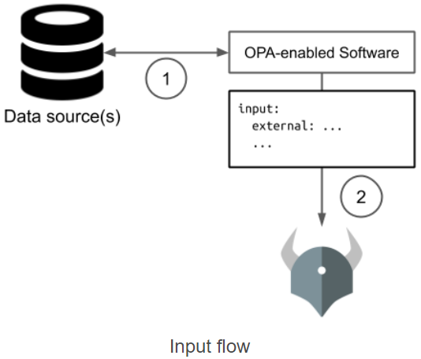

# OPA architecture
OPA is designed to enable distributed policy enforcement. You can run OPA next to each and every service that needs to offload policy decision-making. By colocating OPA with the services that require decision-making, you ensure that policy decisions are rendered as fast as possible and in a highly-available manner.
## Control panel
To control and observe a set of OPAs, each OPA can be configured to connect to management APIs that enable:

Policy distribution (Bundles)
Decision telemetry (Decision Logs)
Agent telemetry (Status)
Dynamic agent configuration (Discovery)
# How to deploy OPA?

-as a sidecar in a pod
as standalone

# Patterns on updating the data [2]
Option 1: JWT Tokens
Option 2: Overload
Option 3: Bundle API
Option 4: Push Data
Option 5: Pull Data during Evaluation
## 1- JWT input [2]

## 2- Overload input [2]

Often policies require external data that’s not available to the authentication system, ruling out JWTs. The calling system can include external data as part of input (necessitating of course that the policy is written accordingly).

For example, suppose your policy says that only a file’s owner may delete it. The authentication system does not track resource-ownership, but the system responsible for files certainly does.

The file-ownership system may be the one that is asking for an authorization decision from OPA. It already knows which file is being operated on and who the owner is, so it can hand OPA the file-owner as part of OPA’s input. This can be dangerous in that it ties the integration of OPA to the policy, but often it’s sufficient to have the file-ownership system hand over all the file’s metadata.

Flow
OPA-enabled software gathers relevant metadata (and caches it for subsequent requests)
OPA-enabled software sends input to OPA including the external data
Policy makes decisions based on external data included in input

Updates
External data gets updated as frequently as the OPA-enabled software updates it. Often some of that data is local to the OPA-enabled software, and sometimes it is remote. The remote data is usually cached for performance and hence is as updated as the caching strategy allows.

Size Limitations
Size limitations are rarely a problem for OPA in this approach because it only sees the metadata for 1 request at a time. However, the cache of remote data that the OPA-enabled service creates will have a limit that the developer controls.

Recommended usage: Local, Dynamic data
This approach is valuable when the data changes fairly frequently and/or when the cost of making decisions using stale data is high. It works especially well when the external data is local to the system asking for authorization decisions. It can work in the case of remote data as well, but there is more coupling of the system to OPA because the system is hardcoded to fetch the data needed by the policy (and only that data).

# Bundle apis
# How to write policies.
### rego
[2] https://www.openpolicyagent.org/docs/latest/external-data/
[] Tracing: https://www.openpolicyagent.org/docs/latest/rest-api/#trace-events+
[] integration https://stackoverflow.com/questions/59875465/integrate-open-policy-agent-with-asp-net-core-web-api