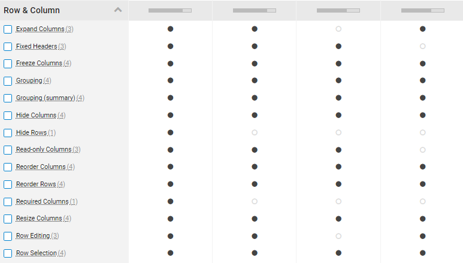

# Introduction
This documentation is aimed to give context to [ADR-069](../decisions/0069-ui-theme-grids-and%20tables.md)
# Approach
This work is partially based on a comparison study already done for 16 out of 17 components included [1].

|16|99|1,584|53|25|
|-|-|-|-|-|
|Commercial Products|Features Compared|Data Points Collected|Hours of Research|Years of Expertise|

Here is the general approach that we adopted to select the final grid component.
1. High level analysis based on key differentiators (see below).
2. Short listed 4 out of 16 and added ag-grid to the short list.
3. Compared features of the 5 grids based on the demos provided by vendors.
4. General appreciation and final recommendation of the final choice.

Here is the short list of the most promising 4 (without ag-grid)

## Key differentiators and comparison with ag-grid:
|Feature|Igx-grid|ag-grid|
|-|-|-|
|Number of features|72/78|-|
|Grouping/Pivoting|5|4|
|Working with Columns |5|3|
|Working with Rows|5|3|
|Simple & Advanced filtering|5|3|
|Persist state|5[5]|3|
|Batch editing|5[6]|3|
|Export to excel/selection|5|3|
|Support of OData|:heavy_check_mark:|:x:|
|Provide Schematics|:heavy_check_mark:|:x:|
|Performance|5[2]|3[10]|
|License|(1295$-1495$)/dev/year[7]|1200$/dev/year+750$/app/srv.[8]|
|ROI|100+ UI components|Grid+charts|
N.B.: 1-5: from poor to rich
## General appreciation of igx-grid
After analysis, Igx-grid is the most suitable grid for complex scenarios for most of our use cases. Overall, it provides the best UX and DX.
Here are some of the main Pros and Cons identified during the analysis:
### Pros
- Ignite UI Grid have the most feature of the shortlisted grids(72/78)
- The UX is better than the competitors (filtering, grouping,etc).
- Easy to integrate to angular components.
- ROI: With the bundle, we have access to charts and a lot of enterprise components.
- The performance is better than other competitors [2]
- Filtering on groups is very advanced and very intuitive(example below).
- Flexible Row and Column pinning/freezing[5]
- Can paste from excel in cell or as rows with Ctrl+V [3]
- Support for schematics: Provides easy integration with our future schematics[9].
- Separate Hierarchical and Tree grids provides more flexibility to our teams.
### Cons
- Do not support PDF export directly (could be done differently if needed)
- Do not support Android mobile (not important for now) 
## Example of features:
### **Simple filtering** :Igx-grid vs ag-grid:
|Ignite data grid|ag-grid|
|-|-|
|||
### **Advanced filtering**:

### **Grouping**

# Resources
- [1] Short List: https://www.componentsource.com/compare/angular-grid-controls-comparison?cc=ca&gclid=CjwKCAjwsJ6TBhAIEiwAfl4TWCFx5_YmPx0GonyCGa6VnONC3G6qZFwugQnyvjwb38NQgET9L2KH5xoCExsQAvD_BwE&p=2075,2827,436,437,651&s=review&utm_campaign=gca001_1002661_en&utm_medium=cpc&utm_source=google
- [2] Ignite vs ag grid: https://www.infragistics.com/products/ignite-ui-angular/ignite-ui-angular-vs-ag-grid
- [3] Ignite Data grid:https://www.infragistics.com/products/ignite-ui-angular/angular/components/grid/paste-excel
- [4] ag-grid: https://www.ag-grid.com/javascript-data-grid/filter-text/
- [5] pin/freeze:https://www.infragistics.com/products/ignite-ui-angular/angular/components/grid/row-pinning
- [6] https://www.infragistics.com/products/ignite-ui-angular/angular/components/grid/batch-editing
- [7] https://www.infragistics.com/how-to-buy/product-pricing
- [8] https://www.ag-grid.com/license-pricing.php
- [9] https://www.infragistics.com/products/ignite-ui-angular/angular/components/general/cli-overview
- [10] ag-grid performance compared to others: https://dzone.com/articles/the-fastest-javascript-data-grid-a-performance-ana
