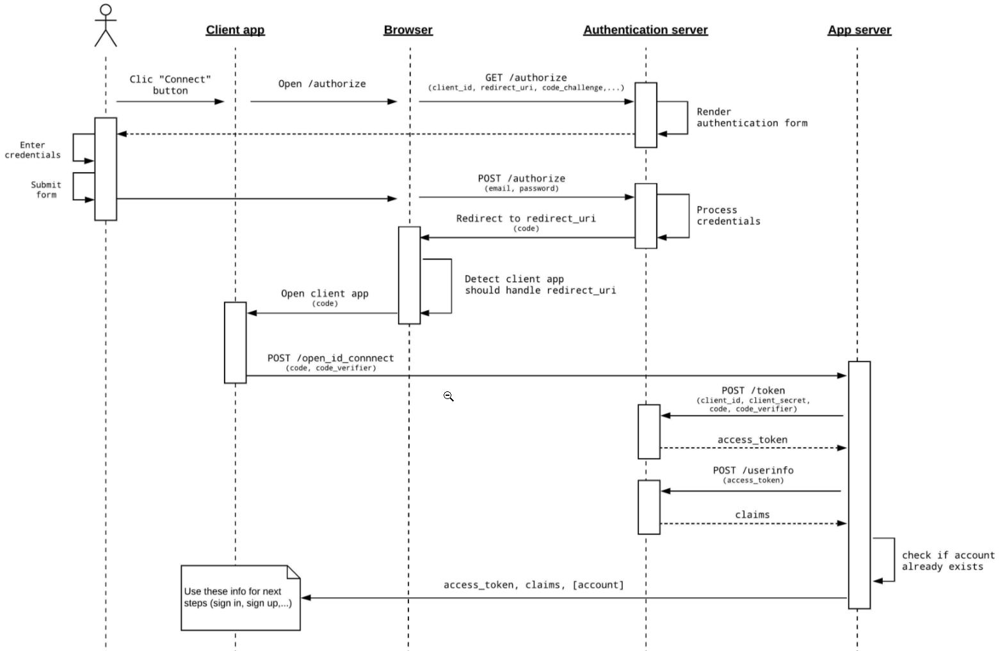

OAuth2.0 deals with Authorization
OpenId Connect delas with authentication.

# Terminology
1- Resource owner:
2- Client:
3- Authorization server
4- Resource Server
5- Authorization grant
6- Redirect URI
7- Access token

# Brief intro:

Token types:
ID tokens:
Access token:
Refresh tokens: Security, usability and privacy. 

OAuth2.0 uses Access tokens and Refresh tokens.
OpenId connect uses ID token. It allows for user authentication, user consent and token issuance.

# Authorization code flow with PKCE
According to RFC8252, OAuth 2.0 authorization requests from native apps should only be made
   through **external user-agents**, primarily the user's browser.

Process:
PART 1: Obtain the Authorization Code (with PKCE extension)
1- Client opens browser tab:
- iOS: SFAuthenticationSession
- Android Custom Tab
Send Authorization Request + code_challenge to an authorization Endpoint.

2- Authorization Endpoint **receives** the Authorization request Endpoint+ code challenge
- Authenticate the user: may involve chaining to other authentication systems
3- Authorization server issues authorization code to the redirect URI
Option 1: Redirect_Uri could be a Custom scheme in reverse DNS (com.pwc.dctu) also know as deep-linking.
N.B.: URL schemes offer a potential attack vector into your app, so make sure to validate all URL parameters and discard any malformed URLs. In addition, limit the available actions to those that don’t risk the user’s data. For example, don’t allow other apps to directly delete content or access sensitive information about the user. When testing your URL-handling code, make sure your test cases include improperly formatted URLs [2].
Option 2:   or  Claimed HTTPS URI. Claimed HTTPS URI is preferred
Universal links (outlinks):

4- Client App receive Authorization Code. Client app should check against CSRF token.

5- Send Authorization code + code_verifier (generated by the client app and validable by the token endpoint at the Authz server)
6- The token Endpoint checks that the **authorization request** is bound to the  **Authorization code** that was issued and the PKCE code_verifier. the token endpoint will generate the JWT Access token and send it in response to the app.


# Concepts

Authorization code: It embodies the authorization granted by the resource's owner. It's a sender-constrained token.

 It is a kind of token that is the client-id ()

  CLIENT         ----------------> Authorization server
client_id=A                         client_id=A
# Important decisions
1- Use the browser to encapsulate 

# Full OAuth2.0+PKCE Sequence Diagram



The goal with PKCE is to keep the secret in the server instead of the browser.
1- AuthN happens in the browser by calling ```Get /authorize ``` in the authN Server.
```
GET <AUTHORIZATION_SERVER_URL>/authorize?
  response_type=code
  &scope=openid email profile
  &client_id=<CLIENT_ID> 
  &redirect_uri=<REDIRECT_URI> 
  &code_challenge_method=S256 
  &code_challenge=<PKCE_CHALLENGE>
```
response_type: with PKCE it should always be 'code'
redirect_uri: A valid URL recognized by your mobile application as an app link. It will allow to redirect the user back to your application after authentication and to get the “code” back from the authentication process.
code_challenge_method PKCE code challenge method, S256 (SHA-256) **MUST be used **if the client supports it.
code_challenge: **use AppAuth to handle it for you**.
   S256
      code_challenge = BASE64URL-ENCODE(SHA256(ASCII(code_verifier)))
As a response the AuthN server renders the authN form.

> Security Concerns:**
This authentication process should be handled using a **registered browser** or an **“in-app browser tabs”**, **not a “web-view” **(see RFC 8252).


2-
## URL scheme (deep linking)[2]:
Provides the ability to launch the application from outside app. With custom URL schemes,Custom URL schemes provide a way to reference resources inside your app. Users tapping a custom URL in an email, for example, launch your app in a specified context [2]. Kind of exposed endpoint in the app.

## Use the browser for authentication [3]

Thinking about an authentication flow on mobile, it is quite intuitive to go with a native implementation. However, keeping the authentication part in the browser helps you achieve important goals :

security: by going through the browser and using the web authentication form of the Authorization server, you instantly benefit from security mechanisms they may already implements (ie : sandboxing, certificates validation, …).
user trust: you may think that a native implementation is always more efficient. However, from a user point of view, having to provide his third party credentials directly in your application seems like a potential security issue. How could he know that you are not going to steal his credentials along the way ?
maintainability: when authentication goes through the browser, the authentication flow is delegated to the Authorization server. So what happens if the authorization server wants to enforce new mechanisms (ie : 2-factors authentication, user consent, …) ? Nothing on your side. It will be completely transparent for your application.


## Validation
The token validation happens at two levels:
1. API gateway:
   1. Validate issuer from ID token and Access Token against data from a secure introspect endpoint in the AuthZ server;
   2. Validate expiration date;
   3. Validate audience in token against client_id via introspection.
   4. Scope: and/Or or just And.
2. Protected resource
   1.  


## Persisting Authentication Data with AsyncStorage [6]
React Native provides a simple solution for persisting data in-app with their AsyncStorage API. As the name suggests, the AsyncStorage methods are asynchronous, meaning they need to be executed in asynchronous functions and not directly within lifecycle methods.

## Refresh token
The refresh token is a special artefact (token) that is used to obtain additional access tokens. This allows for short-lived access tokens without requiring the user to login again. This increases the security and the usability at the same time. The client application can get a new Access Token as long as the refresh token is valid and unexpired. Refresh tokens should not be long-lived token. They should be stored in the client since they are required to obtain new access tokens. Refresh token should be used when we want to provide a good authentication user's experience (avoiding login page again and again).
A best practice is to keep access token short lived and renew them using refresh tokens. To keep things even more secure and still convenient, rotating refresh token comes in handy. Refresh token rotation helps a public client to securely rotate refresh tokens after each use. With refresh token rotation behavior, a new refresh token is returned **each time the client makes a request to exchange a refresh token for a new access token**. Refresh token rotation works with SPAs, native apps, and web apps[7]. This mechanism reduces the risk that an attacker can intercept a refresh token and get an access token. Automatic reuse detection can pair refresh token and the access token eliminating. If a refresh token was stolen by a malicious app than the authZ server will invalidate the whole family (Pair of access+refresh tokens), making it impossible to the malicious user to get a new access token.


To keep refresh tokens secure
## Logout process
# Resources
[RFC8252] RFC for native mobilehttps://datatracker.ietf.org/doc/rfc8252/
[2] https://developer.apple.com/documentation/xcode/defining-a-custom-url-scheme-for-your-app
[3] Building an OpenID Connect flow for mobile https://medium.com/klaxit-techblog/openid-connect-for-mobile-apps-fcce3ec3472
[4] RHSSO integration https://www.janua.fr/pkce-support-with-keycloak-7-0/
[5] https://auth0.com/blog/id-token-access-token-what-is-the-difference/
[6] https://rossbulat.medium.com/react-native-user-authentication-flow-explained-d988905ba106
[7] https://developer.okta.com/docs/guides/refresh-tokens/main/
[8] https://medium.com/@dckalubowila25132/proof-key-for-code-exchange-pkce-in-oauth2-authorization-code-grant-8b36d7e11d61#:~:text=The%20basic%20idea%20behind%20PKCE,token%20for%20the%20client%20app.