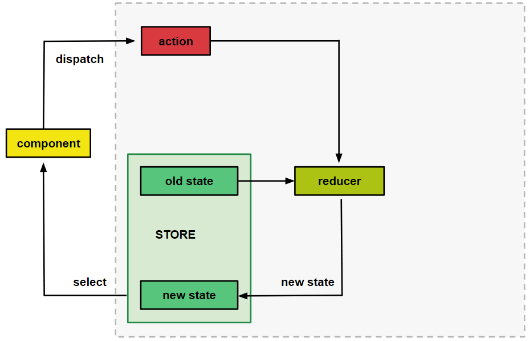
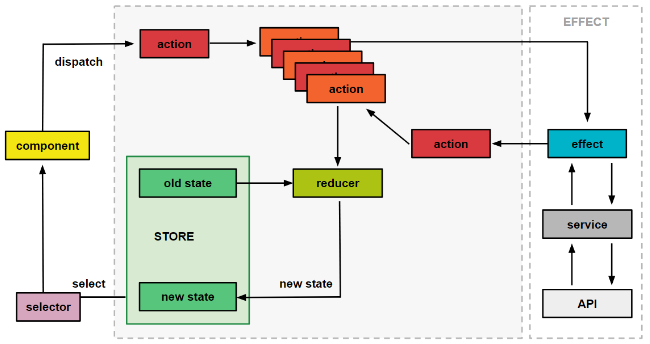

# Why state mangement?
When building a large application that has lots of information coming from and going to the database as well as data that is shared across multiple components, things can easily get messy and complex. Having all the state in one place also means that we can share data between components and don’t have to worry about the complexity of cross-component communication[1].


# Why NGRX? What are the alternatives?
a state management library for Angular applications inspired by Redux. By using this library we are able to keep the current state of the app in one place — the store. This enables us to use the store as a single source of truth meaning we can reliably access the state of the app from this one place rather than components of the app holding their own state and having to communicate and pass data between them. This reduces the communication between components which is particularly helpful to scale our app without adding more complexity[1].
# Advantages 
- The app is more predictable: The Redux pattern prevents the mutation of state in multiple locations in our app. Data is changed in one central location and flows one way from this location to the UI components.
- App easier to understand: All the components in our application follow this pattern.
- Using the @ngrx/store to maintain and manage the state of the application means that we do not duplicate information we already have and we reduce the amount of unnecessary calls to the API. 
  
# NgRx Architecture
## Internal components building blocks
 Articles often mention the store, actions and reducers. All which are key concepts to understand. However when first trying to work out what is going on in the code base of our app, it seems to have a bit more going on. Things like effects, selectors and things our team calls facades[1].
 - Store actions and reducers
 - Selectors: A selector describes what specifically needs to be fetched from the store and the select method knows how to fetch it.
 - Effects:An effect can catch an action, do some processing and then emit another one or more actions.
 - Facade: A facade is used to abstract away the store pattern from the components.
### Level 1: Basic structure


- The component is what the user can interact with. For example, a search input box the user can fill out and submit via a clickable button. When the button is clicked we **dispatch** an action to the store.

- The **action** describes the change in state that is to be made.
- This action is sent to the **reducer** which is a pure function — it takes the data from the action and the current state and generates the new state from it. Each reducer is specific to only a small part of the state [1].
```
    search: {search: oldSearchResults},
    listings: { listing: […]},
    otherThings: {things: otherData}
```
Once the store is updated with the new state from the reducer, we can then update the components with this new state.
### Level 2: Selectors & effects
In our app we make use of selectors called with the store’s select method.
The store’s select method knows how to fetch the current state and it sets up a subscription to the state changes using observables which allows the component to stay up to date with the latest changes in the store. A selector describes what specifically needs to be fetched from the store. A selector can be set up to describe single slices of the state or can group together different slices of the state to get the information that an individual component needs[1].

When an action is dispatched it goes into an action queue. Often there is more than one action in the queue and the actions flow through in sequence.
The above diagram gives a basic overview of the way the store works in our app internally. However, when our app needs to interact with the real world i.e. network, time, browser storage, API requests… basically everything that is asynchronous and outside our app, we use effects. An effect is triggered by an action, does some processing on the side and then emits one or more actions to be added to the action queue which are then again processed by the reducers[1].


### Example:
For example, the ```GetSearchResultsAction``` is caught inside the ```getSearchResults``` effect. This effect checks to see if the search results are already in the store. If not, a new ```GetSearchResultsFromApiAction``` is dispatched. This action is caught in another effect that makes a request through the API Service to the API. When data is retrieved from the API the response is sent back to the store via a different action, i.e. ```GetSearchResultsFromApiSuccessAction```. The reducer takes the data from the action along with the old state to then update the stored state with the new data.
### Level 3: Facades
The facade is a way to **abstract away** the store pattern from the components. The components don’t need to know anything about Redux with its actions and selectors. They can just call methods on the facade to either trigger a change or register for updates.This way we can centralize logic in the facades and leave our components rather dumb and simple which makes it very straightforward to test them[1].


### Example:
- The search **facade** has a method to get all search results. 
- This method internally calls the store **select** method with the correct **selector** and subscribes to changes from the store. 
- The **component** gets an **observable** of search results from the facade but does not need to know where exactly the data comes from and how the Redux mechanisms work. 

## Flavors of NgRx
NgRx comes with different flavors: NgRx, NgRx Data

**To be continued when working on NgRx...**
# Resources
[1] https://medium.com/default-to-open/understanding-a-large-scale-angular-app-with-ngrx-80f9fc5660cc
[2] NGRX data:https://www.learmoreseekmore.com/2022/07/angular14-crud-example-using-ngrx-data.html