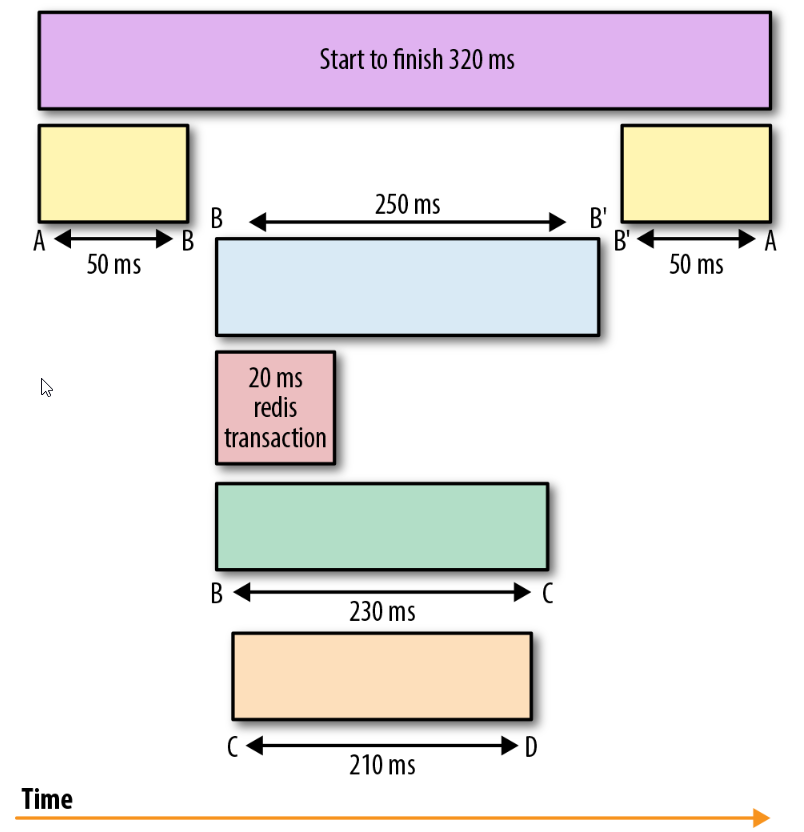

# Observability in the FE
The 3 pillars of observability are :
1- Logs:
2- metrics:
3- traces:
Having access to logs,metrics and traces do not necessarily mean that the software is observable. In fact, they need to be understood well in order to provide the expected value.

# 1- Logging
## What's a log?
A log is a recorded event that is **immutable and timestamped**. It provides context. It can be recorded as free plaintext, the most common format. It can also be structured in a certain format, typically JSON formatted. It Can also be binary such as Protobuf format (pflog).
## Why logging ?
The value of logs is visible **when debugging** at a fine level of granularity. It provides **valuable information and context** when analyzing a trail of event that led to an incident or unpredictable behavior in systems. This logs are particularly useful when the system is distributed, where multiple causes can be involved in an incident. In such systems, correlation of logs is paramount for effective troubleshooting.

# 2- Metrics
## What's a metric ?
They are **numeric representation** of data measured overtime.They can be exploited to derive knowledge through prediction and mathematical modeling.
Metrics are **suitable for building dashboards that reflect historical trends**. They are easy to store, process, compress and retrieve because the values are numerical.

A metric is **immutable** and is composed of few components: Metric Name, Timestamp, labels and a value.

Metrics storage, processing complexity or speed of visualization do not increase with user traffic. Thus, keeping their cost relatively small and predictable. They only increase happens when new resources are allocated (scaled-out). Logs, in the other hand, can be challenging because user traffic affects storage and performance in general requiring the implementation of optimization techniques such as sampling.

Metrics, once collected, are more malleable to mathematical, probabilistic, and statistical transformations such as sampling, aggregation, summarization, and correlation. These characteristics make metrics better suited to report the overall health of a system.

Metrics are also better suited to trigger alerts.

Metrics and logs are sufficient for understanding the performance and behavior of individual systems but not enough at understanding the lifetime of a request spanning multiple systems. 

# 3- Tracing
Distributed tracing is a technique that addresses the problem of bringing **visibility into the lifetime of a request across several systems**.
A trace is a representation of **a series of causally related distributed events** that encode the end-to-end request flow through a distributed system

A trace represents the record of the entire operation you want to measure or track - like page load, an instance of a user completing some action in your application, or a cron job in your backend. When a trace includes work in multiple services, such as those listed above, it's called a distributed trace, because the trace is distributed across those services.[6]

When a request begins, it’s assigned a globally unique ID, which is then propagated throughout the request path so that each point of instrumentation is able to insert or enrich metadata before passing the ID around to the next hop in the meandering flow of a request. Each hop along the flow is represented as a span .

## Challenge of tracing:
Tracing is, by far, the hardest to retrofit into an existing infrastructure, because for tracing to be truly effective, every component in the path of a request needs to be modified to propagate tracing information.
The second problem with tracing instrumentation is that it’s not sufficient for developers to instrument their code alone. A large number of applications in the wild are built using open source frameworks or libraries that might require additional instrumentation.

## Tracing vs Profiling [6]
Tracing is **not** profiling. Though the goals of profiling and tracing **overlap** quite a bit, and though they can both be used to diagnose problems in your application, they differ in terms of **what they measure** and **how the data is recorded**.

A profiler may **measure any number of aspects** of an application's operation: the number of instructions executed, the amount of memory being used by various processes, the amount of time a given function call takes, and many more. The resulting profile is a **statistical summary of these measurements**.

A tracing tool, on the other hand, focuses on **what happened** (and **when**), rather than how many times it happened or how long it took. The resulting **trace is a log of events which occurred during a program's execution**, often across multiple systems. Though traces most often - or, in the case of Sentry's traces, always - include timestamps, allowing durations to be calculated, measuring performance is not their only purpose. They can also show the ways in which interconnected systems interact, and the ways in which problems in one can cause problems in another.

# Conclusion
Logs, metrics, and traces serve their own unique purpose and are complementary. In unison, they provide maximum visibility into the behavior of distributed systems. For example, it makes sense to have the following:

- A counter and log at every major entry and exit point of a request
- A log and trace at every decision point of a request
It also makes sense to have all three semantically linked such that it becomes possible at the time of debugging:
- To reconstruct the code path taken by reading a trace
- To derive request or error ratios from any single point in the code path

# Resources
[1] 
[2] https://www.codemag.com/article/1711021/Logging-in-Angular-Applications
[3] https://medium.com/loftbr/angular-sentry-application-monitoring-with-releases-source-maps-d73e72e873c8
https://opentelemetry.io/registry/?s=&component=exporter&language
https://github.com/jufab/opentelemetry-angular-interceptor
https://github.com/open-telemetry/opentelemetry-collector-contrib/tree/main/exporter/sentryexporter
https://signoz.io/blog/opentelemetry-angular/#running-angular-application-with-opentelemetry

Comparaison with Sentry: instabug.com/sentry-alternative
