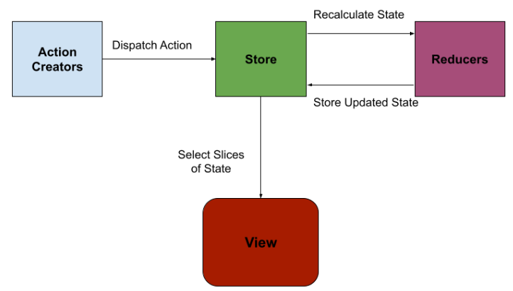
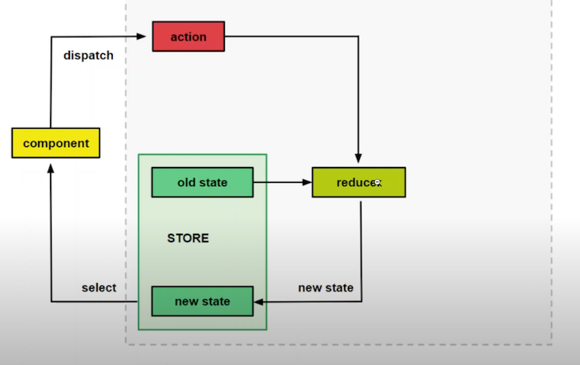

## what is NgRx?

NgRx is a state management solution for Angular built on top of RxJS which adheres to the redux pattern.

(also add this to consequences in ADR)Using a state mangement solution like NgRx to manage state **will free up more** of the code to be tested in a smart components.

It contains an immutable centralized store where the state of our application gets stored.

- We select slices of state from the **Store** using **Selectors**, which we can then render in our components.
- We dispatch **Actions** to our **Store**.
- Our **Store** redirects our **Action** to our **Reducers** to recalculate our state and replaces the state within our **Store**.[1]

Redux like state management frameworks
#### Alternatives
# Resources
[1] https://www.thisdot.co/blog/ngrx-facade-pattern
[2] https://thomasburlesonia.medium.com/push-based-architectures-with-rxjs-81b327d7c32d
[3] Cookbook: https://massivepixel.io/blog/angular-state-management/