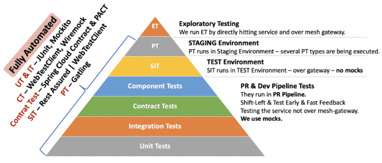

# Consumer Driven Contracts (CDC)
Here is where CDC fits in the testing pyramid[1]:

Contracts are a series of agreements between the service provider and the consumer. The providers can test their service against these contracts to make sure they are not breaking any consumers thereby helping to keep the service backward compatible.
# Resources
[1] https://www.swtestacademy.com/microservices-testing-strategies/